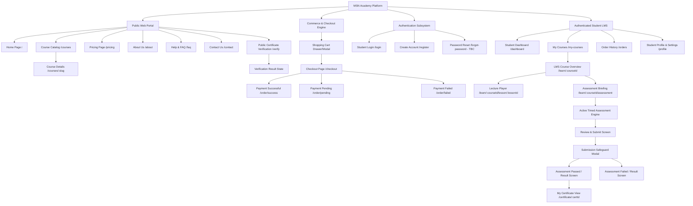
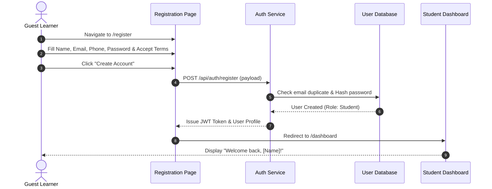
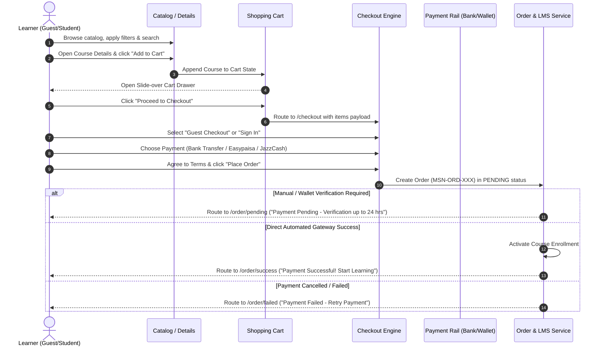
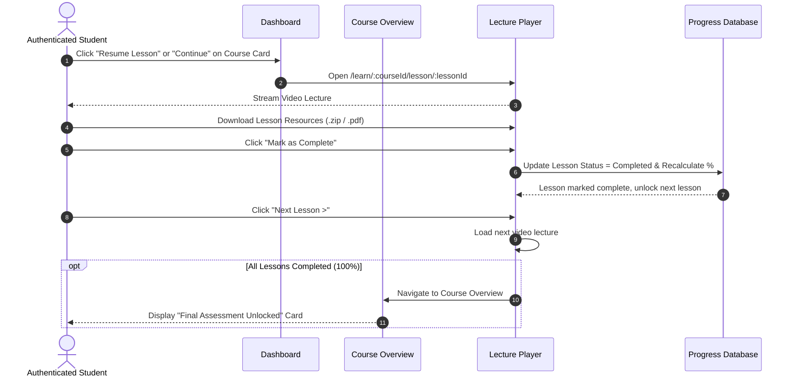
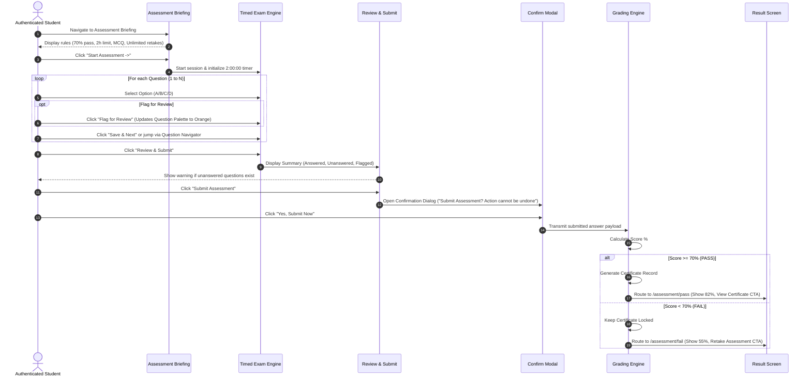
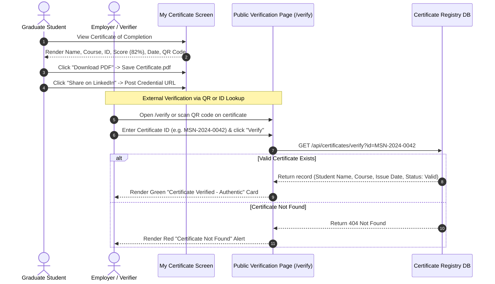

# Product Requirements Document (PRD)
# MSN Academy — Vocational & Technology Learning Management System

---

## 1. Document Information

* **Product Name:** MSN Academy
* **Document Name:** Product Requirements Document (PRD) — Student Learning Experience & Commercial Platform
* **File Identifier:** `01-PRD.md`
* **Version:** 1.0.0 (Baseline from Complete UI/UX Specification)
* **Date:** September 08, 2026
* **Document Status:** Complete / Approved for Technical Architecture Baseline
* **Prepared For:** MSN Academy Executive Leadership, Engineering Leads, Product & Design Teams
* **Prepared By:** Senior Product Manager & Lead Business Analyst
* **Purpose of the Document:** 
  This document serves as the authoritative, definitive Product Requirements Document (PRD) for the MSN Academy platform. It defines functional specifications, screen-level interactions, user flows, business logic, form validations, role-based permissions, and acceptance criteria derived strictly and comprehensively from the 71 production UI/UX screen designs (Desktop and Mobile viewports). This document serves as the foundational contract for subsequent technical design phases: Database Schema Design, Frontend & Backend Architecture, API Contracts, and Sprint Execution Breakdowns.

---

## 2. Product Overview

### 2.1 What MSN Academy Is
**MSN Academy** is a specialized, career-focused vocational and technology Learning Management System (LMS) designed to equip learners with high-demand digital skills (including Data Analytics, Frontend Development, UI/UX Design, AI Automation, Digital Marketing, and MS Office & Productivity). The platform is founded by industry practitioners (headed by founder M. Suleman Naqvi) with the core philosophy that technology education must translate directly into tangible workplace competencies, verifiable portfolio work, and verified digital credentials recognized by employers.

### 2.2 Product Type & Business Model
MSN Academy operates on a **Direct-to-Consumer (D2C) Pay-Per-Course** educational model with **Lifetime Access**. 
* **No Recurring Subscriptions:** Courses are individually priced (ranging between PKR 8,000 and PKR 18,000 as reflected in the designs).
* **Frictionless Entry:** Supports both registered student checkout and frictionless **Guest Checkout**.
* **Localized Payment Rails:** Specially architected for the Pakistani tech ecosystem, supporting direct Pakistani Rupee (PKR) settlements through **Bank Transfer**, **Easypaisa**, and **JazzCash**.
* **Outcome-Oriented Learning:** Combines bite-sized on-demand video lectures, downloadable exercise files, self-paced progress tracking, a rigorous timed MCQ-based assessment with a 70% passing threshold, and tamper-proof digital certificates featuring unique identification numbers and scannable QR codes verifiable in public registries.

### 2.3 Primary Purpose & Problems Solved
Traditional tech education in the target market often suffers from outdated academic curricula, purely theoretical lecturing without practical tooling, cumbersome subscription paywalls, lack of localized payment gateways, and unverified paper certificates prone to fraud. MSN Academy solves these pain points by:
1. Providing industry-standard, project-based video curriculums taught by vetted senior practitioners.
2. Offering transparent, one-time course fees without hidden recurring subscription lock-ins.
3. Enabling seamless local checkout via mobile wallets and local bank transfers.
4. Enforcing real competency validation through automated final assessments before credential issuance.
5. Offering a public, instant certificate verification engine (`MSN-XXXX-XXXX` / `MSN-YYYY-NNNN`) ensuring employers and clients can validate student claims in seconds.

### 2.4 Major Capabilities Visible in the UI/UX
* **Public Discovery & Marketing Engine:** Modern landing page with live platform statistics, course catalog with faceted category/level filtering, search, course syllabus inspection, student testimonials, FAQs, pricing breakdown, and inquiry forms.
* **Shopping Cart & Checkout System:** Multi-item slide-over cart, promotional coupon input, multi-step and single-page checkout supporting Guest Checkout and Existing Student Sign-In, manual payment verification queuing, and clear payment feedback states (Success, Failed, Pending).
* **Student LMS Portal:** Clean, distraction-free student workspace featuring a dynamic Dashboard ("Continue Learning" quick actions, summary progress widgets, pending assessment alerts), centralized course inventory ("My Courses"), modular curriculum player with video lectures, downloadable resource management, and order history tracking.
* **Assessment Engine:** Integrated examination environment featuring timed MCQ delivery (2-hour countdown), instant question navigator, question flagging for review, interactive answer summary reviews, submission confirmation safeguards, immediate score calculation, and unlimited retake pathways.
* **Certificate & Trust Registry:** Dynamic high-resolution certificate rendering with downloadable PDF generation, LinkedIn 1-click sharing, and a public-facing Certificate Verification lookup tool with sample demo credentials and verified student detail popups.
* **Account & Security Settings:** Student profile management, avatar customization, secure password updating, and email notification toggles.

---

## 3. Product Goals & Objectives

All product goals outlined below are directly substantiated by features and messaging present in the UI/UX design:

| Goal # | Platform Goal | UI/UX Evidence & Justification |
| :--- | :--- | :--- |
| **G-01** | **Deliver Career-Ready Vocational Tech Training** | Featured curriculum in Data Analytics, Frontend Dev, UI/UX, AI Automation, Digital Marketing, MS Office. |
| **G-02** | **Enable Frictionless Course Discovery & Evaluation** | Search bar, category filters (Data Science, Design, AI, Web Dev, Marketing, Productivity), level filters, detailed syllabus trees, and video preview modals. |
| **G-03** | **Facilitate Accessible Localized Payments** | Elimination of recurring subscriptions; pricing in PKR (PKR 8k–18k); native support for Bank Transfer, Easypaisa, and JazzCash. |
| **G-04** | **Support Frictionless Onboarding via Guest Checkout** | Checkout UI specifically provides a dual tab/toggle for "Guest Checkout" vs. "Existing Student Sign In". |
| **G-05** | **Provide an Intuitive, Focused Learning Environment** | Custom LMS course player with video stream, lesson notes, key topics, downloadable exercise attachments, and sequential progress tracking. |
| **G-06** | **Ensure Measurable Competency via Rigorous Assessments** | Final examination required for every course: 70% passing threshold, 2-hour time limit, MCQ format, and unlimited retakes. |
| **G-07** | **Issue Authenticated, Tamper-Evident Credentials** | Automated generation of personalized Certificates of Completion with unique Certificate IDs and QR codes upon passing the assessment. |
| **G-08** | **Establish Public Trust & Employer Verification** | Dedicated public Certificate Verification page allowing any third party or employer to query certificate authenticity via Certificate ID or QR code. |
| **G-09** | **Transparent Transaction & Order Tracking** | Dedicated "Orders History" portal in the student LMS categorizing orders into "Completed", "Pending", and "Failed" with invoice details. |

---

## 4. Target Users & User Roles

### 4.1 Identified User Roles in Provided Designs

> [!IMPORTANT]
> **Explicit Architectural Scope Boundary:**
> A thorough examination of all 71 provided UI/UX screens confirms that **only Student, Guest, and Public Evaluator interfaces are present**. There are **no Admin or Instructor portal screens** provided in the design bundle (e.g., Course Authoring Studio, Student Management CRM, Manual Payment Approval Console, CMS Editor). Consequently, this PRD strictly documents the student-facing and public experiences, with back-office administrative dependencies clearly flagged as **"Assumptions / To Be Confirmed (External System)"**.

```
                           ┌───────────────────────────────┐
                           │      MSN Academy Users        │
                           └───────────────┬───────────────┘
                                           │
         ┌─────────────────────────────────┴─────────────────────────────────┐
         │                                                                   │
┌────────┴─────────┐                                               ┌─────────┴────────┐
│   Public Guest   │                                               │ Enrolled Student │
└────────┬─────────┘                                               └─────────┬────────┘
         │                                                                   │
 ┌───────┴───────────────────────┐                           ┌───────────────┴───────────────┐
 │ • Browse catalog & syllabus   │                           │ • Access student dashboard    │
 │ • Add courses to cart         │                           │ • Stream video lectures       │
 │ • Execute Guest Checkout      │                           │ • Download learning resources │
 │ • Query public certificates   │                           │ • Attempt timed assessments   │
 │ • Submit inquiry contact form │                           │ • Earn/download certificates  │
 └───────────────────────────────┘                           │ • Manage profile & orders     │
                                                             └───────────────────────────────┘
```

#### Role 1: Guest / Public Visitor
* **Profile:** Prospective learners, working professionals exploring upskilling opportunities, or employers checking course offerings.
* **Access Scope:** Public marketing website, Course Catalog, Course Detail pages, About Us, Pricing, FAQ, Contact Us, Shopping Cart, Checkout (in Guest mode), Public Certificate Verification portal.
* **Key Actions:** Search and filter courses, view sample preview videos, add items to cart, enter promo codes, initiate checkout, register for an account, verify certificate IDs.

#### Role 2: Authenticated Student
* **Profile:** A registered user who has created an account or completed an enrollment purchase.
* **Access Scope:** All public pages plus the authenticated Student LMS portal: Dashboard, My Courses, Course Overview, Video Lecture Player, Timed Assessment Engine, Assessment Results, My Certificates, Order History, Student Profile & Settings.
* **Key Actions:** Stream course lectures, mark lessons as complete, download exercise files, launch and submit final assessments, review flagged assessment questions, retake failed tests, download certificates in PDF format, share certificates to LinkedIn, toggle notification preferences, change passwords.

#### Role 3: External Verifier / Employer / Recruiter
* **Profile:** Third-party hiring managers, HR personnel, clients, or academic institutions seeking to validate a candidate's credentials.
* **Access Scope:** Public Certificate Verification page (`/verify` or via QR code link).
* **Key Actions:** Enter an MSN Certificate ID (e.g., `MSN-2024-0042`), review official student name, course title, issue date, issuance status, and credential validity.

---

## 5. User Personas

### Persona 1: Hamza — The Aspiring Career Switcher
* **Demographics:** 24 years old, Junior Operations Associate in Lahore, Pakistan.
* **Background:** Holds a non-technical commerce degree; wants to transition into Data Analytics to double his earning potential.
* **Goals:** Learn practical SQL, Power BI, and Python without taking time off work; earn a verified credential to show recruiters on LinkedIn.
* **Pain Points:** Cannot afford expensive international university bootcamps; frustrated by foreign platforms that reject local debit cards or require USD credit card subscriptions.
* **Experience with MSN Academy:** Discovers the Data Analytics course on MSN Academy, appreciates the PKR 15,000 one-time pricing, uses JazzCash to complete checkout, studies at night, completes the 10-module curriculum, passes the assessment with 82%, and posts the verified certificate directly to his LinkedIn profile.

### Persona 2: Ayesha — The Self-Taught Designer Seeking Validation
* **Demographics:** 22 years old, Freelance Graphic Designer in Karachi, Pakistan.
* **Background:** Has self-learned basic Figma and Canva but struggles to win high-ticket UI/UX client contracts.
* **Goals:** Master modern design systems, auto-layout, wireframing, and design-to-development handoff; get certified by an industry expert.
* **Pain Points:** Free YouTube tutorials lack structured sequence, exercises, and recognized certification; previous platforms had broken assessment tests.
* **Experience with MSN Academy:** Reviews the detailed UI/UX syllabus, downloads the reference guides, watches lessons on her laptop, uses the mobile web app to review lessons during commutes, takes the timed assessment, uses question flagging to re-check complex UI design questions, and downloads the official PDF certificate.

### Persona 3: Tariq — The Tech Recruitment Lead
* **Demographics:** 35 years old, Talent Acquisition Manager at a software house in Islamabad.
* **Background:** Evaluates hundreds of junior software and data applicants monthly.
* **Goals:** Filter out fraudulent resumes and ensure junior applicants possess verifiable, hands-on competencies.
* **Pain Points:** Candidates frequently fabricate certificates using Canva or Photoshop with zero genuine assessment backing.
* **Experience with MSN Academy:** Receives an applicant's resume with certificate ID `MSN-2024-0042`, navigates to `msnacademy.com/verify`, inputs the ID, immediately verifies that candidate Ahmed Hassan achieved an 82% score in Data Analytics issued on Jan 15, 2024, and schedules an interview with full confidence.

---

## 6. Information Architecture

### 6.1 Structural Hierarchy Diagram



### 6.2 Navigation Map & Layout Archetypes

1. **Public Marketing Navigation Header (Sticky):**
   * Logo: `MSN Academy` (links to `/`)
   * Main Nav Links: `Home`, `About`, `Courses`, `Pricing`, `Tech Blog` (Assumption/External), `FAQ`, `Contact`
   * Actions: Cart Icon with item counter badge, `Student Login` (Secondary outline button), `Explore Courses` (Primary crimson button).
   * Mobile Hamburger Menu: Opens off-canvas navigation overlay containing: `HOME`, `ABOUT US`, `COURSES`, `CAREER`, `TESTIMONIALS`, `VERIFICATION`, `CONTACT`, and full-width `ENROLL NOW` button.
2. **Authenticated LMS Navigation Layout (Desktop):**
   * Left Sidebar (Dark Navy `#0B132B` / `#0F172A` theme):
     * Brand Logo
     * Navigation Items: `Dashboard`, `My Courses`, `Certificates`, `Order History`, `Profile`
     * Sidebar Footer: `Back to Website` (external link icon), `Sign Out` (exit icon)
   * Top App Bar:
     * Dynamic breadcrumb navigation (e.g., `Course Overview (LMS) > Student Profile`)
     * Notification Bell with unread indicator badge
     * Student Avatar thumbnail with Full Name and Email Address.
3. **Authenticated LMS Navigation Layout (Mobile):**
   * Top Header: Brand Logo, Notification Bell with red indicator, Profile Avatar trigger, Mobile Drawer toggle.
   * Tab / In-page Navigators: Segmented controls for switching views (e.g., `All Courses | In Progress | Completed`, `All Orders | Completed | Pending | Failed`).

---

## 7. Complete Feature List & Feature Inventory

Priorities are classified using standard MoSCoW notation:
* **Must Have (P1):** Mission-critical for MVP core operational viability.
* **Should Have (P2):** High impact, visually represented in design, critical for full user experience.
* **Could Have (P3):** Enhancements represented in UI that can have simplified initial implementations.
* **Not Confirmed (TBC):** Implied by UX context but requiring client/engineering confirmation.

| Feature ID | Category | Feature Name | User Role | Priority | Related Screens | Description |
| :--- | :--- | :--- | :--- | :--- | :--- | :--- |
| **FEAT-AUTH-01** | Authentication | Email & Password Login | Student | Must Have | Student login (Desktop & Mobile) | Traditional credentials login with show/hide password toggle. |
| **FEAT-AUTH-02** | Authentication | OAuth 2.0 Social Login | Student | Should Have | Create Account (Desktop & Mobile) | 1-click authentication via "Continue with Google" and "Continue with Apple". |
| **FEAT-AUTH-03** | Authentication | Account Registration | Guest / Student | Must Have | Create Account (Desktop & Mobile) | Registration capturing First Name, Last Name, Email, Phone, Password, and Terms acceptance. |
| **FEAT-AUTH-04** | Authentication | Password Recovery Flow | Student | Should Have (TBC) | Student login ("Forgot Password?" link) | Password reset email trigger (Implied link present in UI). |
| **FEAT-AUTH-05** | Authentication | Session Termination | Student | Must Have | Sidebar / Mobile Profile (`Sign Out`) | Clears active student JWT/session and routes back to homepage. |
| **FEAT-PROF-01** | User Profile | View Personal Info | Student | Must Have | Student Profile (Desktop & Mobile) | Displays user avatar, name, email, phone number. |
| **FEAT-PROF-02** | User Profile | Edit Personal Details | Student | Should Have | Student Profile (`Edit` CTA) | Enables updating first name, last name, phone number. |
| **FEAT-PROF-03** | User Profile | Change Password | Student | Must Have | Student Profile | Form with Current Password, New Password, Confirm New Password. |
| **FEAT-PROF-04** | User Profile | Notification Preferences | Student | Could Have | Student Profile | Toggle switch for "Email Notifications (Course updates and announcements)". |
| **FEAT-DISC-01** | Course Discovery | Catalog Faceted Filtering | Guest / Student | Must Have | Course Catalog (Desktop & Mobile) | Category filters (Data Science, AI, Design, Web Dev, Marketing, Productivity) & Level filters. |
| **FEAT-DISC-02** | Course Discovery | Course Keyword Search | Guest / Student | Must Have | Course Catalog | Free text search input filtering courses dynamically. |
| **FEAT-DISC-03** | Course Discovery | Course Sorting | Guest / Student | Should Have | Course Catalog | Dropdown sorting (e.g., "Most Popular", "Price Low-High", etc.). |
| **FEAT-DISC-04** | Course Discovery | Course Details Inspection | Guest / Student | Must Have | Course Details (Desktop & Mobile) | Detailed page with video trailer, curriculum accordion, instructor info, requirements, and outcomes. |
| **FEAT-DISC-05** | Course Discovery | "Coming Soon" Badging | Guest / Student | Must Have | Catalog, Home, Pricing | Non-enrollable badge and disabled CTA for future courses (e.g., AI Automation). |
| **FEAT-CART-01** | Cart | Slide-Over Shopping Cart | Guest / Student | Must Have | Shopping Cart | Slide-over drawer displaying selected courses, thumbnails, prices, and item count badge. |
| **FEAT-CART-02** | Cart | Remove Item from Cart | Guest / Student | Must Have | Shopping Cart | Circular "X" button on each card removing course from purchase queue. |
| **FEAT-CART-03** | Cart | Promo Code Voucher Input | Guest / Student | Should Have | Shopping Cart | Text input and "Apply" button for discount application. |
| **FEAT-CHK-01** | Checkout | Guest Checkout Mode | Guest | Must Have | Checkout (Desktop & Mobile) | Allows purchasing by providing customer info without prior account creation. |
| **FEAT-CHK-02** | Checkout | Student Sign-In Toggle | Student | Must Have | Checkout (Desktop & Mobile) | Toggle tab switching checkout form to login mode for returning students. |
| **FEAT-CHK-03** | Checkout | Multi-Step Mobile Indicator | Guest / Student | Should Have | Checkout-1 (Mobile) | 4-step progress stepper: Cart -> Details -> Payment -> Confirm. |
| **FEAT-PAY-01** | Payments | Bank Transfer Selection | Guest / Student | Must Have | Checkout | Manual direct transfer option to MSN Academy bank account. |
| **FEAT-PAY-02** | Payments | Easypaisa Mobile Account | Guest / Student | Must Have | Checkout | Direct mobile account payment rail option. |
| **FEAT-PAY-03** | Payments | JazzCash Mobile Account | Guest / Student | Must Have | Checkout | Direct mobile account payment rail option. |
| **FEAT-PAY-04** | Payments | Success Feedback Screen | Guest / Student | Must Have | Success / Payment successful-mb | Immediate confirmation with "Go to Dashboard" and "Start Learning" CTAs. |
| **FEAT-PAY-05** | Payments | Failure Feedback Screen | Guest / Student | Must Have | Failed / Payment failed-mb | Failure notice with "Retry Payment" and "Change Payment Method" CTAs. |
| **FEAT-PAY-06** | Payments | Pending Verification Notice | Guest / Student | Must Have | Pending / Pending-mb | Instructions on 24-hour manual verification for Bank Transfer/Easypaisa/JazzCash. |
| **FEAT-ORD-01** | Orders | Order History Tracking | Student | Must Have | Order History (Desktop & Mobile) | Tabbed interface (All, Completed, Pending, Failed) displaying Order ID, Date, Amount, Status. |
| **FEAT-ORD-02** | Orders | Order Detail Inspection | Student | Should Have | Order History (`View Details` button) | View order breakdown, payment method, and billing items. |
| **FEAT-LRN-01** | Learning | Student LMS Dashboard | Student | Must Have | Dashboard (Desktop & Mobile) | Central hub with aggregate metrics (Enrolled, Completed, Certificates, Pending Assessment). |
| **FEAT-LRN-02** | Learning | "Continue Learning" Widget | Student | Must Have | Dashboard & My Courses | Direct 1-click CTA resuming the exact lesson and playback state where student left off. |
| **FEAT-LRN-03** | Learning | Course Overview / Syllabus | Student | Must Have | Course Overview (Desktop & Mobile) | Structured module and lesson directory displaying completion checkmarks and locked status. |
| **FEAT-LRN-04** | Learning | Video Lecture Player | Student | Must Have | Lecture (Desktop & Mobile) | Custom media player with playback controls, progress timeline, and module selector sidebar. |
| **FEAT-LRN-05** | Learning | Downloadable Resources | Student | Must Have | Course Overview & Lecture Player | File attachment cards for downloading slides (.pdf), code (.zip), spreadsheets (.xlsx). |
| **FEAT-LRN-06** | Learning | Lesson Completion Tracking | Student | Must Have | Lecture Player | "Mark as Complete" button advancing progress percentage and unlocking next lesson. |
| **FEAT-ASS-01** | Assessment | Assessment Gating / Unlocking | Student | Must Have | Course Overview | Assessment remains strictly locked until 100% of course lessons are marked completed. |
| **FEAT-ASS-02** | Assessment | Assessment Briefing Screen | Student | Must Have | Course Assessment (Desktop & Mobile) | Displays rules: 70% Pass Mark, 2 Hours Limit, Unlimited Attempts, MCQ Only format. |
| **FEAT-ASS-03** | Assessment | Timed Question Delivery | Student | Must Have | Assessmet questions (Desktop & Mobile) | Real-time countdown timer (`01:59:56`), question display, single-select radio options. |
| **FEAT-ASS-04** | Assessment | Question Flagging | Student | Must Have | Assessmet questions (Desktop & Mobile) | "Flag for Review" action highlighting question in orange on the navigator palette. |
| **FEAT-ASS-05** | Assessment | Question Navigator Palette | Student | Must Have | Assessmet questions | Grid showing question state (Current = Dark, Answered = Green, Unanswered = Gray, Flagged = Orange). |
| **FEAT-ASS-06** | Assessment | Review & Submit Overview | Student | Must Have | Review and submit (Desktop & Mobile) | Summary cards (Answered, Unanswered, Flagged) with warning on unattempted questions. |
| **FEAT-ASS-07** | Assessment | Submission Confirmation Modal | Student | Must Have | Go back (Modal dialog) | Double-confirmation modal preventing accidental test finalization. |
| **FEAT-ASS-08** | Assessment | Passed Result State | Student | Must Have | Assessment pass (Desktop & Mobile) | Displays score percentage (e.g. 82%), pass status, and "View My Certificate" primary CTA. |
| **FEAT-ASS-09** | Assessment | Failed Result State | Student | Must Have | Assessment fail (Desktop & Mobile) | Displays score percentage (e.g. 55%), fail status, "Certificate Locked" alert, and "Retake Assessment" CTA. |
| **FEAT-CERT-01** | Certificates | Certificate Generation | Student | Must Have | Certificate (Desktop & Mobile) | Renders authenticated certificate with student name, course title, ID, date, score, and QR code. |
| **FEAT-CERT-02** | Certificates | PDF Download | Student | Must Have | Certificate (`Download PDF`) | Downloads print-ready, high-resolution vector PDF certificate. |
| **FEAT-CERT-03** | Certificates | LinkedIn Credential Sharing | Student | Should Have | Certificate (`Share on LinkedIn`) | Generates pre-populated LinkedIn Add-to-Profile certification link. |
| **FEAT-CERT-04** | Certificate Verification | Public Certificate Lookup | Public / Recruiter | Must Have | Certificate verification (Desktop & Mobile) | Public input form accepting Certificate ID (e.g. `MSN-DEMO-0001`) with sample demo pills. |
| **FEAT-CERT-05** | Certificate Verification | Verified Credential Display | Public / Recruiter | Must Have | Verification complete | Green verification card displaying Student Name, Course, Issue Date, Certificate ID, and "Valid & Active" status. |
| **FEAT-MISC-01** | Static Marketing | Contact Us Form | Guest / Student | Must Have | Contact (Desktop & Mobile) | Lead form with Full Name, Email, Subject, Message, and WhatsApp contact link. |
| **FEAT-MISC-02** | Static Marketing | Categorized FAQ Accordion | Guest / Student | Should Have | FAQs (Desktop & Mobile) | Tabbed filter pills (All, Courses, Enrollment, Payments, LMS, Assessments, Certificates) with accordion items. |
| **FEAT-MISC-03** | Static Marketing | Transparent Pricing Page | Guest / Student | Should Have | Pricing (Desktop & Mobile) | Overview of one-time pricing philosophy, value inclusions, price catalog, and FAQ section. |

---

## 8. Detailed Functional Requirements

### 8.1 Authentication & Account Management

#### FR-AUTH-001: Student Account Registration
* **Description:** Enables new users to create an MSN Academy student account to store course enrollments and learning records.
* **Preconditions:** User is unauthenticated and navigates to `/register` or triggers registration from checkout.
* **User Actions:**
  1. User enters `First Name` and `Last Name`.
  2. User enters a valid `Email Address`.
  3. User enters a Pakistani mobile `Phone Number` (`+92 XXX XXXXXXX`).
  4. User enters a `Password` (minimum 8 characters).
  5. User re-enters password into `Confirm Password`.
  6. User checks the checkbox agreeing to `Terms of Use` and `Privacy Policy`.
  7. User clicks `Create Account`.
* **System Behavior:**
  1. Validates field presence, regex format, password minimum length, and password match.
  2. Checks for email uniqueness in the database.
  3. Hashes password securely (e.g., bcrypt/argon2).
  4. Creates user entity with role `Student`.
  5. Automatically authenticates the user, generates JWT session tokens, and redirects to `/dashboard` (or resumes the checkout session).
* **Success Condition:** User record is persisted; authenticated session is established; user arrives at dashboard.
* **Failure Conditions:**
  * Duplicate email: System renders inline error *"An account with this email address already exists."*
  * Password mismatch: System renders inline error *"Passwords do not match."*
  * Mandatory checkbox unchecked: Registration button remains disabled or triggers validation alert.
* **Related UI Screens:** `Create Account.png`, `Create account-mobile.png`.

#### FR-AUTH-002: Student Login
* **Description:** Authenticates returning students using their email address and password.
* **Preconditions:** User has a registered student account.
* **User Actions:**
  1. User navigates to `/login` or clicks `Student Login` in header.
  2. User inputs registered `Email Address`.
  3. User inputs `Password`.
  4. (Optional) User clicks eye icon to unmask password text.
  5. User clicks `Sign In`.
* **System Behavior:**
  1. Validates input formatting.
  2. Looks up user by email; compares hashed password credentials.
  3. Issues session cookies/JWT tokens upon successful match.
  4. Updates user's `last_login_at` timestamp.
  5. Redirects to `/dashboard` (or requested redirect destination).
* **Success Condition:** User is authenticated and navigated to the Student Dashboard.
* **Failure Conditions:**
  * Invalid credentials: Displays error *"Invalid email or password. Please try again."*
  * Inactive/locked account: Displays error *"Your account has been suspended. Please contact support."*
* **Related UI Screens:** `Student login.png`, `Login-Mobile.png`.

#### FR-AUTH-003: Social Authentication (Google & Apple OAuth)
* **Description:** Provides seamless 1-click account creation and login via third-party OAuth providers.
* **Preconditions:** User clicks `Continue with Google` or `Continue with Apple`.
* **User Actions:** User clicks the respective social login button.
* **System Behavior:**
  1. Redirects user to OAuth consent provider.
  2. Upon callback verification, extracts verified email, first name, and last name.
  3. If account exists with this email, logs user in. If not, auto-provisions a new student account.
  4. Issues JWT session and redirects to `/dashboard`.
* **Success Condition:** Authenticated user session established without manual password creation.
* **Failure Conditions:** Provider authentication cancelled or handshake timeout; system displays friendly notification banner on login screen.
* **Related UI Screens:** `Create Account.png`, `Create account-mobile.png`.

---

### 8.2 Course Discovery & Details

#### FR-DISC-001: Course Catalog Filtering & Search
* **Description:** Facilitates fast filtering and querying of available technology courses.
* **Preconditions:** User navigates to `/courses` (Course Catalog).
* **User Actions:**
  1. User types query string into the search input (e.g. "Data").
  2. User selects category radio pill: `All`, `Data Science`, `Artificial Intelligence`, `Design`, `Web Development`, `Marketing`, `Productivity`.
  3. User selects skill level radio pill: `All Levels`, `Beginner`, `Intermediate`, `Advanced`, `Job Ready`.
  4. User changes sorting dropdown: `Most Popular`, `Newest`, `Price: Low to High`, `Price: High to Low`.
  5. (Optional) User clicks `Clear Filters` button.
* **System Behavior:**
  1. Dynamically filters course grid based on active criteria.
  2. Updates course counter badge (e.g., *"Showing 6 courses"*).
  3. Renders course cards containing: Thumbnail, Badge (`Bestseller`, `Design`, `Job Ready`, `Advanced`, `Coming Soon`), Category, Rating with star (`4.8`), Course Title, Excerpt description, Metrics (Lessons count, Duration hours, Enrolled count `100+`), Price (`PKR 15,000`), Instructor credit (`by MSN Academy Instructor`), and CTA button (`View Course` or disabled `Coming Soon`).
  4. Shows pagination bar (`<- [1] ->`) if results exceed page limits.
* **Success Condition:** Course grid accurately reflects matching filters in real time.
* **Failure Conditions:** No courses match criteria; displays empty state: *"No courses match your selected filters. Try clearing filters."*
* **Related UI Screens:** `Course catalog.png`, `Course catalog-mobile.png`.

#### FR-DISC-002: Course Details & Curriculum Inspection
* **Description:** Delivers full marketing transparency and detailed syllabus breakdown before purchase.
* **Preconditions:** User clicks `View Course` on any course card.
* **User Actions:**
  1. User scrolls through Course Hero: Title, rating, enrolled count, duration, instructor profile, and sticky purchase card.
  2. User clicks on video player thumbnail to play promotional trailer.
  3. User expands accordion modules under `Course Curriculum` to view lecture titles, individual runtimes, and preview icons.
  4. User reviews `What You'll Learn` bullet items, `Requirements`, and `Your Instructor` bio.
  5. User clicks `Enroll Now` (direct to checkout) or `Add to Cart`.
* **System Behavior:**
  1. Fetches published course syllabus structure.
  2. If course is already owned by authenticated user, alters CTA button from `Enroll Now` to `Go to Course`.
  3. If user clicks `Add to Cart`, adds course ID to active cart and opens slide-over cart drawer.
* **Success Condition:** Course metadata, curriculum tree, and commercial CTAs are correctly rendered.
* **Failure Conditions:** Course slug not found; displays 404 with link to catalog.
* **Related UI Screens:** `Course details.png`, `Course details-1.png`.

---

### 8.3 Shopping Cart, Checkout & Orders

#### FR-COMM-001: Slide-Over Cart Management
* **Description:** Lightweight cart drawer enabling learners to aggregate multiple courses before checkout.
* **Preconditions:** User clicks `Add to Cart` or clicks the cart icon in the top header.
* **User Actions:**
  1. Drawer slides in from the right edge.
  2. User views list of selected courses with title, badge, thumbnail, and price.
  3. User clicks `X` icon on any item card to delete it from the cart.
  4. User inputs promo code string and clicks `Apply`.
  5. User clicks `Proceed to Checkout ->` or `Continue Shopping`.
* **System Behavior:**
  1. Calculates subtotal and dynamically updates grand total in PKR.
  2. If promo code is valid, applies discount line item and recalculates total.
  3. Updates cart icon badge counter in global navigation.
  4. Persists cart state in browser localStorage and database (for authenticated users).
* **Success Condition:** Cart totals update dynamically; navigating to checkout transfers full payload.
* **Failure Conditions:** Empty cart; disables `Proceed to Checkout` and shows message *"Your cart is empty."*
* **Related UI Screens:** `Shopping cart.png`.

#### FR-COMM-002: Guest & Registered Checkout
* **Description:** Unified checkout process supporting both new visitors (Guest Checkout) and existing students.
* **Preconditions:** User has at least one course in the cart and navigates to `/checkout`.
* **User Actions:**
  1. User selects account mode: `Guest Checkout` (default) or `Existing Student Sign In`.
  2. If `Guest Checkout`:
     * User inputs `First Name`, `Last Name`, `Email Address`, `Phone Number` (`+92 XXX XXX XXXX`).
  3. If `Existing Student Sign In`:
     * User inputs email and password to authenticate inline.
  4. User selects payment method radio card:
     * `Bank Transfer` (*Direct transfer to MSN Academy bank account*)
     * `Easypaisa` (*Pay via Easypaisa mobile account*)
     * `JazzCash` (*Pay via JazzCash mobile account*)
  5. User checks checkbox: *"I agree to MSN Academy's Terms of Use and Refund Policy"*.
  6. User clicks `Place Order · PKR XX,XXX`.
* **System Behavior:**
  1. Validates all required contact fields and payment selection.
  2. If Guest Checkout, creates pending student account record keyed by email.
  3. Creates an `Order` record with unique format `MSN-ORD-XXX` in `Pending` state.
  4. Renders payment state outcome:
     * For manual offline verification (Bank Transfer / Wallets): Routes to `Payment Pending` screen with instructions.
     * If automated gateway transaction succeeds: Routes to `Payment Successful` screen and grants course enrollment.
     * If transaction fails: Routes to `Payment Failed` screen.
* **Success Condition:** Order record is stored; user receives appropriate confirmation screen and email invoice.
* **Failure Conditions:**
  * Terms checkbox unchecked: Submit blocked.
  * Form fields invalid: Red inline validation alerts displayed.
* **Related UI Screens:** `Checkout.png`, `Checkout-1.png`.

#### FR-COMM-003: Order History Tracking
* **Description:** Provides students with full visibility into their financial transactions and enrollment purchases.
* **Preconditions:** Student is logged in and navigates to `/orders` in the LMS sidebar.
* **User Actions:**
  1. Student views order items list.
  2. Student filters orders by tabs: `All Orders`, `Completed`, `Pending`, `Failed`.
  3. Student clicks `View Details` on any order card.
* **System Behavior:**
  1. Displays order card with Course Name, Order ID (`MSN-ORD-001`), Order Date (`Jan 10, 2024`), Total Amount (`PKR 10,000`), and Status badge (`Completed` green, `Pending` orange, `Failed` red).
  2. When `View Details` is clicked, opens order breakdown modal or receipt drawer showing itemized course cost, payment rail, and activation status.
* **Success Condition:** Student can review the exact audit trail of all historical purchases.
* **Related UI Screens:** `Order history.png`, `Order history-1.png`, `Order history-mob.png`.

---

### 8.4 Learning Management Experience (LMS)

#### FR-LRN-001: Student Dashboard & Progress Overview
* **Description:** Central command center for authenticated students showing high-level stats and quick learning actions.
* **Preconditions:** Authenticated student navigates to `/dashboard`.
* **User Actions:**
  1. Student reviews top metric widgets: `Enrolled` count (e.g. 3), `Completed` count (e.g. 1), `Certificates` count (e.g. 1), `Pending Assessment` count (e.g. 1).
  2. Under `Continue Learning`, student clicks `Resume Lesson` to jump immediately to their active lecture.
  3. Under `My Courses`, student reviews progress bars across active courses and clicks `Continue` (in progress) or `View Certificate` (completed).
  4. Under `Pending Assessment` callout card, student reviews alert (*"Assessment ready for: Data Analytics - Complete all lessons to unlock..."*) and clicks `Start Assessment` if unlocked.
  5. Under `My Certificates` card, student clicks `View` to access earned certificates.
* **System Behavior:**
  1. Dynamically aggregates enrolled course data, completion percentages, unlocked assessments, and issued certificates for the logged-in student ID.
* **Success Condition:** Dashboard reflects current, accurate learning progress metrics.
* **Related UI Screens:** `dashboard.png`, `dashboard-1.png`, `Dashboard-mb.png`.

#### FR-LRN-002: Course Overview & Modular Syllabus
* **Description:** Dedicated course hub inside the LMS displaying syllabus completion status, resources, and assessment unlocks.
* **Preconditions:** Student clicks on an enrolled course from Dashboard or My Courses.
* **User Actions:**
  1. Student reviews course progress percentage bar (e.g., `35% - 2 of 9 lessons completed`).
  2. Student clicks `Continue Learning` primary button at top right.
  3. Student navigates module list:
     * Completed lessons: Green checkmark icon, duration, and `Rewatch` link.
     * Current active lesson: Red play indicator, `Current` badge, and `Watch` button.
     * Future locked lessons: Gray lock icon and runtime (enforcing linear or guided sequence).
  4. Under `Resources` sidebar card, student clicks file links to download attachments (`Course Slides.pdf 2.4MB`, `Exercise Files.zip 8.1MB`, `Reference Guide.pdf 1.2MB`).
  5. Student inspects `Final Assessment` card at bottom of screen.
* **System Behavior:**
  1. Renders complete lesson tree with real-time completion state.
  2. Keeps the `Final Assessment` button disabled with a lock icon until 100% of lessons are completed. Once all lessons are finished, unlocks the button and styles it as active `Start Assessment`.
* **Success Condition:** Student clearly sees completed vs. remaining coursework and has direct access to all study materials.
* **Related UI Screens:** `course overview.png`, `course overview-1.png`, `Overview-mb.png`.

#### FR-LRN-003: Video Lecture Player & Lesson Progression
* **Description:** The core learning interface where students stream video lectures, read notes, download lesson files, and mark lessons complete.
* **Preconditions:** Student launches a lecture from Course Overview or Dashboard.
* **User Actions:**
  1. Student plays, pauses, seeks, and controls playback speed on the custom HTML5 video player.
  2. Student reviews `Lesson Description` and `Key Topics` bullet points below the player.
  3. Student downloads specific `Lesson Resources` (e.g., `Excel Practice File.xlsx`, `Lesson Notes.pdf`).
  4. Student navigates between lessons using `< Previous Lesson` and `Next Lesson >` controls.
  5. Student clicks `Mark as Complete` button.
  6. Student clicks lesson items in the collapsible right-hand `Course Curriculum` sidebar to switch lessons.
* **System Behavior:**
  1. Tracks video watch time; updates course progress percentage when `Mark as Complete` is clicked.
  2. Unlocks the subsequent lesson in the database.
  3. Updates the segmented bottom pagination pill (e.g., `Lesson 3 of 6`).
  4. If the final lesson in the course is completed, updates course status to eligible for final assessment.
* **Success Condition:** Lesson is recorded as completed; course progress incremented; next lesson unlocked.
* **Related UI Screens:** `lecture.png`, `lecture-1.png`, `Lecture-mb.png`.

---

### 8.5 Assessment Engine

#### FR-ASS-001: Assessment Briefing & Rule Acceptance
* **Description:** Pre-assessment briefing screen outlining testing rules, time limits, and passing criteria before the timer starts.
* **Preconditions:** Student has completed 100% of course lessons and clicks `Start Assessment` from Course Overview.
* **User Actions:**
  1. Student reviews assessment parameters:
     * `Pass Mark:` **70%**
     * `Time Limit:` **2 Hours**
     * `Attempts:` **Unlimited**
     * `Question Type:` **MCQ Only**
  2. Student reviews `Assessment Overview` and `Before You Start` guidelines:
     * Questions may be flagged for review.
     * Answers can be changed anytime before final submission.
     * Question Navigator allows direct jumping to any question.
     * Timer is visible at all times in the top bar.
     * Unanswered questions will be marked incorrect.
  3. Student clicks `Start Assessment ->` (or `<- Back to Course` to exit).
* **System Behavior:**
  1. Validates student eligibility (all course lessons completed).
  2. Initializes a new assessment attempt session in the database.
  3. Fetches randomized or pre-configured question set for the course.
  4. Starts the 2-hour countdown timer on the server/client and routes to active question screen.
* **Success Condition:** Assessment session created; timer begins; Question 1 is rendered.
* **Failure Conditions:** Student attempts to access via direct URL before completing all lessons; system redirects back to `/overview` with an alert *"You must complete all lessons before attempting the final assessment."*
* **Related UI Screens:** `Course assessment.png`, `Course assessment-1.png`, `Course assessment-mb.png`.

#### FR-ASS-002: Timed Active Assessment & Navigation
* **Description:** Interactive testing environment delivering questions, answer selection, flagging, and navigation.
* **Preconditions:** Active assessment session is initialized.
* **User Actions:**
  1. Student reads question text (e.g., *"Which of the following best describes the role of a data analyst?"*).
  2. Student selects one radio option out of A, B, C, D.
  3. (Optional) Student clicks `Flag for Review` button to mark uncertain questions.
  4. Student clicks `Save & Next >` to commit answer and advance to next question.
  5. Student clicks `< Previous` to revisit prior questions.
  6. Student uses the `Question Navigator` grid to jump directly to any question (1 to 10 or 1 to 30 as shown on mobile).
  7. Student monitors the live countdown clock in the top bar (`01:59:56`).
  8. Student clicks `Review & Submit` at any time to inspect their progress.
* **System Behavior:**
  1. Immediately saves selected option state in the session payload.
  2. Updates color coding on the Question Navigator in real time:
     * Dark Navy: Currently active question
     * Green: Answered question
     * Light Gray: Unanswered question
     * Amber / Orange with flag icon: Flagged question
  3. Updates live counters: `Answered`, `Unanswered`, `Flagged`.
  4. If countdown reaches `00:00:00`, automatically forces submission of active answers.
* **Success Condition:** Answers and flags are saved asynchronously; navigation is instantaneous.
* **Related UI Screens:** `Assessmet questions.png`, `Assessmet questions-1.png`, `asses. Questions-mb.png`.

#### FR-ASS-003: Review & Submit Safeguard
* **Description:** Comprehensive pre-submission review screen ensuring students do not accidentally submit with missing answers.
* **Preconditions:** Student clicks `Review & Submit` from the active assessment screen.
* **User Actions:**
  1. Student reviews aggregate metric cards: `Answered` (e.g. 8), `Unanswered` (e.g. 2), `Flagged` (e.g. 3).
  2. Student reviews the Question Summary visual grid.
  3. If unanswered questions exist, student reviews yellow warning banner: *"2 unanswered questions — unanswered questions will be marked incorrect. Go back to answer them before submitting."*
  4. Student can click on any question number or click `Go Back to Questions` to resume answering.
  5. Student clicks `Submit Assessment`.
  6. Double-confirmation modal appears: *"Submit Assessment? You are about to submit your final answers. This action cannot be undone. Your results will be displayed immediately."*
  7. Student clicks `Yes, Submit Now` (or `Go Back` to cancel).
* **System Behavior:**
  1. Locks assessment session; stops countdown timer.
  2. Evaluates submitted answers against answer key.
  3. Computes score percentage: `(Correct Answers / Total Questions) * 100`.
  4. If score >= 70%: Sets status to `Passed`; triggers certificate generation.
  5. If score < 70%: Sets status to `Failed`; keeps certificate locked; enables retake.
  6. Redirects immediately to the respective Assessment Result screen.
* **Success Condition:** Assessment finalized and accurately graded; instant result presented.
* **Related UI Screens:** `Review and submit.png`, `Review and submit-1.png`, `Review-mb.png`, `go back.png`, `go back-1.png`.

#### FR-ASS-004: Assessment Result & Retake Pathways
* **Description:** Post-exam feedback displaying score, pass/fail status, and next step actions.
* **Preconditions:** Assessment submitted and evaluated.
* **User Actions (If Passed - Score >= 70%):**
  1. Screen displays celebratory headline: *"Congratulations! You Passed."*
  2. Large green circular badge displaying score (e.g., `82% Your Score` vs `70% Pass Mark`).
  3. Stats cards: `8/10 Correct Answers`, `70% Pass Mark`, `PASSED Status`.
  4. Banner: *"Certificate Available! Your Certificate of Completion is ready to download."*
  5. Student clicks `View My Certificate` (primary green CTA) or `Go to Dashboard`.
* **User Actions (If Failed - Score < 70%):**
  1. Screen displays constructive headline: *"Not Passed" / "Keep Going! Not Quite There"*.
  2. Red circular badge displaying score (e.g., `55% Your Score` vs `70% Pass Mark`).
  3. Stats cards: `5/10 Correct Answers`, `70% Pass Mark`, `FAILED Status`.
  4. Alert banner: *"Certificate Locked - Pass the assessment to earn your certificate. Attempts: Unlimited."*
  5. Student clicks `Retake Assessment` (primary red CTA) to start a fresh attempt, or clicks `Return to Course` to review lectures.
* **System Behavior:**
  1. Persists assessment result record in student history.
  2. If passed, updates course enrollment record to `Completed` (100%) and provisions certificate record.
* **Success Condition:** Results rendered accurately with appropriate action buttons.
* **Related UI Screens:** `assessment pass.png`, `assessment pass-1.png`, `Pass-mob.png`, `assessment fail.png`, `assessment fail-1.png`, `Fail-mob.png`.

---

### 8.6 Certificate Generation & Verification

#### FR-CERT-001: Certificate Display & Export
* **Description:** Allows graduates to view, download, and share their officially earned credential.
* **Preconditions:** Student has achieved >= 70% in course assessment.
* **User Actions:**
  1. Student navigates to `/certificate/:certId` or clicks `View My Certificate`.
  2. Student inspects the rendered certificate graphic:
     * MSN Academy Logo & Official Ribbon Emblem
     * Title: `Certificate Of Completion`
     * Recipient Name: `[Student Full Name]` (e.g., Ahmed Hassan)
     * Course Title: `[Course Name]` (e.g., Data Analytics)
     * Issue Date: e.g., `January 15, 2024`
     * Certificate Identification Number: e.g., `MSN-2024-0042` or `MSN-XXXX-XXXX`
     * Score Achieved: `82%`
     * Founder Signature: `M. Suleman Naqvi (Founder of MSN Academy)`
     * Verification QR Code: Scannable graphic linking to public verification URL.
  3. Student clicks `Download PDF` (red primary CTA).
  4. Student clicks `View Full Screen`.
  5. Student clicks `Verify Certificate` (opens verification page).
  6. Student clicks `Share on LinkedIn`.
* **System Behavior:**
  1. Generates downloadable PDF preserving vector typography, signatures, and QR code.
  2. Pre-populates LinkedIn Add Certification modal with Name, Issuing Org (MSN Academy), Issue Date, Credential ID, and Verification URL.
* **Success Condition:** PDF downloads successfully; credentials accurately formatted.
* **Related UI Screens:** `certificate.png`, `certificate-1.png`, `Certificate-mob.png`.

#### FR-CERT-002: Public Certificate Verification Registry
* **Description:** Publicly accessible validation tool allowing anyone to check credential authenticity in seconds.
* **Preconditions:** Any visitor navigates to `/verify` (or scans a certificate QR code).
* **User Actions:**
  1. User views input box: `Enter Certificate ID (e.g. MSN-XXXX-XXXX / MSN-DEMO-0001)`.
  2. (Optional) User clicks demo quick-fill pills: `MSN-DEMO-0001` or `MSN-DEMO-0002`.
  3. User clicks `Verify` (or `Verify Certificate`).
* **System Behavior (If Valid):**
  1. Queries database for matching certificate record.
  2. Displays green verified card:
     * Checkmark badge: `Certificate Verified - This is an authentic MSN Academy certificate.`
     * `Student Name:` e.g., Ahmed Raza / Ahmed Hassan
     * `Course:` e.g., Data Analytics
     * `Issue Date:` e.g., 15 March 2025
     * `Certificate ID:` e.g., MSN-DEMO-0001
     * `Issued By:` MSN Academy
     * `Status:` Valid & Active
* **System Behavior (If Invalid / Not Found):**
  1. Displays clear red error feedback: *"Certificate not found. Please verify the ID and try again."*
* **Success Condition:** Accurate credential status displayed to public verifier.
* **Related UI Screens:** `certificate verification.png`, `certificate verification-1.png`, `verification complete.png`, `verification complete-1.png`, `Certificate verification-mobile.png`.

---

## 9. End-to-End User Flows

### 9.1 Registration & Student Onboarding Flow



### 9.2 Course Discovery, Cart & Checkout Flow



### 9.3 Learning & Lesson Progression Flow



### 9.4 Assessment & Examination Flow



### 9.5 Certificate Generation & Public Verification Flow



---

## 10. Screen-by-Screen Requirements Inventory

### Screen S-01: Public Homepage
* **Screen Name:** Home Page
* **Route / URL:** `/`
* **User Role:** Guest / Public Visitor / Returning Student
* **Entry Point:** Direct domain entry, logo click.
* **UI Elements:**
  * Top navigation bar with logo, links (`Home`, `About`, `Courses`, `Pricing`, `Tech Blog`, `FAQ`, `Contact`), cart trigger with badge, `Student Login` button, `Explore Courses` button.
  * Hero Section: Pill tag *"Pakistan's Growing Tech Academy"*, Headline *"Learn Tech Skills. Build Your Career with MSN Academy."*, Subtitle, CTAs: `Explore Courses ->` (primary red) and `Verify a Certificate` (secondary outline with shield icon).
  * Stat Bar: 4 metric cards: `10+ Courses`, `1000+ Students`, `34+ Certificates Issued`, `4.9/5 Average Rating`.
  * Featured Courses Section: Heading *"Our Programs / Featured Courses"*, `View All ->` link, 4 course cards (Data Analytics, UI/UX Design, Frontend Development, AI Automation - Coming Soon).
  * Value Proposition Section: *"Why MSN Academy?"* with 4 feature cards (`Practical Learning`, `Verifiable Certificates`, `Expert Instructors`, `Self-Paced Access`) and promotional graphic card highlighting verifiable QR credentials.
  * Learning Journey Section: 5-step numbered horizontal roadmap: `1. Browse` -> `2. Enroll` -> `3. Learn` -> `4. Assess` -> `5. Certify`, with `Start Your Journey ->` CTA.
  * Quick Certificate Verification Teaser: Shield icon, heading *"Trust & Integrity / Verify a Certificate"*, input box with placeholder *"Enter Certificate ID (e.g. MSN-XXXX-XXXX)"*, `Verify` button, and link to full verification page.
  * Testimonials Carousel: *"What Our Students Say"* with star ratings, quotes, avatar initials, names (Fatima M., Usman T., Hira B.), roles, and carousel pagination dots/arrows.
  * FAQ Accordion Teaser: Top 5 questions with expand/collapse arrows and `View All FAQs ->` button.
  * Bottom CTA Banner: Dark navy card with *"Ready to Build Your Career?"*, `Browse All Courses` and `Create Free Account` buttons.
  * Global Footer: Brand info, social icons, Quick Links, Courses links, Contact information, Copyright 2026, Privacy Policy, Terms of Use.
* **Navigation Destinations:** `/courses`, `/verify`, `/register`, `/login`, `/faq`, `/about`, `/contact`.
* **Related Features:** FEAT-DISC-01, FEAT-CERT-04, FEAT-MISC-01.

### Screen S-02: Course Catalog
* **Screen Name:** Course Catalog
* **Route / URL:** `/courses`
* **User Role:** Guest / Student
* **Entry Point:** Header `Courses` link, hero `Explore Courses` buttons.
* **UI Elements:**
  * Header banner: *"Our Programs / Course Catalog - Filter through our world-class vocational training programs."*
  * Search Bar: Magnifying glass icon, text input placeholder *"Search courses..."*.
  * Filter Bar / Dropdowns: Sorting dropdown (`Most Popular`), Mobile `Filters` button modal trigger.
  * Left Filter Sidebar (Desktop):
    * Category radio group: `All`, `Data Science`, `Artificial Intelligence`, `Design`, `Web Development`, `Marketing`, `Productivity`.
    * Level radio group: `All Levels`, `Beginner`, `Intermediate`, `Advanced`, `Job Ready`.
    * `Clear Filters` button.
  * Course Grid: Course count header (e.g. *"Showing 6 courses"*), responsive grid of course cards.
  * Pagination Controls: Centered previous, active page `[1]`, next buttons.
* **Navigation Destinations:** `/courses/:slug`, `/cart`.
* **Related Features:** FEAT-DISC-01, FEAT-DISC-02, FEAT-DISC-03.

### Screen S-03: Course Details Page
* **Screen Name:** Course Details
* **Route / URL:** `/courses/:slug` (e.g. `/courses/data-analytics`)
* **User Role:** Guest / Student
* **Entry Point:** Clicking any course card or `View Course` button.
* **UI Elements:**
  * Breadcrumb: `Home > Courses > Data Analytics`.
  * Badges: `Data Science`, `Bestseller`.
  * Title & Description: Course title, comprehensive summary, rating (`4.8`), enrolled counter (`100+ enrolled`), total lessons (`42 lessons`), runtime (`38 hours`), instructor credit.
  * Right Sticky Purchase Card (Desktop) / Video Hero (Mobile):
    * Video trailer thumbnail with circular play button overlay.
    * Price tag: `PKR 15,000`.
    * Primary CTA: `Enroll Now` (crimson).
    * Secondary CTA: `Add to Cart` (outline).
    * Inclusions checklist: `38 hours of on-demand video`, `Downloadable resources and datasets`, `Certificate of Completion`, `Lifetime access`, `Self-paced learning`.
  * Main Content Area:
    * `What You'll Learn`: 6 bullet cards with green checkmarks.
    * `Course Curriculum`: Expandable module accordions showing lesson titles, runtimes, and preview icons.
    * `Requirements`: Prerequisites list.
    * `Your Instructor`: Photo/initials avatar, Instructor Name, Designation, Bio.
    * `Certificate of Completion` banner: Highlight on 70% assessment requirement.
    * `Course FAQ`: Accordion section addressing course-specific questions.
    * `Related Courses`: Carousel of alternative programs.
* **Navigation Destinations:** `/checkout`, `/cart`, `/courses`.
* **Related Features:** FEAT-DISC-04, FEAT-CART-01.

### Screen S-04: Student Login
* **Screen Name:** Student Login
* **Route / URL:** `/login`
* **User Role:** Guest / Unauthenticated Student
* **Entry Point:** Header `Student Login` button, checkout sign-in toggle.
* **UI Elements:**
  * Back navigation: `<- Back to Website`.
  * Centered Card: MSN Academy logo container.
  * Header: Title *"Student Login"*, Subtitle *"Welcome back. Sign in to access your learning dashboard."*
  * Form Fields:
    * `Email Address` input (`you@example.com`).
    * `Password` input with inline `Forgot Password?` link and show/hide eye icon toggle.
  * Submit Button: Full-width `Sign In` (crimson).
  * Footer Link: *"Don't have an account? Create Account"*.
* **Navigation Destinations:** `/dashboard`, `/register`, `/forgot-password` (TBC).
* **Related Features:** FEAT-AUTH-01, FEAT-AUTH-04.

### Screen S-05: Create Account / Registration
* **Screen Name:** Create Account
* **Route / URL:** `/register`
* **User Role:** Guest
* **Entry Point:** Header links, login page footer link, checkout guest flow.
* **UI Elements:**
  * Back navigation: `<- Back to Website`.
  * Centered Card: MSN Academy logo.
  * Social Sign-Up Buttons: `Continue with Google` (with color Google G icon), `Continue with Apple` (black button with Apple logo).
  * Form Fields:
    * `First Name` & `Last Name` (side-by-side grid).
    * `Email Address` input.
    * `Phone Number` input (`+92 XXX XXX XXXX`).
    * `Password` input (`Minimum 8 characters` placeholder, eye toggle).
    * `Confirm Password` input (`Re-enter your password`).
    * Agreement Checkbox: *"I agree to the Terms of Use and Privacy Policy"*.
  * Submit Button: Full-width `Create Account` (crimson).
  * Footer Link: *"Already have an account? Sign In"*.
* **Navigation Destinations:** `/dashboard`, `/login`.
* **Related Features:** FEAT-AUTH-02, FEAT-AUTH-03.

### Screen S-06: Shopping Cart Drawer
* **Screen Name:** Shopping Cart
* **Route / URL:** Drawer / `/cart`
* **User Role:** Guest / Student
* **Entry Point:** Clicking header cart icon, clicking `Add to Cart` on course pages.
* **UI Elements:**
  * Top Bar: Brand logo, cart badge with item counter (e.g. `2`), close toggle.
  * Title: *"Shopping Cart / 2 items in your cart"*.
  * Course Item Cards: Thumbnail, category badge, course title, price (`PKR 10,000`), circular `X` remove button.
  * Action Link: `<- Continue Shopping`.
  * Promo Code Card: Text input *"Enter promo code"*, `Apply` button.
  * Order Summary Card: Itemized price list, bold `Total: PKR 19,000`.
  * Primary Button: `Proceed to Checkout ->` (crimson).
* **Navigation Destinations:** `/checkout`, `/courses`.
* **Related Features:** FEAT-CART-01, FEAT-CART-02, FEAT-CART-03.

### Screen S-07: Checkout Page
* **Screen Name:** Checkout
* **Route / URL:** `/checkout`
* **User Role:** Guest / Student
* **Entry Point:** Cart drawer `Proceed to Checkout`, course page `Enroll Now`.
* **UI Elements:**
  * Breadcrumb: `Cart > Checkout`.
  * Mobile Step Indicator: `1. Cart (Done) -> 2. Details (Done) -> 3. Payment (Active) -> 4. Confirm (Next)`.
  * Account Selection Box: Toggle buttons for `Guest Checkout` (dark navy active) and `Existing Student Sign In`.
  * Customer / Account Information Form:
    * `First Name` & `Last Name`.
    * `Email Address` (*"Your course access details will be sent to this email"*).
    * `Phone Number` (`+92 XXX XXX XXXX`).
  * Payment Method Radio Card Selector:
    * Radio 1: `Bank Transfer` (*Direct transfer to MSN Academy bank account*).
    * Radio 2: `Easypaisa` (*Pay via Easypaisa mobile account*).
    * Radio 3: `JazzCash` (*Pay via JazzCash mobile account*).
  * Terms Checkbox: *"I agree to MSN Academy's Terms of Use and Refund Policy"*.
  * Right Order Summary Box: Thumbnail, course titles, individual prices, bold `Total: PKR 29,000`.
  * Submit Button: `Place Order · PKR 29,000` (padlock icon, crimson).
  * Security reassurance: `Lock icon Secure checkout`.
* **Navigation Destinations:** `/order/success`, `/order/pending`, `/order/failed`.
* **Related Features:** FEAT-CHK-01, FEAT-CHK-02, FEAT-PAY-01, FEAT-PAY-02, FEAT-PAY-03.

### Screen S-08: Payment Feedback States (Success, Failed, Pending)
* **Screen Names:** Payment Successful, Payment Failed, Payment Pending
* **Route / URL:** `/order/success`, `/order/failed`, `/order/pending`
* **User Role:** Guest / Student
* **Entry Point:** Post-checkout submission.
* **UI Elements (Success):**
  * Green circle with checkmark icon.
  * Headline: *"Payment Successful! Your enrollment is confirmed."*
  * Subtitle: *"You're all set. Your course has been added to your student dashboard. Start learning right now."*
  * Action Buttons: `Go to Dashboard` (primary crimson with layout grid icon), `Start Learning` (secondary outline with book icon).
* **UI Elements (Failed):**
  * Red circle with "X" icon.
  * Headline: *"Payment Failed - Your payment could not be processed."*
  * Subtitle: *"No charge has been made. Please try again or choose a different payment method."*
  * Action Buttons: `Retry Payment` (primary crimson with reload icon), `Change Payment Method` (secondary outline).
* **UI Elements (Pending):**
  * Orange/yellow circle with clock icon.
  * Headline: *"Payment Pending - Your payment is awaiting verification."*
  * Subtitle: *"Manual payments (bank transfer, Easypaisa, JazzCash) may take up to 24 hours to verify. You will receive an email confirmation once your enrollment is activated. Your course access will be granted after verification."*
  * Action Button: `Return to Dashboard` (primary crimson).
* **Navigation Destinations:** `/dashboard`, `/learn/:courseId`, `/checkout`.
* **Related Features:** FEAT-PAY-04, FEAT-PAY-05, FEAT-PAY-06.

### Screen S-09: Order History
* **Screen Name:** Order History
* **Route / URL:** `/orders`
* **User Role:** Authenticated Student
* **Entry Point:** LMS sidebar `Orders History` / `Orders`.
* **UI Elements:**
  * Breadcrumb: `Course Overview (LMS)`.
  * Title: *"Order History / Track and manage all your orders in one place"*.
  * Filter Tabs: `All Orders` (active red pill), `Completed`, `Pending`, `Failed`.
  * Order Cards List:
    * Course Title (e.g. `Data Analytics`, `UI/UX Design`, `Frontend Development`).
    * Order ID (e.g. `MSN-ORD-001`, `MSN-ORD-002`, `MSN-ORD-003`).
    * Date (e.g. `Jan 10, 2024`, `Dec 5, 2023`).
    * Amount (e.g. `PKR 10,000`).
    * Status Badge: `Completed` (green pill), `Pending` (orange pill), `Failed` (red pill).
    * Action Button: `View Details` (rounded outline button).
* **Navigation Destinations:** Order detail modal / receipt view.
* **Related Features:** FEAT-ORD-01, FEAT-ORD-02.

### Screen S-10: Student Dashboard
* **Screen Name:** Student Dashboard
* **Route / URL:** `/dashboard`
* **User Role:** Authenticated Student
* **Entry Point:** Successful login, LMS sidebar `Dashboard` link.
* **UI Elements:**
  * Top Bar: Breadcrumb `Student Dashboard (LMS)`, notification bell, student profile avatar.
  * Welcome Banner: *"Welcome back, Student!"* (or *"Welcome back, Ahmed! 👋"* on mobile) with subtitle *"Here's a summary of your learning progress."*
  * Quick Action CTA: `Browse More Courses` (crimson book icon).
  * Metric Summary Grid (4 Cards):
    * `Enrolled` (Blue icon, count e.g. 3)
    * `Completed` (Green checkmark, count e.g. 1)
    * `Certificates` (Purple ribbon, count e.g. 1)
    * `Pending Assessment` (Orange alert, count e.g. 1)
  * Continue Learning Section:
    * Heading with `View All` link.
    * Large card: Thumbnail, badge `CURRENTLY LEARNING`, Course Title (`Data Analytics`), Subtitle (`Introduction & Fundamentals · Setting Up Your Environment`), Progress bar (`35%`), `Resume Lesson` button (red with play icon).
  * My Courses Section:
    * Heading with `Go to My Courses ->` link.
    * Course rows with thumbnail, title, progress bar, percentage, and action button (`Continue` dark navy or `View Certificate` light green).
  * Bottom Split Widgets:
    * Left Card: `Pending Assessment` (yellow alert container, course name, unlock criteria, `Start Assessment` orange button).
    * Right Card: `My Certificates` (purple ribbon container, course name, *"Certificate earned"*, `View` link).
* **Navigation Destinations:** `/my-courses`, `/learn/:courseId/lesson/:lessonId`, `/learn/:courseId/assessment`, `/certificate/:certId`.
* **Related Features:** FEAT-LRN-01, FEAT-LRN-02.

### Screen S-11: My Courses
* **Screen Name:** My Courses
* **Route / URL:** `/my-courses`
* **User Role:** Authenticated Student
* **Entry Point:** LMS sidebar `My Courses`.
* **UI Elements:**
  * Breadcrumb: `My Courses LMS > My Courses`.
  * Heading: *"My Courses / All enrolled courses. No marketplace or discovery content here."*
  * Segmented Tabs: `All Courses` (white active card), `In Progress`, `Completed`.
  * Course List Cards:
    * Thumbnail image.
    * Title with status badge (`In Progress` light blue pill, `Completed` light green pill).
    * Subtitle showing current active lesson (e.g. *"Setting Up Your Environment"*).
    * Progress bar and percentage (`35%`, `72%`, `100%`).
    * Action buttons: `Continue` (red with play icon) for in-progress; `View Certificate` (green with ribbon) and `Course Overview` for completed.
* **Navigation Destinations:** `/learn/:courseId`, `/learn/:courseId/lesson/:lessonId`, `/certificate/:certId`.
* **Related Features:** FEAT-LRN-01, FEAT-LRN-03.

### Screen S-12: Course Overview (LMS)
* **Screen Name:** Course Overview (LMS)
* **Route / URL:** `/learn/:courseId`
* **User Role:** Authenticated Student
* **Entry Point:** Clicking course row in My Courses.
* **UI Elements:**
  * Breadcrumb: `My Courses > Data Analytics`.
  * Header: Title `Data Analytics`, meta (*By MSN Academy Instructor · 42 lessons · 38 hours*), `Continue Learning` primary button.
  * Your Progress Banner: Full-width progress bar, `35%`, text *"2 of 9 lessons completed"*.
  * Left Column: `Course Curriculum`:
    * Module 1: `Introduction & Fundamentals (3 lessons)`:
      * Lesson 1: Green checkmark, title, `5 min`, `Rewatch` link.
      * Lesson 2: Green checkmark, title, `18 min`, `Rewatch` link.
      * Lesson 3: Red play circle, title, `Current` red badge, `12 min`, `Watch` red link.
    * Module 2: `Core Concepts (3 lessons)`: Gray locks on all lessons.
    * Module 3: `Advanced Topics (3 lessons)`: Gray locks on module and lessons.
  * Right Column:
    * `Resources` Card: List of downloadable files with size badges (`Course Slides.pdf 2.4 MB`, `Exercise Files.zip 8.1 MB`, `Reference Guide.pdf 1.2 MB`).
    * `Progress Summary` Card: `Lessons Completed: 2 / 9`, `Assessment: Locked`, `Certificate: Not earned`.
  * Bottom Assessment Card: Dark navy container, ribbon icon, title `Final Assessment`, subtitle (*"Complete all lessons to unlock · MCQ · 70% to pass · 2 hours · Unlimited attempts"*), `Locked` disabled button with padlock.
* **Navigation Destinations:** `/learn/:courseId/lesson/:lessonId`, `/learn/:courseId/assessment`.
* **Related Features:** FEAT-LRN-03, FEAT-LRN-05, FEAT-ASS-01.

### Screen S-13: Video Lecture Player
* **Screen Name:** Lecture Player
* **Route / URL:** `/learn/:courseId/lesson/:lessonId`
* **User Role:** Authenticated Student
* **Entry Point:** Clicking `Watch` / `Rewatch` or `Continue Learning`.
* **UI Elements:**
  * Breadcrumbs: `Data Analytics > Introduction & Fundamentals > Setting Up Your Environment`.
  * Title: `Setting Up Your Environment`.
  * Video Player Container: Custom video player with large center play button overlay, progress bar, runtime indicator (`3:36 / 12:00`).
  * Right Sidebar (Desktop): `Course Curriculum` drawer with modules, completed lesson checkmarks, and active lesson indicator.
  * Content Below Video:
    * `Lesson Description`: Paragraph text explaining objectives and tools.
    * `Key Topics` (Mobile): Bullet list of foundational topics.
    * `Downloadable Resources` Card: File download rows with download icon and file size (`Exercise Files.zip 8.1 MB`, `Reference Guide.pdf 1.2 MB`, `Excel Practice File.xlsx`).
  * Bottom Control Bar:
    * `< Previous Lesson` button.
    * Segmented progress indicator pill (`Lesson 3 of 6` with green/red status dashes).
    * `Next Lesson >` button.
    * `Mark as Complete` button (prominent on mobile).
* **Navigation Destinations:** Previous/Next lesson, Course Overview.
* **Related Features:** FEAT-LRN-04, FEAT-LRN-05, FEAT-LRN-06.

### Screen S-14: Course Assessment Briefing
* **Screen Name:** Course Assessment Briefing / Intro
* **Route / URL:** `/learn/:courseId/assessment`
* **User Role:** Authenticated Student
* **Entry Point:** Clicking `Start Assessment` on unlocked course overview card.
* **UI Elements:**
  * Breadcrumb: `Assessment Intro (LMS) > Course Overview > Assessment`.
  * Header Icon: Bullseye target badge in navy squircle.
  * Title: *"Course Assessment / Course: Data Analytics"*.
  * Metric Cards Row (4 Cards):
    * `70% Pass Mark` (Green target icon)
    * `2 Hours Time Limit` (Blue clock icon)
    * `Unlimited Attempts` (Purple infinity icon)
    * `MCQ Only Question Type` (Yellow question mark icon)
  * Assessment Overview Card: Detailed bullet list describing flagging, answer editing, question navigator, and visible timer.
  * `Before You Start` Card: Dark navy box with checkmarked rules.
  * Action Buttons: Centered `Start Assessment ->` (large crimson button), `<- Back to Course` link.
* **Navigation Destinations:** Active assessment engine, `/learn/:courseId`.
* **Related Features:** FEAT-ASS-02.

### Screen S-15: Active Timed Assessment Screen
* **Screen Name:** Assessment Active Questions
* **Route / URL:** `/learn/:courseId/assessment/session`
* **User Role:** Authenticated Student
* **Entry Point:** Clicking `Start Assessment ->` on briefing screen.
* **UI Elements:**
  * Top Navigation Bar: Brand logo, course assessment title (`Course Assessment: Data Analytics`), Centered digital countdown clock pill (`01:59:56`), `Review & Submit` button (red).
  * Main Content Area:
    * Question Counter: `QUESTION 1 OF 10` (or `Question 5 / 30` on mobile).
    * Flag Action: `Flag for Review` button with flag icon.
    * Question Card: Large bold text with question statement.
    * Radio Options List: 4 option cards (A, B, C, D) with circular radio selectors. Active selection highlighted with red outline and filled red radio badge.
    * Bottom Navigation: `< Previous` button (disabled on Q1), `Save & Next >` button (dark navy).
  * Right Sidebar: `Question Navigator`:
    * Status Legend: `Current` (Dark navy), `Answered` (Green), `Unanswered` (Light gray), `Flagged` (Orange).
    * Numbered Question Grid (1 to 10 or 1 to 30).
    * Metric Counters: `Answered: 0`, `Unanswered: 10`, `Flagged: 0`.
    * Bottom Button: `Review & Submit` (crimson).
* **Navigation Destinations:** Next question, previous question, review screen.
* **Related Features:** FEAT-ASS-03, FEAT-ASS-04, FEAT-ASS-05.

### Screen S-16: Assessment Review & Submit
* **Screen Name:** Review & Submit Assessment
* **Route / URL:** `/learn/:courseId/assessment/review`
* **User Role:** Authenticated Student
* **Entry Point:** Clicking `Review & Submit` in active test.
* **UI Elements:**
  * Back Link: `<- Go Back to Questions`.
  * Title: *"Review & Submit / Check your answers before final submission. You can return to any question to change your answer."*
  * Summary Metric Cards (3 Cards):
    * `8 Answered` (Green circle checkmark)
    * `2 Unanswered` (Gray circle exclamation)
    * `3 Flagged` (Orange flag icon)
  * Question Summary Grid: Numbered blocks (1 to 10) styled according to state (green, gray, orange with flag).
  * Warning Alert Box: Yellow container with exclamation icon: *"2 unanswered questions — unanswered questions will be marked incorrect. Go back to answer them before submitting."*
  * Bottom Action Box: Title *"Ready to Submit? Once submitted, you cannot change your answers. Results are shown immediately. Pass mark: 70%."*
  * Action Buttons: `Go Back to Questions` (outline), `Submit Assessment` (crimson).
* **Navigation Destinations:** Active question, submission modal.
* **Related Features:** FEAT-ASS-06.

### Screen S-17: Assessment Submission Confirmation Modal
* **Screen Name:** Submit Assessment Modal Dialog
* **Route / URL:** Modal overlay on Review Screen
* **User Role:** Authenticated Student
* **Entry Point:** Clicking `Submit Assessment` button.
* **UI Elements:**
  * Backdrop: Semi-transparent dimmed background overlay.
  * Modal Card: Warning exclamation icon in red circle.
  * Title: *"Submit Assessment?"*
  * Body Text: *"You are about to submit your final answers. This action cannot be undone. Your results will be displayed immediately."*
  * Action Buttons: `Go Back` (outline), `Yes, Submit Now` (crimson).
* **Navigation Destinations:** Result Pass or Result Fail screen.
* **Related Features:** FEAT-ASS-07.

### Screen S-18: Assessment Result — Passed
* **Screen Name:** Assessment Passed
* **Route / URL:** `/learn/:courseId/assessment/result`
* **User Role:** Authenticated Student
* **Entry Point:** System grading >= 70%.
* **UI Elements:**
  * Top Bar: Breadcrumb `Assessment Result (LMS)`, notification bell, student profile avatar.
  * Main Card: Light green celebratory card background.
  * Icon: Large green circle with white checkmark.
  * Celebration Header: Party popper emoji + *"Congratulations! You Passed."*
  * Subtitle: *"You have successfully completed the Data Analytics course."*
  * Score Callout: Giant green text `82% Your Score` alongside muted `70% Pass Mark`.
  * Metric Breakdown (3 Columns):
    * `8/10 Correct Answers` (or `28/30` on mobile)
    * `70% Pass Mark`
    * `PASSED Status` (Green bold text)
    * (Mobile also shows `Time Taken: 1h 22m`).
  * Certificate Unlock Banner: Light green container with green ribbon icon: *"Certificate Available! Your Certificate of Completion is ready to download."*
  * Action Buttons: `View My Certificate` (primary green button with ribbon icon), `Go to Dashboard` (secondary outline button) / `Back to Course`.
* **Navigation Destinations:** `/certificate/:certId`, `/dashboard`, `/learn/:courseId`.
* **Related Features:** FEAT-ASS-08, FEAT-CERT-01.

### Screen S-19: Assessment Result — Failed
* **Screen Name:** Assessment Failed
* **Route / URL:** `/learn/:courseId/assessment/result`
* **User Role:** Authenticated Student
* **Entry Point:** System grading < 70%.
* **UI Elements:**
  * Top Bar: Breadcrumb `Assessment Result (LMS)`, notification bell, student profile avatar.
  * Main Card: Light pink/red card background.
  * Icon: Large red circle with white "X" icon.
  * Headline: *"Not Passed"* (or *"Keep Going! Not Quite There"* on mobile).
  * Subtitle: *"You did not meet the 70% pass mark. Don't worry — you can retake the assessment anytime."*
  * Score Callout: Giant red text `55% Your Score` alongside muted `70% Pass Mark`.
  * Metric Breakdown (3 Columns):
    * `5/10 Correct Answers` (or `24/30` on mobile)
    * `70% Pass Mark`
    * `FAILED Status` (Red bold text)
    * (Mobile also shows `Time Taken: 1h 48m`).
  * Certificate Locked Banner: Pink container with red "X" circle: *"Certificate Locked - Pass the assessment to earn your certificate. Attempts: Unlimited."*
  * Action Buttons: `Retake Assessment` (primary red button with reload icon), `Return to Course` / `Review Course Material` (secondary outline button).
* **Navigation Destinations:** Active assessment engine, `/learn/:courseId`.
* **Related Features:** FEAT-ASS-09.

### Screen S-20: Certificate Display Screen
* **Screen Name:** My Certificate
* **Route / URL:** `/certificate/:certId`
* **User Role:** Authenticated Student
* **Entry Point:** Assessment Pass screen, Dashboard certificates widget, My Courses.
* **UI Elements:**
  * Left Column (Desktop): Full visual rendered certificate graphic:
    * Navy left brand banner with vertical rotated text `Certificate`.
    * Geometric geometric pattern corner accents.
    * Official MSN Academy logo.
    * Title: `Certificate Of Completion`.
    * Recipient line: `This certificate is presented to [Your Name] / Ahmed Hassan`.
    * Course line: `for successfully completing the course [Your Course Name] / Data Analytics`.
    * Official recognition statement.
    * Two authenticating seals: Date rosette stamp (`DD MMM YYYY`), Founder signature of `M. Suleman Naqvi (Founder of MSN Academy)`.
    * Bottom Certificate ID: `Certificate Number: MSN-XXXX-XXXX` / `MSN-2024-0042`.
  * Right Column (Desktop):
    * `Certificate Details` Card: Student Full Name, Course Name, Certificate ID, Issue Date.
    * Action Button 1: `Download PDF` (primary crimson with download icon).
    * Action Button 2: `View Full Screen` (secondary outline with external link icon).
    * Action Button 3: `Verify Certificate` (outline with shield icon).
    * Action Button 4: `Share on LinkedIn` (outline with share icon).
  * Mobile View (`Certificate-mob.png`): Compact mobile certificate card with embedded scannable QR code box (`Scan to Verify / MSN-2024-0042 / Verify Online`), followed by `Download` and `Share` buttons.
* **Navigation Destinations:** `/verify`, external LinkedIn URL, PDF file download.
* **Related Features:** FEAT-CERT-01, FEAT-CERT-02, FEAT-CERT-03.

### Screen S-21: Public Certificate Verification (Search & Result)
* **Screen Name:** Certificate Verification
* **Route / URL:** `/verify`
* **User Role:** Public Visitor / Recruiter / Employer / Student
* **Entry Point:** Global footer link, Home page hero button, Certificate page link, QR code scan.
* **UI Elements (Lookup State):**
  * Shield emblem badge.
  * Tagline: *"AUTHENTICATION"*.
  * Heading: *"Certificate Verification / Enter a Certificate ID to instantly verify the authenticity of an MSN Academy certificate."*
  * Search Box Card:
    * Input placeholder: `e.g. MSN-DEMO-0001` or `e.g. MSN-2024-001`.
    * Primary CTA: `Verify` / `Verify Certificate` (crimson button with magnifying glass).
    * Demo Quick-Fill Links: `Try: MSN-DEMO-0001 or MSN-DEMO-0002`.
* **UI Elements (Verified Complete State):**
  * Verification Result Card: Light green container with green circle checkmark icon.
  * Header: `Certificate Verified / This is an authentic MSN Academy certificate.`
  * Data Table / Grid:
    * `Student Name:` Ahmed Raza / Ahmed Hassan
    * `Course:` Data Analytics
    * `Issue Date:` 15 March 2025 / January 15, 2024
    * `Certificate ID:` MSN-DEMO-0001 / MSN-2024-0042
    * `Issued By:` MSN Academy
    * `Status:` Valid & Active (Bold text)
* **Navigation Destinations:** `/verify`, `/courses`.
* **Related Features:** FEAT-CERT-04, FEAT-CERT-05.

### Screen S-22: Student Profile & Settings
* **Screen Name:** Student Profile
* **Route / URL:** `/profile`
* **User Role:** Authenticated Student
* **Entry Point:** LMS sidebar `Profile`, top-bar user avatar click.
* **UI Elements:**
  * Breadcrumb: `Course Overview (LMS) > Student Profile`.
  * Title: *"Student Profile / Manage your personal information, password and notification preference."*
  * Left Card: Profile Avatar graphic with pencil edit badge, Full Name (`Ahmed Hassan`), Email address.
  * Top Right Card: `Personal Information` with `Edit` link button:
    * `First Name:` Ahmed
    * `Last Name:` Hassan
    * `Email:` ahmed@example.com
    * `Phone:` +92 300 1234567
  * Bottom Left Card: `Change Password` Form:
    * Input: `Current Password` (masked, dots)
    * Input: `New Password` (masked, dots)
    * Input: `Confirm New Password` (masked, dots)
    * Submit Button: `Update Password` (crimson).
  * Bottom Right Card: `Notifications`:
    * Title: `Email Notifications`
    * Subtitle: *"Course updates and announcements"*
    * Control: Red toggle switch (On/Off state).
  * Mobile Footer: Prominent `Sign Out` outline button.
* **Navigation Destinations:** `/dashboard`, `/login` (on sign out).
* **Related Features:** FEAT-PROF-01, FEAT-PROF-02, FEAT-PROF-03, FEAT-PROF-04.

### Screen S-23: About Us
* **Screen Name:** About MSN Academy
* **Route / URL:** `/about`
* **User Role:** Public Visitor / Student
* **Entry Point:** Header `About` link, footer link.
* **UI Elements:**
  * Hero Banner: *"OUR STORY / About MSN Academy - A technology education platform built to give every motivated learner access to practical, career-ready digital skills."*
  * Mission Section: *"Equipping Learners with Skills That Matter"* with isometric 3D tech illustration and 4 checkmark value points.
  * Core Values (4 Cards): `Practical Focus`, `Community-First`, `Verified Excellence`, `Accessible Education`.
  * Impact Metrics Banner: `20+ Courses Available`, `340+ Students Enrolled`, `34+ Certificates Issued`, `4.9/5 Average Rating`.
  * Bottom CTA: *"Start Learning Today"* with `Explore Courses ->` button.
* **Navigation Destinations:** `/courses`.
* **Related Features:** FEAT-MISC-03.

### Screen S-24: Pricing Page
* **Screen Name:** Pricing
* **Route / URL:** `/pricing`
* **User Role:** Public Visitor / Student
* **Entry Point:** Header `Pricing` link, footer link.
* **UI Elements:**
  * Hero Banner: *"TRANSPARENT PRICING / Pricing - MSN Academy courses are individually priced. Pay once, learn for life."*
  * Value Pitch Box: *"Pay Per Course — No Subscriptions"* with checklist (full on-demand video, downloadable resources, self-paced, lifetime access, final MCQ assessment, verifiable certificate, QR code).
  * Sticky Inclusions Card: *"Course Price Range: PKR 8,000 – 18,000 per course · one-time payment"* with `Browse Courses ->` button.
  * Course Pricing Grid: Cards for all 6 catalog courses with exact prices:
    * Data Analytics: `PKR 15,000`
    * Frontend Development: `PKR 16,000`
    * UI/UX Design: `PKR 14,000`
    * AI Automation: `PKR 18,000` (Coming Soon)
    * Digital Marketing: `PKR 12,000`
    * MS Office & Productivity: `PKR 8,000`
  * Pricing FAQs: Dedicated accordion answering payment and enrollment queries.
* **Navigation Destinations:** `/courses`, `/courses/:slug`.
* **Related Features:** FEAT-MISC-03.

### Screen S-25: Help Centre / FAQs
* **Screen Name:** Frequently Asked Questions
* **Route / URL:** `/faq`
* **User Role:** Public Visitor / Student
* **Entry Point:** Header `FAQ` link, footer link.
* **UI Elements:**
  * Hero Banner: *"HELP CENTRE / Frequently Asked Questions - Everything you need to know about MSN Academy — courses, enrollment, payments, and certificates."*
  * Filter Category Pills: `All`, `Courses`, `Enrollment`, `Payments`, `LMS Access`, `Assessments`, `Certificates`.
  * Accordion List: Each item has a category tag, question title, and expand/collapse caret revealing rich text answer.
* **Navigation Destinations:** `/contact`.
* **Related Features:** FEAT-MISC-02.

### Screen S-26: Contact Us
* **Screen Name:** Contact MSN Academy
* **Route / URL:** `/contact`
* **User Role:** Public Visitor / Student
* **Entry Point:** Header `Contact` link, footer link.
* **UI Elements:**
  * Hero Banner: *"GET IN TOUCH / Contact MSN Academy - Have a question? Our team is here to help."*
  * Left Column: `Send Us a Message` Form:
    * `Full Name` text input
    * `Email Address` input
    * `Subject` text input
    * `Message` multiline textarea
    * `Send Message` submit button (crimson).
  * Right Column:
    * `Contact Information` Card: Email (`info@msnacademy.com`), Phone (`+92 XXX XXX XXXX`), Location (`Pakistan`), WhatsApp link (*"Message us on WhatsApp"*).
    * `Response Time` Card: Guaranteed 24-hour response SLA notice.
* **Navigation Destinations:** `/`.
* **Related Features:** FEAT-MISC-01.

### Screen S-27: Mobile Menu Drawer
* **Screen Name:** Mobile Off-Canvas Menu
* **Route / URL:** Overlay Drawer
* **User Role:** Mobile Visitor / Student
* **Entry Point:** Clicking hamburger icon on mobile public header.
* **UI Elements:**
  * Dark navy full-height drawer.
  * Top bar with MSN Academy logo and `X` close icon.
  * Nav links: `HOME`, `ABOUT US`, `COURSES`, `CAREER`, `TESTIMONIALS`, `VERIFICATION`, `CONTACT`.
  * Bottom sticky button: `ENROLL NOW` (large full-width crimson button).
* **Navigation Destinations:** Public pages.
* **Related Features:** FEAT-DISC-01, FEAT-CERT-04.

---

## 11. Forms & Validation Requirements

| Form Identifier | Field Name | Field Type | Required | Expected Format / Regex | Validation Rules | Error Message Display Behavior | Submit Behavior |
| :--- | :--- | :--- | :--- | :--- | :--- | :--- | :--- |
| **FORM-LOGIN** | Email Address | Email | Yes | `^[^\s@]+@[^\s@]+\.[^\s@]+$` | Valid email syntax; non-empty. | Inline red text below input: *"Please enter a valid email address."* | POST credentials to `/api/auth/login`; disable button during request; redirect to dashboard on success. |
| **FORM-LOGIN** | Password | Password | Yes | String | Non-empty. | Inline red text: *"Password is required."* | Included in login POST payload. |
| **FORM-REG** | First Name | Text | Yes | Alpha characters only | 2-50 characters. | Inline red text: *"First name is required (letters only)."* | Stored in user entity. |
| **FORM-REG** | Last Name | Text | Yes | Alpha characters only | 2-50 characters. | Inline red text: *"Last name is required (letters only)."* | Stored in user entity. |
| **FORM-REG** | Email Address | Email | Yes | Valid email syntax | Unique in database. | Inline red text: *"Email already registered or invalid."* | Account username/login identifier. |
| **FORM-REG** | Phone Number | Tel | Yes | `^\+92\s?[0-9]{3}\s?[0-9]{7}$` | Valid Pakistani mobile format. | Inline red text: *"Please enter a valid phone number (e.g. +92 300 1234567)."* | Stored for SMS/order notifications. |
| **FORM-REG** | Password | Password | Yes | Min 8 chars, 1 num, 1 letter | Length >= 8. | Inline red text: *"Password must be at least 8 characters long."* | Hashed before persistence. |
| **FORM-REG** | Confirm Password | Password | Yes | String matching Password | Exact character match with Password. | Inline red text: *"Passwords do not match."* | Validated on client and server. |
| **FORM-REG** | Terms Checkbox | Checkbox | Yes | Boolean `true` | Must be checked. | Highlight checkbox in red: *"You must agree to the Terms of Use and Privacy Policy."* | Blocks account creation if `false`. |
| **FORM-CHECKOUT**| First Name | Text | Yes | Alpha | 2-50 characters. | Red border and text: *"First name is required."* | Populates order billing details. |
| **FORM-CHECKOUT**| Last Name | Text | Yes | Alpha | 2-50 characters. | Red border and text: *"Last name is required."* | Populates order billing details. |
| **FORM-CHECKOUT**| Email Address | Email | Yes | Valid email | Used for access grant & invoice. | Red border and text: *"Valid email is required for course delivery."* | Associates order with student profile. |
| **FORM-CHECKOUT**| Phone Number | Tel | Yes | `^\+92\s?[0-9]{3}\s?[0-9]{7}$` | Pakistani phone format. | Red border and text: *"Valid mobile number is required."* | Used for payment verification contact. |
| **FORM-CHECKOUT**| Payment Method | Radio | Yes | `BANK_TRANSFER`, `EASYPAISA`, `JAZZCASH` | One option selected. | Validation alert if unselected. | Determines payment instruction workflow. |
| **FORM-CHECKOUT**| Terms Checkbox | Checkbox | Yes | Boolean `true` | Must be checked. | Red alert: *"You must accept the Terms of Use and Refund Policy."* | Disables order placement if unchecked. |
| **FORM-CART-PROMO**| Promo Code | Text | No | Alphanumeric uppercase | Valid active promo coupon. | Inline alert below input: *"Invalid or expired promo code."* | Triggers discount calculation without full page reload. |
| **FORM-CONTACT** | Full Name | Text | Yes | Alpha string | Non-empty. | Inline red text: *"Please enter your full name."* | Transmits inquiry to support desk. |
| **FORM-CONTACT** | Email Address | Email | Yes | Valid email | Non-empty. | Inline red text: *"Please enter a valid email."* | Reply-to email destination. |
| **FORM-CONTACT** | Subject | Text | Yes | String | 3-100 characters. | Inline red text: *"Subject is required."* | Inquiry classification. |
| **FORM-CONTACT** | Message | Textarea | Yes | String | 10-2000 characters. | Inline red text: *"Message must be at least 10 characters."* | Support ticket body. |
| **FORM-PASS-UPDATE**| Current Password | Password | Yes | String | Matches current DB hash. | Inline red text: *"Current password is incorrect."* | Authorizes password change. |
| **FORM-PASS-UPDATE**| New Password | Password | Yes | Min 8 characters | Must differ from current password. | Inline red text: *"New password must be at least 8 characters."* | Overwrites password hash upon success. |
| **FORM-PASS-UPDATE**| Confirm Password | Password | Yes | Matches New Password | Exact character match. | Inline red text: *"Passwords do not match."* | Prevents typing errors. |
| **FORM-VERIFY** | Certificate ID | Text | Yes | `^MSN-[A-Za-z0-9]{4,}-[A-Za-z0-9]{4,}$` | Non-empty formatted string. | Inline red message: *"Please enter a valid Certificate ID."* | Queries public certificate database. |

---

## 12. Business Rules & Logic

Each business rule is classified based on whether it is explicitly substantiated by the UI designs or inferred as an assumption:

* **BR-01 (Course Monetization Model - Confirmed):** Courses are purchased on a one-time fee basis granting lifetime access. There are no recurring subscriptions or periodic renewals.
* **BR-02 (Course Access Protection - Confirmed):** A user cannot access protected lecture videos, downloadable exercise files, or final assessments unless they have an active `Completed` enrollment record for that course.
* **BR-03 (Guest Checkout Account Provisioning - Confirmed):** When an unauthenticated user completes Guest Checkout, the system automatically provisions a student account using the submitted email address and sends initial access credentials via email.
* **BR-04 (Manual Payment Verification Window - Confirmed):** As documented in `pending.png`, manual payments (Bank Transfer, Easypaisa, JazzCash) require up to 24 hours for administrative verification before course enrollment is activated.
* **BR-05 (Sequential Learning Gating - Strongly Implied):** As shown in `course overview.png`, lessons follow a guided sequence where future modules and lessons remain locked until prior lessons are completed.
* **BR-06 (Assessment Unlock Threshold - Confirmed):** A student is strictly prohibited from starting the final assessment until 100% of all lessons in the course curriculum are marked complete (as shown by the locked state on `course overview.png`).
* **BR-07 (Assessment Examination Parameters - Confirmed):**
  * Format: Strictly Multiple Choice Questions (MCQ Only).
  * Time Limit: Exactly 2 Hours (120 minutes countdown).
  * Pass Threshold: Exactly 70% correct answers.
  * Retake Policy: Unlimited attempts allowed with zero penalty or waiting period.
* **BR-08 (Unanswered Question Scoring - Confirmed):** As stated in `Review and submit.png` and `go back.png`, any question left unanswered when the assessment is submitted is marked incorrect (receives 0 points).
* **BR-09 (Certificate Issuance Criteria - Confirmed):** A Certificate of Completion is issued if and only if the student achieves a score >= 70% on the final assessment.
* **BR-10 (Public Certificate Uniqueness - Confirmed):** Every issued certificate must possess a unique, immutable Certificate Identification Number (format `MSN-YYYY-NNNN` or `MSN-XXXX-XXXX`) and an encoded QR code linking to `/verify?id={certId}`.
* **BR-11 (Promo Code Application - Assumption / To Be Confirmed):** Only one promo coupon can be applied per checkout session; discounts cannot reduce total below PKR 0.
* **BR-12 (Passing Certificate Overwrite - Assumption / To Be Confirmed):** If a student retakes an assessment after having already passed, the system records the highest achieved score or retains the original certification date.

---

## 13. Role-Based Access & Permissions Matrix

| Feature / Action / Route | Guest / Unauthenticated Visitor | Authenticated Student | System Administrator (Back-Office / TBC) |
| :--- | :---: | :---: | :---: |
| **Browse Homepage, About, Pricing, FAQ** | Yes | Yes | Yes |
| **Browse Course Catalog & Search/Filter** | Yes | Yes | Yes |
| **View Course Details & Curriculum Outline** | Yes | Yes | Yes |
| **Watch Sample Promotional Trailer** | Yes | Yes | Yes |
| **Add Courses to Cart & Apply Promo Code** | Yes | Yes | Yes |
| **Execute Guest Checkout** | Yes | No (Prompts Sign In) | No |
| **Execute Authenticated Checkout** | No (Must Register/Sign In) | Yes | Yes |
| **Verify Certificate in Public Registry** | Yes | Yes | Yes |
| **Submit Contact Us Support Ticket** | Yes | Yes | Yes |
| **Access Student Dashboard (`/dashboard`)** | No (Redirects to `/login`) | Yes | Yes |
| **Access "My Courses" Hub (`/my-courses`)** | No (Redirects to `/login`) | Yes | Yes |
| **Stream Protected Video Lectures** | No (401 Unauthorized) | Yes (If Enrolled) | Yes |
| **Download Course Slide & Exercise Files** | No (401 Unauthorized) | Yes (If Enrolled) | Yes |
| **Mark Lessons as Completed** | No (401 Unauthorized) | Yes (If Enrolled) | Yes |
| **Launch Final Course Assessment** | No (401 Unauthorized) | Yes (If 100% Course Finished)| Yes |
| **Submit Assessment & View Results** | No (401 Unauthorized) | Yes (Active Session) | Yes |
| **Download Official PDF Certificate** | No (401 Unauthorized) | Yes (If Assessment Passed)| Yes |
| **View Order History & Invoices** | No (Redirects to `/login`) | Yes (Own Orders Only) | Yes (All Orders) |
| **Update Profile, Password, Notifications**| No (Redirects to `/login`) | Yes (Own Profile Only) | Yes |
| **Approve Manual Bank/Wallet Payments** | No | No | Yes (Back-Office) |
| **Create/Edit Courses & Question Banks** | No | No | Yes (Back-Office) |

---

## 14. Non-Functional Requirements (NFRs)

### 14.1 Performance Requirements
* **Page Load Times:** Initial page loads on public marketing routes (Home, Catalog, Pricing) must achieve a First Contentful Paint (FCP) of < 1.5 seconds and Largest Contentful Paint (LCP) of < 2.5 seconds on a standard 4G mobile connection.
* **API Response Latency:** All authenticated API endpoints (Dashboard load, Lesson navigation, Cart actions) must respond within <= 250 milliseconds under standard load.
* **Video Streaming Optimization:** Video playback must initiate within <= 1.0 second using adaptive bitrate streaming (HLS/DASH) to accommodate fluctuating mobile internet bandwidths in Pakistan.
* **Assessment State Sync:** Answer selection auto-save must execute asynchronously with a network timeout threshold of < 300ms without blocking UI responsiveness.

### 14.2 Security Requirements
* **Authentication & Tokens:** Authentication must utilize industry-standard JWTs stored in secure, `HttpOnly`, `SameSite=Strict`, TLS-encrypted cookies to mitigate Cross-Site Scripting (XSS) and Cross-Site Request Forgery (CSRF).
* **Password Hashing:** Student passwords must be salted and hashed using Argon2id or bcrypt (minimum cost factor of 12).
* **Payment Security:** No credit card or mobile wallet PIN numbers are stored on MSN Academy servers. Checkout transmits customer reference details over encrypted HTTPS.
* **Media Piracy Protection:** Video stream URLs must be signed, expiring URLs preventing unauthorized hotlinking or unauthorized sharing.
* **Certificate Anti-Tampering:** Certificate verification data must be cryptographically hashed or signed to prevent unauthorized creation of forged credential records.

### 14.3 Usability & Accessibility
* **Full Viewport Responsiveness:** Seamless visual fidelity across standard viewports: Desktop (1440px+), Laptop (1024px), Tablet (768px), and Mobile (375px–425px) matching the provided desktop and mobile UI designs.
* **Color Contrast:** Text and interactive elements must satisfy WCAG 2.1 AA contrast standards (minimum 4.5:1 for body copy, 3:1 for large headings).
* **Visual Hierarchy & Micro-Feedback:** All clickable buttons, inputs, and cards must display explicit hover, focus, active, and disabled states.

### 14.4 Reliability & Data Consistency
* **High Availability:** Platform target uptime of 99.9% during peak study hours (evening and weekend cohorts).
* **Exam Session Persistence:** If a student experiences a local browser crash or transient network disconnection during an active assessment, all previously answered questions and the server-side countdown timer must be restored upon page refresh.

### 14.5 Scalability
* **Stateless API Architecture:** Application servers must remain stateless to allow horizontal container scaling (Docker/Kubernetes) during major promotional launches or marketing campaigns.

---

## 15. Notifications & System Feedback

| Event Trigger | Feedback Channel | Message Copy / UI Presentation | Dismissal Behavior |
| :--- | :--- | :--- | :--- |
| **Account Created** | In-App Toast & Welcome Email | Toast: *"Account created successfully! Welcome to MSN Academy."* Email: Onboarding guide and login link. | Auto-dismisses in 4s. |
| **Invalid Login Attempt** | Inline Form Alert | Red text: *"Invalid email or password. Please try again."* | Persists until form resubmission. |
| **Course Added to Cart** | Drawer Animation & Badge | Cart badge increments; cart drawer automatically slides out from right. | User dismisses drawer. |
| **Invalid Promo Code** | Inline Form Alert | Red text below promo input: *"Invalid or expired coupon code."* | Clears upon new text entry. |
| **Payment Success** | Dedicated Screen & Email | Screen: *`Payment Successful! Your enrollment is confirmed.`* Email: Purchase receipt with enrollment link. | User clicks CTA button. |
| **Payment Pending** | Dedicated Screen & Email | Screen: *`Payment Pending - Your payment is awaiting verification (up to 24 hours).`* Email: Payment instructions & order ID. | User clicks CTA button. |
| **Payment Failed** | Dedicated Screen | Screen: *`Payment Failed - Your payment could not be processed.`* | User clicks `Retry Payment`. |
| **Lesson Marked Complete**| Progress Bar Animation | Progress percentage smoothly increments; next lesson in curriculum unlocks. | Instantaneous micro-animation. |
| **Unanswered Exam Alert** | Yellow Warning Banner | Box: *`2 unanswered questions — unanswered questions will be marked incorrect. Go back to answer them before submitting.`* | Persists on Review Screen. |
| **Assessment Passed** | Dedicated Screen & Email | Screen: *`Congratulations! You Passed. (Score: 82%)`* Email: Official certificate notification with verification link. | User clicks `View My Certificate`. |
| **Assessment Failed** | Dedicated Screen | Screen: *`Not Passed (Score: 55%) - Certificate Locked. Retake assessment anytime.`* | User clicks `Retake Assessment`. |
| **Certificate Copied/Shared**| In-App Toast | Toast: *"Certificate verification link copied to clipboard!"* | Auto-dismisses in 3s. |
| **Invalid Certificate ID**| Inline Form Alert | Red text: *"Certificate ID not found. Please verify the code and try again."* | Clears upon new query. |

### 15.1 Comprehensive Transactional Email Notification System (Phase 6 / Final Phase Implementation)

> [!NOTE]
> **Implementation Timeline:** The comprehensive email delivery infrastructure will be implemented in **Phase 6 (Final Phase)** after core frontend workflows and backend domain services are completed. In intermediate development phases, critical credentials/tokens are surfaced via secure development fallback responses and server console logging.

The MSN Academy platform specifies a production-grade transactional email service powered by **Nodemailer** and an enterprise SMTP gateway (e.g. AWS SES, Gmail SMTP with App Passwords, or Mailtrap for staging). All outgoing communications feature responsive HTML templates with MSN Academy branding (Crimson `#C9252C`, Deep Navy `#0B132B`, clean typography, and direct action CTAs).

#### 15.1.1 Email Notification Matrix by Domain

| # | Notification Event | Trigger / Source Endpoint | Target Recipient | Template Purpose & Key Elements | Priority / SLA |
| :---: | :--- | :--- | :--- | :--- | :---: |
| **1** | **Password Reset Link** | `POST /api/v1/auth/forgot-password` | Registered Student | 15–60 min single-use reset token with red button: *"Reset Your Password"* (`/reset-password?token=...`). | High / Instant |
| **2** | **Password Changed Alert** | `PUT /api/v1/users/password` or `POST /api/v1/auth/reset-password` | Student | Security notification confirming password was updated, with timestamp and security hotline. | High / Instant |
| **3** | **Student Welcome & Onboarding** | `POST /api/v1/auth/register` | New Student | Welcomes student to MSN Academy, provides platform orientation, and links to Course Catalog & LMS Dashboard. | Normal / Async |
| **4** | **Guest Checkout Credentials** | `POST /api/v1/orders/checkout` (Guest Mode) | Guest Purchaser | Auto-provisions account (`isGuestProvisioned: true`), generates temporary password, and sends login instructions + course access link. | High / Instant |
| **5** | **Email Verification Link** | `POST /api/v1/auth/verify-email` | New Student | Supports `isEmailVerified` lifecycle with secure one-click confirmation link. | Normal / Async |
| **6** | **Payment Pending / Bank Instructions** | `POST /api/v1/orders/checkout` or `POST /api/v1/payments/verify-payment` | Student | Triggered on manual Bank Transfer / Easypaisa / JazzCash orders. Itemizes Order ID, payable PKR total, IBAN/Account details, and 24h slip upload instructions. | High / Instant |
| **7** | **Payment Receipt & Enrollment Confirmed**| Gateway Webhook or Instant Settlement | Student | Itemized official payment receipt with Order ID, course title(s), PKR amount, transaction reference, and primary CTA: *"Start Learning"*. | High / Instant |
| **8** | **Manual Payment Approved (Admin)** | `PATCH /api/v1/admin/payments/:id/verify` (`APPROVED`) | Student | Alerts student that their bank slip was verified by the admin team and course lectures are unlocked on their dashboard. | High / Instant |
| **9** | **Manual Payment Rejected** | `PATCH /api/v1/admin/payments/:id/verify` (`REJECTED`) | Student | Alerts student that payment slip could not be verified (e.g. illegible screenshot or mismatched reference) with rejection reason and resubmission link. | High / Instant |
| **10**| **Assessment Passed & Certificate Issued**| `POST /api/v1/assessments/:id/submit` (Score $\ge 70\%$) | Graduated Student | Celebratory email with final score, Certificate ID (`MSN-YYYY-XXXXX`), public verification link (`/verify/:id`), and *"Download Certificate PDF"* CTA. | High / Instant |
| **11**| **Course 100% Completion Milestone** | Video curriculum marked complete | Student | Congratulates student on finishing all modules and presents immediate CTA: *"Take Final Assessment"*. | Normal / Async |
| **12**| **Contact Inquiry Admin Dispatch** | `POST /api/v1/contact` | Admin (`admin@msnacademy.pk`) | Real-time lead dispatch containing sender's full name, email, phone number, subject, and message. | Normal / Instant |
| **13**| **Contact Inquiry User Auto-Responder** | `POST /api/v1/contact` | Inquiring Visitor | Immediate acknowledgement confirming receipt of message and promising response within 24 hours. | Normal / Async |
| **14**| **Course Announcement & Updates** | Course Announcement Broadcast | Enrolled Students | Updates students regarding curriculum changes, live Q&A sessions, or new resources. Respects student notification preferences. | Low / Batch |

#### 15.1.2 Student Notification Preference Compliance
In accordance with `FEAT-PROF-04` and the Student Profile UI (`student Profile-desktop.png`):
* The platform honors `user.preferences.emailNotifications`.
* **Marketing & Curriculum Updates (Event #14)** are strictly suppressed when the student toggles email notifications off.
* **Transactional Security & Financial Emails (Events #1, #2, #4, #6, #7, #8, #9, #10)** are classified as critical system transactions and are always dispatched regardless of preference settings.

---

## 16. Search, Filtering & Sorting Specifications

### 16.1 Course Catalog Search
* **Search Input:** Full-width text input with magnifying glass icon located above catalog grid.
* **Execution Model:** Debounced client-side filter (if catalog < 50 courses) or server-side full-text query matching course title, short description, category tags, and instructor name.
* **Case Sensitivity:** Case-insensitive match (e.g. "python", "Python", "PYTHON" return identical results).

### 16.2 Faceted Filters
1. **Category Filter (Radio selection):**
   * `All` (Default)
   * `Data Science` (e.g., Data Analytics)
   * `Artificial Intelligence` (e.g., AI Automation)
   * `Design` (e.g., UI/UX Design)
   * `Web Development` (e.g., Frontend Development)
   * `Marketing` (e.g., Digital Marketing)
   * `Productivity` (e.g., MS Office & Productivity)
2. **Level Filter (Radio selection):**
   * `All Levels` (Default)
   * `Beginner`
   * `Intermediate`
   * `Advanced`
   * `Job Ready`

### 16.3 Sorting Rules
* `Most Popular` (Default): Ranked by total enrolled students descending.
* `Newest`: Ranked by course publish date descending.
* `Price: Low to High`: Numerical sort on PKR price ascending.
* `Price: High to Low`: Numerical sort on PKR price descending.

### 16.4 Reset & Empty State Behavior
* Clicking `Clear Filters` button resets category to `All`, level to `All Levels`, clears search input, and resets sort dropdown to `Most Popular`.
* If zero courses match the search query or active facet combination:
  * Catalog displays an empty state illustration with message: *"No courses match your selected criteria. Try adjusting your search or clearing filters."*
  * Renders a `Reset Filters` primary button.

---

## 17. Payment & Order Requirements

### 17.1 Supported Payment Methods
As explicitly specified in `Checkout.png`:
1. **Bank Transfer:** Direct electronic fund transfer / IBAN transfer to MSN Academy's corporate bank account.
2. **Easypaisa:** Mobile wallet transfer via Easypaisa account number.
3. **JazzCash:** Mobile wallet transfer via JazzCash account number.

### 17.2 Payment Verification Workflows
```
                    ┌─────────────────────────┐
                    │ Checkout Order Created  │
                    │   Status: PENDING       │
                    └────────────┬────────────┘
                                 │
                 ┌───────────────┴───────────────┐
                 │                               │
       [Manual Bank/Wallet]            [Direct API Gateway]
                 │                               │
        ┌────────┴────────┐             ┌────────┴────────┐
        │ Payment Pending │             │ Gateway Response│
        │ Screen Rendered │             └────────┬────────┘
        └────────┬────────┘                      │
                 │                     ┌─────────┴─────────┐
                 │                     │                   │
                 ▼                     ▼                   ▼
     ┌───────────────────────┐   ┌───────────┐       ┌───────────┐
     │ Admin Manual Review   │   │  SUCCESS  │       │  FAILED   │
     │  (Within 24 Hours)    │   └─────┬─────┘       └─────┬─────┘
     └───────────┬───────────┘         │                   │
                 │                     ▼                   ▼
        ┌────────┴────────┐      ┌───────────┐       ┌───────────┐
        │                 │      │ Enrolled  │       │   Retry   │
        ▼                 ▼      │ Dashboard │       │  Payment  │
  ┌───────────┐     ┌───────────┐└───────────┘       └───────────┘
  │ APPROVED  │     │ REJECTED  │
  │  Enrolled │     │   Email   │
  └───────────┘     └───────────┘
```

* **Automated Gateway (Immediate):** Upon successful payment callback, status updates to `Completed`, enrollment is created immediately, and student is redirected to `/order/success`.
* **Manual Verification (Asynchronous):** Upon order placement, status remains `Pending`. The student is shown the `Payment Pending` screen (`pending.png`). The student receives an email containing bank/wallet account details and instructions to submit their transaction reference ID / proof. Once verified by the back-office, enrollment is activated and a confirmation email is triggered.

---

## 18. Learning & Course Completion Requirements

* **Course Access Grant:** A student can only access lessons for courses where an enrollment record exists with status `ACTIVE`.
* **Curriculum Structure:**
  * Courses are subdivided into **Modules** (e.g. `Module 1: Introduction & Fundamentals`).
  * Modules contain individual **Lessons** (e.g. `Setting Up Your Environment`, runtime `12 min`).
* **Content Delivery:** Video lecture stream, lesson overview description, key topic takeaways, and downloadable attachments (.zip, .pdf, .xlsx).
* **Progress Tracking Formula:**
  $$\text{Course Progress (\%)} = \left( \frac{\text{Total Lessons Marked Completed}}{\text{Total Lessons in Curriculum}} \right) \times 100$$
* **Completion Criteria:**
  * A course reaches `100% Lessons Completed` when every lesson has been marked as complete.
  * Reaching 100% lessons completed is the mandatory prerequisite to unlock the **Final Assessment**.

---

## 19. Assessment Requirements

* **Eligibility:** Locked until 100% course lessons are marked complete.
* **Exam Structure:**
  * Format: Strictly Multiple Choice Questions (MCQ Only).
  * Number of Questions: 10 questions (as shown on desktop `Assessmet questions.png`) or 30 questions (as shown on mobile `asses. Questions-mb.png`). *(Configurable per course)*.
  * Options per Question: Exactly 4 options (A, B, C, D) with single selection radio controls.
* **Timing & Execution:**
  * Strict 2-hour (120:00) countdown timer displayed prominently in the top bar.
  * Real-time timer decrements every second.
  * Timer state is anchored to the server start time to prevent client manipulation.
* **In-Exam Interactive Tools:**
  * **Question Flagging:** Students can flag any question for subsequent review. Flagged items display an orange/amber color badge with a flag icon in the Question Navigator.
  * **Question Navigator Palette:** Grid showing question numbers color-coded by status:
    * Navy: Current question
    * Green: Answered
    * Light Gray: Unanswered
    * Orange / Yellow: Flagged
  * **Answer Editing:** Students can freely jump between questions and change selected options prior to final submission.
* **Pre-Submission Review Screen:**
  * Aggregates counters: `Answered`, `Unanswered`, `Flagged`.
  * Warns students that unanswered questions will be marked incorrect (0 score).
  * Double-confirmation modal before locking submission.
* **Grading & Outcomes:**
  * Passing Grade: **70%** or higher.
  * Pass Result: Instant score display, celebratory messaging, and primary CTA to `View My Certificate`.
  * Fail Result: Instant score display, notification that certificate remains locked, and primary CTA to `Retake Assessment`.
  * Retake Policy: **Unlimited attempts** permitted with zero cooldown penalty.

---

## 20. Certificate Requirements

* **Eligibility:** Granted exclusively upon achieving >= 70% in the course final assessment.
* **Certificate Graphic Structure:**
  * Official MSN Academy Brand Header and Ribbon Rosette.
  * Recipient Full Name (e.g. `Ahmed Hassan`).
  * Course Title (e.g. `Data Analytics`).
  * Unique Certificate Identification Number: `MSN-XXXX-XXXX` or `MSN-YYYY-NNNN` (e.g. `MSN-2024-0042`).
  * Issue Date: Formatted date string (e.g. `January 15, 2024`).
  * Assessment Score Achieved: e.g. `82%`.
  * Authenticating Signatures: `M. Suleman Naqvi (Founder of MSN Academy)`.
  * Scannable QR Code: Resolves to `https://msnacademy.com/verify?id={certId}`.
* **Export & Sharing Capabilities:**
  * **PDF Download:** Renders a high-resolution, vector-quality PDF suitable for printing.
  * **Full Screen Mode:** Expandable lightbox preview.
  * **LinkedIn 1-Click Sharing:** Formats official certification URL for student LinkedIn profile.
* **Public Verification Registry:**
  * Public portal `/verify` allowing anyone to enter a Certificate ID.
  * On match, displays authentic confirmation card detailing student name, course title, issue date, issuing body, and "Valid & Active" status.
  * On mismatch, displays red invalid credential alert.

---

## 21. Edge Cases & Exception Handling

| Edge Case ID | Scenario | System Behavior & Mitigation |
| :--- | :--- | :--- |
| **EC-001** | **Duplicate Account Registration** | User attempts to register with an email that already exists. System rejects submission, displays inline error *"Email already registered"*, and provides a direct link to the login page. |
| **EC-002** | **Expired Exam Session / Timer Depletion** | The 2-hour assessment timer expires while the student is still answering questions. The client automatically finalizes the exam, disables further input, sends all answered questions to the grading engine, and routes to the result screen. |
| **EC-003** | **Network Disconnection During Assessment** | Student loses internet connectivity mid-exam. System caches selected answers in `localStorage`. If connection is restored, syncs answers back to server. When reconnecting, student resumes where they left off without timer reset. |
| **EC-004** | **Direct URL Access to Locked Assessment** | Student navigates directly to `/learn/:courseId/assessment` without completing all lessons. Server evaluates progress; returns 403 Forbidden and redirects to Course Overview with alert *"Complete all lessons to unlock assessment."* |
| **EC-005** | **Direct URL Access to Unearned Certificate** | User guesses or navigates to `/certificate/:certId` before passing the assessment. System checks certificate ownership and validity; returns 404 Not Found or redirects to Course Overview. |
| **EC-006** | **Double Order Submission / Rapid Clicks** | User spams the `Place Order` button on checkout. Client immediately disables button upon first click and renders a loading spinner; backend implements idempotent transaction handling using an idempotency key. |
| **EC-007** | **Empty Cart Checkout Navigation** | User clears cart in another tab and attempts to proceed on checkout page. System redirects to `/courses` with notification *"Your cart is empty."* |
| **EC-008** | **Non-Existent Certificate ID Verification** | Public visitor queries a randomized or forged ID on `/verify`. System displays inline error alert *"Certificate not found. Please verify the ID and try again."* |
| **EC-009** | **Special Characters in Student Profile Name** | Student enters special characters or numbers in Name fields. Input validation sanitizes input and enforces alphabetic characters to ensure certificate names remain professional and valid. |

---

## 22. Acceptance Criteria (Given / When / Then)

### AC-01: User Login
* **Given** a student has a registered account with valid credentials,
* **When** the student enters their email and password on the login screen and clicks `Sign In`,
* **Then** the system authenticates the user, generates a secure session, and redirects to the Student Dashboard.

### AC-02: Course Search and Filtering
* **Given** a visitor is viewing the Course Catalog,
* **When** the visitor selects the `Data Science` category filter and inputs `"Analytics"` in the search bar,
* **Then** the catalog displays only courses matching both criteria, and the course counter updates to reflect matching results.

### AC-03: Guest Checkout Completion
* **Given** a guest visitor has added a course to the shopping cart,
* **When** the visitor selects `Guest Checkout`, enters valid contact info, selects `Bank Transfer`, accepts terms, and clicks `Place Order`,
* **Then** the system creates an order record in `Pending` status, auto-provisions a student account, and displays the `Payment Pending` confirmation screen.

### AC-04: Lesson Completion & Progress Calculation
* **Given** an enrolled student is watching a course lecture,
* **When** the student clicks `Mark as Complete`,
* **Then** the system marks the lesson as completed, recalculates course progress percentage, unlocks the next lesson in sequence, and updates the curriculum sidebar.

### AC-05: Assessment Submission & Passing
* **Given** a student has completed 100% of course lessons and has answered all questions in the final assessment,
* **When** the student confirms submission in the modal dialog and achieves an 82% score (>= 70%),
* **Then** the system records a `Passed` status, displays the celebratory green result screen, provisions a certificate record, and enables the `View My Certificate` button.

### AC-06: Public Certificate Verification
* **Given** an employer navigates to `/verify`,
* **When** the employer inputs valid Certificate ID `"MSN-DEMO-0001"` and clicks `Verify`,
* **Then** the system queries the registry and displays a green verification card with Student Name, Course Title, Issue Date, and `"Valid & Active"` status.

---

## 23. MVP Scope vs. Post-MVP vs. Out of Scope

```
┌────────────────────────────────────────────────────────────────────────┐
│                              MVP SCOPE                                 │
│ • Full public marketing site (Home, Catalog, Details, About, Pricing)  │
│ • User registration, email login, session management                   │
│ • Course search, category/level filtering, sorting                     │
│ • Shopping cart drawer with promo code input                           │
│ • Guest Checkout & Registered Checkout with PKR pricing                │
│ • Local payment rails (Bank Transfer, Easypaisa, JazzCash)             │
│ • Payment feedback screens (Success, Pending, Failed)                  │
│ • Student LMS Dashboard, My Courses, and Course Overview               │
│ • Video lecture player with downloadable resources and progress tracking│
│ • Timed Assessment Engine (MCQ, 2h timer, flagging, navigator, review) │
│ • Instant grading, Pass (>=70%) and Fail (<70%) result screens         │
│ • Dynamic Certificate generation, PDF download, and LinkedIn share     │
│ • Public Certificate Verification registry with QR code resolution     │
│ • Order History tracking and Student Profile password management       │
│ • Phase 6 (Final Phase): Comprehensive Email Delivery System (Nodemailer, SMTP, Branded Templates) │
└───────────────────────────────────┬────────────────────────────────────┘
                                    │
                                    ▼
┌────────────────────────────────────────────────────────────────────────┐
│                             POST-MVP                                   │
│ • Automated real-time payment gateway webhooks (auto-activation)       │
│ • Advanced student video playback speed toggles & quality selector     │
│ • Student discussion forums & lecture Q&A threads                      │
│ • In-app push notifications and SMS payment alerts                     │
│ • Dark/Light theme switching for student LMS workspace                 │
│ • Course completion badges and gamified learning streaks               │
└───────────────────────────────────┬────────────────────────────────────┘
                                    │
                                    ▼
┌────────────────────────────────────────────────────────────────────────┐
│                           OUT OF SCOPE                                 │
│ • Recurring subscription billing engine (explicitly rejected by model) │
│ • Live video streaming or interactive 1-on-1 tutoring classrooms       │
│ • Native iOS / Android mobile applications (Web PWA only)              │
│ • Instructor / Third-party course creator marketplace                  │
│ • Multi-currency international forex checkout (PKR only in v1)         │
└────────────────────────────────────────────────────────────────────────┘
```

---

## 24. Assumptions & Open Decisions

### 24.1 Documented Assumptions (Inferred from UI)
1. **Administrative Back-Office:** It is assumed that an external or backend administrative portal/console exists where administrators manually verify Bank Transfer, Easypaisa, and JazzCash receipts before updating order status from `Pending` to `Completed`.
2. **Video Hosting Infrastructure:** It is assumed that video lectures are hosted via a secure video streaming CDN (e.g., Vimeo OTT, AWS CloudFront with signed cookies, or Cloudflare Stream) rather than self-hosted MP4 file servers.
3. **Assessment Question Counts:** The desktop UI displays 10 questions (`Assessmet questions.png`) while the mobile UI displays 30 questions (`asses. Questions-mb.png`). It is assumed that the assessment question pool size is configurable per course.
4. **Passing Retake Policy:** It is assumed that when a student retakes a passed assessment, their highest score is retained and the original completion date remains intact.
5. **Certificate QR Resolution:** It is assumed that scanning the QR code on any certificate resolves to `https://msnacademy.com/verify?id={certificateId}`.
6. **Transactional Email Phasing:** Transactional email sending is slated for implementation as the final milestone (Phase 6). Intermediate development phases utilize console debug logging and API fallback fields.

### 24.2 Open Questions for Product Leadership & Stakeholders
1. **Payment Gateway Integration:** Which specific merchant aggregator (e.g., PayFast, Kuickpay, Safepay, JazzCash Direct Merchant API) will be integrated for automated instant digital payments to bypass the 24-hour manual verification lag?
2. **Video DRM & Download Security:** Does MSN Academy require forensic watermarking (rendering student email/phone dynamically over the video stream) to prevent unauthorized screen recording of proprietary lectures?
3. **Password Reset Mechanism:** What exact password recovery flow is preferred (time-limited magic login link vs. 6-digit email OTP verification code)?
4. **Promo Code Business Rules:** Can promo codes be restricted by course category or expiration date, and can a promo code provide a 100% discount (free enrollment)?

---

## 25. Dependencies & Third-Party Integrations

| Integration Type | Service / Provider | Status | Purpose & Role |
| :--- | :--- | :--- | :--- |
| **Authentication** | Google Identity Services & Apple Sign-In | Confirmed (UI represented) | 1-click social sign-up and student authentication. |
| **Local Payment Rails** | Bank Transfer (1Link/IBAN), Easypaisa, JazzCash | Confirmed (UI represented) | Local currency payment settlement in Pakistan. |
| **Video Streaming CDN** | Cloudflare Stream / Vimeo Pro / AWS CloudFront | Potential / TBC | Secure, adaptive bitrate video delivery for lectures. |
| **Transactional Email** | Nodemailer with SMTP (Gmail App Password, AWS SES, Mailtrap) | Confirmed (Phase 6 Final Milestone) | Account onboarding, password recovery, order receipts, payment approvals, certificate delivery, admin inquiries. |
| **PDF Generation Engine**| Puppeteer / React-PDF / PDFKit | Confirmed (UI represented) | Server-side vector PDF generation for Certificates of Completion. |
| **File Storage** | AWS S3 / Cloudflare R2 | Confirmed (UI represented) | Hosting downloadable course slides (.pdf), code (.zip), spreadsheets (.xlsx). |
| **Public Registry & QR** | QR Code Generator Library (e.g., node-qrcode) | Confirmed (UI represented) | Generation of dynamic scannable QR codes for physical/digital certificates. |

---

## 26. Traceability Matrix

| Requirement ID | Feature Name | Related Screen(s) | Primary User Flow | Priority | Status |
| :--- | :--- | :--- | :--- | :---: | :---: |
| **FR-AUTH-001** | Student Account Registration | `Create Account.png`, `Create account-mobile.png` | Registration Flow | Must Have | Confirmed |
| **FR-AUTH-002** | Student Login | `Student login.png`, `Login-Mobile.png` | Authentication Flow | Must Have | Confirmed |
| **FR-AUTH-003** | OAuth Social Login | `Create Account.png` | Onboarding Flow | Should Have | Confirmed |
| **FR-DISC-001** | Course Catalog Filtering & Search | `Course catalog.png`, `Course catalog-mobile.png` | Discovery Flow | Must Have | Confirmed |
| **FR-DISC-002** | Course Details Inspection | `Course details.png`, `Course details-1.png` | Discovery Flow | Must Have | Confirmed |
| **FR-COMM-001** | Slide-Over Cart Management | `Shopping cart.png` | Purchase Flow | Must Have | Confirmed |
| **FR-COMM-002** | Guest & Student Checkout | `Checkout.png`, `Checkout-1.png` | Purchase Flow | Must Have | Confirmed |
| **FR-COMM-003** | Order History Tracking | `Order history.png`, `Order history-mob.png` | Account History Flow | Must Have | Confirmed |
| **FR-PAY-001** | Payment Success State | `Success.png`, `Payment successful-mb.png` | Purchase Flow | Must Have | Confirmed |
| **FR-PAY-002** | Payment Pending State | `pending.png`, `Pending-mb.png` | Purchase Flow | Must Have | Confirmed |
| **FR-PAY-003** | Payment Failed State | `Failed.png`, `Payment failed-mb.png` | Purchase Flow | Must Have | Confirmed |
| **FR-LRN-001** | Student Dashboard | `dashboard.png`, `Dashboard-mb.png` | Learning Flow | Must Have | Confirmed |
| **FR-LRN-002** | My Courses Inventory | `My courses.png`, `My courses-mb.png` | Learning Flow | Must Have | Confirmed |
| **FR-LRN-003** | Course Overview & Syllabus | `course overview.png`, `Overview-mb.png` | Learning Flow | Must Have | Confirmed |
| **FR-LRN-004** | Video Lecture Player | `lecture.png`, `Lecture-mb.png` | Learning Flow | Must Have | Confirmed |
| **FR-LRN-005** | Lesson Completion Tracking | `lecture.png`, `Lecture-mb.png` | Learning Flow | Must Have | Confirmed |
| **FR-ASS-001** | Assessment Gating & Briefing | `Course assessment.png`, `Course assessment-mb.png`| Assessment Flow | Must Have | Confirmed |
| **FR-ASS-002** | Active Timed Examination | `Assessmet questions.png`, `asses. Questions-mb.png`| Assessment Flow | Must Have | Confirmed |
| **FR-ASS-003** | Question Flagging & Navigation | `Assessmet questions.png` | Assessment Flow | Must Have | Confirmed |
| **FR-ASS-004** | Pre-Submission Review & Modal | `Review and submit.png`, `go back.png` | Assessment Flow | Must Have | Confirmed |
| **FR-ASS-005** | Assessment Result (Pass / Fail) | `assessment pass.png`, `assessment fail.png` | Assessment Flow | Must Have | Confirmed |
| **FR-CERT-001** | Certificate Display & PDF Export | `certificate.png`, `Certificate-mob.png` | Certification Flow | Must Have | Confirmed |
| **FR-CERT-002** | Public Certificate Verification | `certificate verification.png`, `verification complete.png`| Trust & Verification | Must Have | Confirmed |
| **FR-PROF-001** | Profile & Password Management | `student Profile-desktop.png`, `Student Profile-mob.png`| Profile Flow | Must Have | Confirmed |
| **FR-MISC-001** | Contact Us Lead Submission | `Contact.png`, `Contact us-mobile.png` | Support Flow | Must Have | Confirmed |
| **FR-MISC-002** | Categorized Help Centre FAQs | `FAQs.png`, `FAQs-mobile.png` | Support Flow | Should Have | Confirmed |
| **FR-MISC-003** | Transparent Pricing Directory | `Pricing.png`, `Pricing-1.png` | Discovery Flow | Should Have | Confirmed |

---

## 27. Final Product Summary

* **What the Platform Does:** MSN Academy is a modern, career-focused vocational technology Learning Management System that eliminates recurring subscription barriers in favor of transparent, one-time course fees denominated in PKR. It bridges the gap between theoretical schooling and digital industry employment through hands-on curriculums, rigorous automated competency assessments, and publicly verifiable digital credentials.
* **Main User Journey:** 
  $$\text{Discover Course} \longrightarrow \text{Add to Cart} \longrightarrow \text{Checkout (Guest/Student via Bank/Wallet)} \longrightarrow \text{Stream Video Lectures} \longrightarrow \text{Complete Lessons (100\%)} \longrightarrow \text{Pass 2-Hour MCQ Exam } (\ge 70\%) \longrightarrow \text{Download / Verify Certificate}$$
* **Core MVP Scope:** 27 synchronized desktop and mobile screens encompassing discovery marketing, guest/student commerce, student LMS learning player, timed examination engine, result distribution, certificate rendering with PDF generation, and public verification lookup.
* **Major Unresolved Architectural Decisions:** Integration of an automated online payment aggregator (to eliminate the 24-hour manual verification window for bank/wallet payments), selection of a video streaming infrastructure provider, and determination of back-office administrative tooling for manual payment validation.

---
*End of Product Requirements Document — Baseline v1.0.0*
