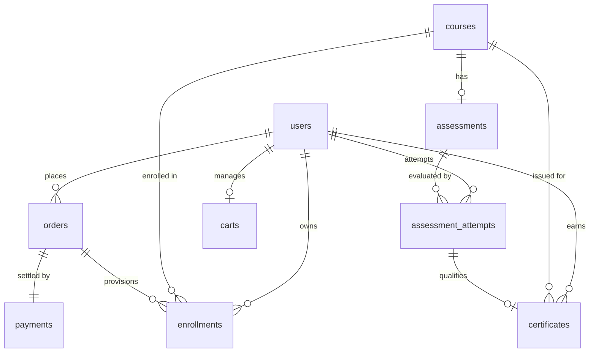
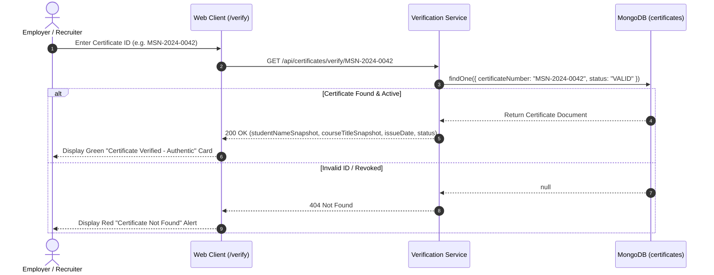
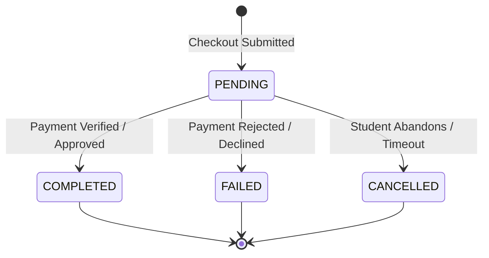
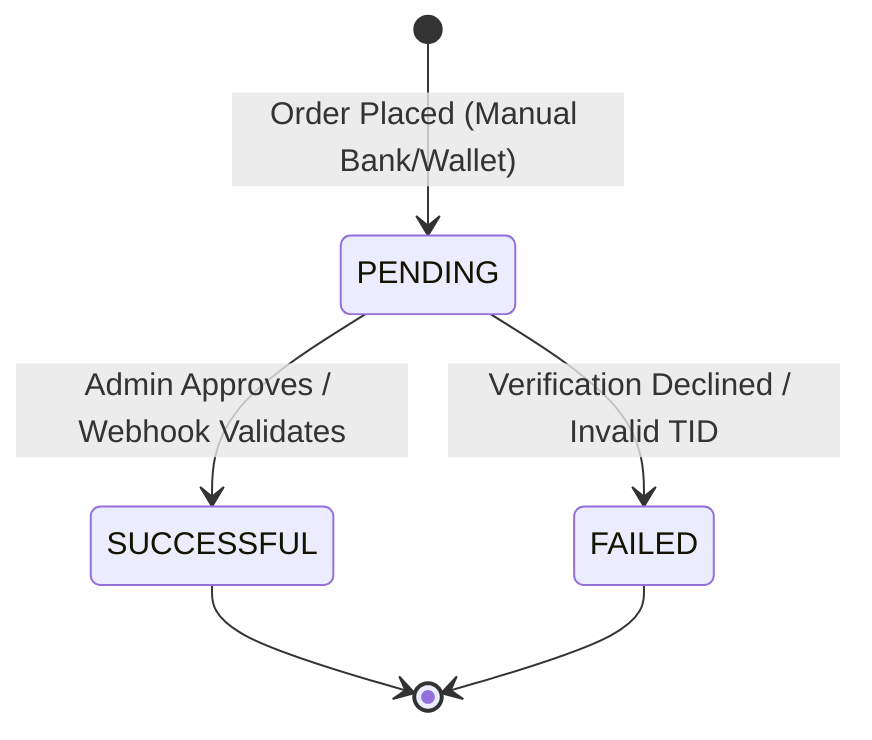
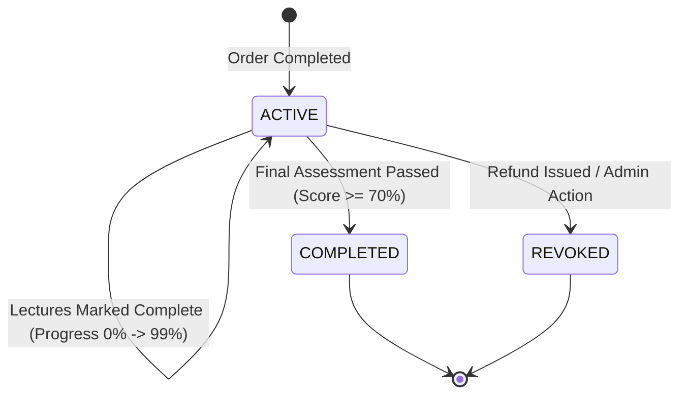
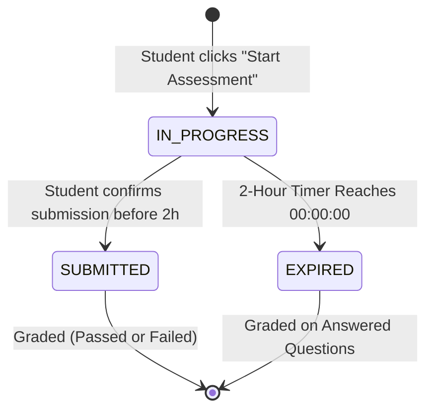

# Database Design Document
# MSN Academy — Vocational & Technology Learning Management System

---

## 1. Document Information

* **Project Name:** MSN Academy
* **Document Name:** Database Design Document & MongoDB Data Model Specification
* **File Identifier:** `02-Database-Design.md`
* **Version:** 1.0.0 (Baseline Architecture)
* **Date:** September 08, 2026
* **Status:** Complete / Approved for Engineering Implementation
* **Author / Role:** Senior Database Architect & Lead MongoDB Data Modeler
* **Target Technology Stack:** 
  * Runtime: Node.js (LTS)
  * Framework: Express.js
  * Database: MongoDB (v7.0+ Community / Atlas Replica Set)
  * Object Data Modeling (ODM): Mongoose (v8.x)
* **Purpose:**
  This document establishes the official database architecture and physical data models for the MSN Academy Learning Management System (LMS). It translates all functional requirements, UI/UX screens, and business logic identified in [`01-PRD.md`](file:///c:/Users/HS%20LAPTOP/Downloads/MSN%20Academy%20project/01-PRD.md) into an optimized, robust, secure, and production-grade MongoDB schema design. It serves as the single source of truth for database engineers and backend developers implementing Mongoose models, data validations, indexes, and transactions.

---

## 2. Database Architecture Overview

### 2.1 Why MongoDB is Appropriate for MSN Academy
MongoDB is ideally suited for MSN Academy for the following architectural reasons:
1. **Hierarchical Document Affinity:** Educational curricula naturally represent hierarchical, tree-structured domain objects (Course $\rightarrow$ Modules $\rightarrow$ Lectures $\rightarrow$ Downloadable Resources). Document models allow co-locating tightly coupled sub-documents, enabling single-read retrieval of complete course syllabi without multi-table relational joins.
2. **Polymorphic Content Delivery:** Educational lessons contain variable metadata (video runtimes, downloadable PDFs, exercise ZIPs, Excel sheets, and external reading guides). MongoDB's flexible schema handles evolving media attributes effortlessly.
3. **High Read-to-Write Ratio:** The student learning journey is overwhelmingly read-intensive (catalog browsing, syllabus inspection, streaming video, reviewing notes). MongoDB's document model and secondary indexing engine provide sub-millisecond query execution on indexed compound paths.
4. **Atomic In-Document Updates:** Operations such as appending a completed lecture to an enrollment record, toggling an exam question flag, or updating lesson progress are natively executed using atomic array operators (`$addToSet`, `$push`, `$set`), eliminating complex multi-row locking overhead.
5. **ACID Transaction Support:** MongoDB multi-document transactions guarantee absolute consistency across commercial checkouts, payment state mutations, and enrollment grants.

### 2.2 Major Data Domains
The database is structured around five core operational domains:
* **Identity & Security Domain:** User accounts, credentials, OAuth providers, profile metadata, and notification settings.
* **Curriculum & Content Domain:** Courses, modules, lectures, video metadata, downloadable files, and instructor credentials.
* **Commerce & Transaction Domain:** Shopping carts, promo vouchers, orders, billing details, and payment audit logs.
* **Learning & Progress Domain:** Course enrollments, lesson completion status, and aggregate progress metrics.
* **Evaluation & Trust Registry Domain:** Assessments, question banks, examination attempt logs, digital certificates, and the public verification registry.

### 2.3 High-Level Data Flow Architecture

```mermaid
graph TD
    %% Identity Domain
    subgraph Identity Domain
        User[User Document]
    end

    %% Commerce Domain
    subgraph Commerce Domain
        Cart[Cart Document]
        Order[Order Document]
        Payment[Payment Document]
    end

    %% Curriculum Domain
    subgraph Curriculum Domain
        Course[Course Document]
        Module[Embedded Modules]
        Lecture[Embedded Lectures & Resources]
    end

    %% Learning Domain
    subgraph Learning Domain
        Enrollment[Enrollment Document]
        Progress[Embedded Lesson Progress Array]
    end

    %% Evaluation & Credential Domain
    subgraph Evaluation & Credential Domain
        Assessment[Assessment Document]
        Question[Embedded Question Bank]
        Attempt[Assessment Attempt Document]
        Certificate[Certificate Document]
        PublicVerify[Public Verification Registry /verify]
    end

    %% Interactions
    User -->|Adds items| Cart
    Cart -->|Checks out| Order
    Order -->|Generates| Payment
    Payment -->|When Verified / Paid| Enrollment
    User -->|Owns| Enrollment
    Enrollment -->|References| Course
    Course *-- Module
    Module *-- Lecture
    Enrollment *-- Progress

    %% Learning to Assessment
    Enrollment -->|When 100% Complete| Assessment
    Assessment *-- Question
    User -->|Initiates| Attempt
    Attempt -->|Evaluates against| Assessment
    Attempt -->|If Score >= 70%| Certificate
    User -->|Owns| Certificate
    Certificate -->|Public Lookup| PublicVerify
```

---

## 3. Database Design Principles

### 3.1 Controlled Denormalization & Hybrid Embedding
* **1-to-Few (Embed):** Where child entities have bounded cardinalities and are always retrieved with the parent (e.g., Course $\rightarrow$ Modules $\rightarrow$ Lectures, Order $\rightarrow$ Order Items, Assessment $\rightarrow$ Questions), entities are embedded as sub-documents. This maximizes query locality and guarantees that a single document fetch fulfills all UI requirements for that screen.
* **1-to-Many / 1-to-Squillions (Reference):** Where collections experience independent lifecycles, unbounded growth, or cross-domain querying (e.g., User $\rightarrow$ Enrollments, User $\rightarrow$ Orders, Assessment $\rightarrow$ Attempts), clean 12-byte `ObjectId` references are utilized.

### 3.2 Immutability of Financial & Credential Records
* **Snapshots Over References:** In `orders` and `certificates`, student names, course titles, and price amounts are copied as immutable string snapshots at transaction/issuance time. Subsequent price changes or student profile edits will never mutate historical financial ledgers or issued credentials.

### 3.3 Strict Schema Validation
* Even within MongoDB's schema-less engine, strict Mongoose schemas and MongoDB JSON Schema Validators (`$jsonSchema`) enforce required attributes, data types, string trimming, lowercase email normalization, regex formats (e.g., Pakistani phone numbers and Certificate IDs), and finite enumeration constraints.

### 3.4 Defensive Indexing
* Indexes are designed strictly according to identified UI access patterns. Single-field and compound indexes support query filtering, sorting, and unique key constraints. Redundant indexes are eliminated to minimize write latency and RAM overhead.

### 3.5 Comprehensive Auditability & Soft Deletes
* Every root document includes automated timestamps (`createdAt`, `updatedAt`).
* Core content and user entities implement soft-delete mechanisms (`isDeleted: Boolean`, `deletedAt: Date`) to preserve relational integrity and transactional audit trails.

---

## 4. Complete Collection Inventory

All collections are named in lower-case, pluralized English (`snake_case` or single words) following standard MongoDB conventions.

| Collection Name | Purpose | Domain / Owner | Priority | PRD Traceability |
| :--- | :--- | :--- | :---: | :--- |
| **`users`** | Stores student identity, credentials, OAuth bindings, contact info, and profile settings. | Identity | Must Have | FR-AUTH-001, FR-AUTH-002, FR-AUTH-003, FR-PROF-001, FR-PROF-004 |
| **`courses`** | Master catalog of vocational courses containing curriculum trees (modules, lectures, resources). | Curriculum | Must Have | FR-DISC-001, FR-DISC-002, FR-LRN-003, FR-LRN-004 |
| **`carts`** | Manages transient course selections, promo codes, and pricing subtotals prior to checkout. | Commerce | Must Have | FR-COMM-001, FEAT-CART-01, FEAT-CART-02, FEAT-CART-03 |
| **`orders`** | Canonical commercial ledger tracking course purchases, guest/student billing, and financial totals. | Commerce | Must Have | FR-COMM-002, FR-COMM-003, FEAT-ORD-01 |
| **`payments`** | Detailed transaction logs for payment attempts (Bank Transfer, Easypaisa, JazzCash) and verification audits. | Commerce | Must Have | FR-COMM-002, FR-PAY-001, FR-PAY-002, FR-PAY-003 |
| **`enrollments`** | Links student to an unlocked course, storing lecture completion progress and assessment eligibility. | Learning | Must Have | FR-LRN-001, FR-LRN-002, FR-LRN-005, BR-02, BR-06 |
| **`assessments`** | Stores course examination configurations (2-hour timer, 70% passing mark) and embedded question banks. | Evaluation | Must Have | FR-ASS-001, FR-ASS-002, BR-07, BR-08 |
| **`assessment_attempts`** | Immutable logs of student exam sessions, question responses, flagging states, timers, and scores. | Evaluation | Must Have | FR-ASS-002, FR-ASS-003, FR-ASS-004, FR-ASS-005 |
| **`certificates`** | Stores officially issued digital credentials, verification tokens, founder signatures, and QR codes. | Credential | Must Have | FR-CERT-001, FR-CERT-002, BR-09, BR-10 |
| **`contact_inquiries`** | Captures lead and inquiry submissions sent through the public Contact Us form. | Engagement | Should Have | FR-MISC-001, FEAT-MISC-01 |

---

## 5. Detailed Collection Schemas

---

### 5.1 Collection: `users`

#### Purpose
Maintains student accounts, authentication credentials (passwords, OAuth tokens), profile contact information, and account settings. Supports both registered students and accounts provisioned automatically during Guest Checkout.

#### Schema Definition

| Field Name | Type | Required | Unique | Default | Description & Validation Rules |
| :--- | :--- | :---: | :---: | :---: | :--- |
| **`_id`** | `ObjectId` | Yes | Yes | Auto | MongoDB unique primary key. |
| **`firstName`** | `String` | Yes | No | - | Student's given name. Trimmed, 2–50 chars. |
| **`lastName`** | `String` | Yes | No | - | Student's surname. Trimmed, 2–50 chars. |
| **`email`** | `String` | Yes | Yes | - | Primary login identifier. Lowercase, trimmed, RFC 5322 regex validated. |
| **`passwordHash`** | `String` | No* | No | - | Salted Argon2id / bcrypt hash. *Optional only if registered exclusively via OAuth. |
| **`phoneNumber`** | `String` | Yes | No | - | Mobile phone number. Regex: `^\+92\s?[0-9]{3}\s?[0-9]{7}$`. |
| **`role`** | `String` | Yes | No | `'STUDENT'` | Finite enum: `['STUDENT', 'ADMIN']`. *(Admin role reserved for back-office manual payment approvals).* |
| **`avatarUrl`** | `String` | No | No | `null` | URL path to stored profile image. Defaults to null (system displays initial avatar). |
| **`authProviders`** | `Array of Subdocs`| No | No | `[]` | Tracks linked authentication providers (Google, Apple, Local). |
| **`authProviders.provider`** | `String` | Yes | No | - | Enum: `['LOCAL', 'GOOGLE', 'APPLE']`. |
| **`authProviders.providerId`** | `String` | Yes | No | - | Unique sub/id string issued by OAuth provider. |
| **`preferences`** | `Subdocument` | Yes | No | `{}` | Student workspace configuration. |
| **`preferences.emailNotifications`** | `Boolean` | Yes | No | `true` | Toggle switch mapped to Student Profile UI: Course updates & announcements. |
| **`accountStatus`** | `String` | Yes | No | `'ACTIVE'` | Enum: `['ACTIVE', 'PENDING_VERIFICATION', 'SUSPENDED']`. |
| **`isGuestProvisioned`** | `Boolean` | Yes | No | `false` | Flag indicating account was auto-created during guest checkout. |
| **`passwordResetToken`** | `String` | No | No | `null` | Hashed cryptographic token for password recovery (TBC). |
| **`passwordResetExpires`** | `Date` | No | No | `null` | Timestamp when password reset token expires. |
| **`lastLoginAt`** | `Date` | No | No | `null` | Audit timestamp of most recent successful login. |
| **`isDeleted`** | `Boolean` | Yes | No | `false` | Soft-delete flag. |
| **`deletedAt`** | `Date` | No | No | `null` | Timestamp when account was deactivated. |
| **`createdAt`** | `Date` | Yes | No | Auto | Automated Mongoose audit timestamp. |
| **`updatedAt`** | `Date` | Yes | No | Auto | Automated Mongoose audit timestamp. |

---

### 5.2 Collection: `courses`

#### Purpose
Stores the complete catalog of educational offerings, commercial pricing, marketing metadata, instructor credentials, and the hierarchical syllabus (embedded modules and lectures).

#### Schema Definition

| Field Name | Type | Required | Unique | Default | Description & Validation Rules |
| :--- | :--- | :---: | :---: | :---: | :--- |
| **`_id`** | `ObjectId` | Yes | Yes | Auto | MongoDB unique primary key. |
| **`title`** | `String` | Yes | Yes | - | Full course title (e.g., "Data Analytics", "UI/UX Design"). Trimmed. |
| **`slug`** | `String` | Yes | Yes | - | URL-friendly slug (e.g., "data-analytics"). Lowercase, indexed. |
| **`category`** | `String` | Yes | No | - | Enum: `['Data Science', 'Artificial Intelligence', 'Design', 'Web Development', 'Marketing', 'Productivity']`. |
| **`level`** | `String` | Yes | No | `'All Levels'` | Enum: `['All Levels', 'Beginner', 'Intermediate', 'Advanced', 'Job Ready']`. |
| **`badge`** | `String` | No | No | `null` | Visual UI ribbon badge: `['Bestseller', 'Design', 'Job Ready', 'Advanced', 'Coming Soon', null]`. |
| **`shortDescription`** | `String` | Yes | No | - | 1–2 sentence summary used on catalog cards and pricing grids. |
| **`fullDescription`** | `String` | Yes | No | - | Long-form course summary rendered on Course Details page. |
| **`price`** | `Number` | Yes | No | - | One-time purchase fee in PKR (e.g., `15000`). Minimum: `0`. |
| **`currency`** | `String` | Yes | No | `'PKR'` | Currency ISO code. Strictly `'PKR'` for domestic scope. |
| **`thumbnailUrl`** | `String` | Yes | No | - | Image asset URL for catalog cards and video posters. |
| **`previewVideoUrl`** | `String` | No | No | `null` | Public stream URL for course trailer video. |
| **`durationHours`** | `Number` | Yes | No | `0` | Aggregate estimated video runtime (e.g., `38` hours). |
| **`totalLessonsCount`**| `Number` | Yes | No | `0` | Total lessons count cached for fast card rendering (e.g., `42`). |
| **`enrolledStudentsCount`** | `Number` | Yes | No | `0` | Aggregate enrolled student count (e.g., `100`+). |
| **`rating`** | `Number` | Yes | No | `5.0` | Average student rating (e.g., `4.8`). Range: `1.0` to `5.0`. |
| **`instructor`** | `Subdocument` | Yes | No | - | Embedded instructor metadata. |
| **`instructor.name`** | `String` | Yes | No | - | Full name (e.g., "Muhammad Saad N." or "MSN Academy Instructor"). |
| **`instructor.title`** | `String` | Yes | No | - | Designation (e.g., "Senior Data Analyst & Educator"). |
| **`instructor.bio`** | `String` | Yes | No | - | Professional background narrative. |
| **`instructor.avatarUrl`** | `String` | No | No | `null` | Profile photo URL. |
| **`whatYouWillLearn`** | `Array of Strings`| Yes | No | `[]` | List of learning outcome bullets (e.g., "Build professional dashboards in Power BI"). |
| **`requirements`** | `Array of Strings`| Yes | No | `[]` | List of prerequisites (e.g., "Basic computer proficiency"). |
| **`modules`** | `Array of Subdocs`| Yes | No | `[]` | Hierarchical modules array (ordered sequence). |
| **`modules._id`** | `ObjectId` | Yes | Yes | Auto | Unique module identifier. |
| **`modules.title`** | `String` | Yes | No | - | Module title (e.g., "Module 1: Introduction & Fundamentals"). |
| **`modules.order`** | `Number` | Yes | No | `1` | 1-based sequential display order. |
| **`modules.lectures`** | `Array of Subdocs`| Yes | No | `[]` | Hierarchical lessons array within module. |
| **`modules.lectures._id`** | `ObjectId` | Yes | Yes | Auto | Unique lecture identifier. Referenced by progress records. |
| **`modules.lectures.title`** | `String` | Yes | No | - | Lesson title (e.g., "Setting Up Your Environment"). |
| **`modules.lectures.order`** | `Number` | Yes | No | `1` | 1-based sequential display order within module. |
| **`modules.lectures.durationMinutes`** | `Number` | Yes | No | `0` | Video runtime in minutes (e.g., `12`). |
| **`modules.lectures.videoStreamUrl`** | `String` | Yes | No | - | Protected streaming URL (e.g., Cloudflare Stream / Vimeo OTT). |
| **`modules.lectures.description`** | `String` | No | No | `""` | Detailed lecture notes rendered below video player. |
| **`modules.lectures.keyTopics`** | `Array of Strings`| No | No | `[]` | Bullet list of core takeaways (rendered on mobile lecture view). |
| **`modules.lectures.resources`** | `Array of Subdocs`| No | No | `[]` | Downloadable attachment metadata. |
| **`modules.lectures.resources._id`** | `ObjectId` | Yes | Yes | Auto | Attachment identifier. |
| **`modules.lectures.resources.title`** | `String` | Yes | No | - | File display name (e.g., "Exercise Files.zip", "Lesson Notes.pdf"). |
| **`modules.lectures.resources.fileUrl`** | `String` | Yes | No | - | Secure file storage download URL (e.g., S3/R2). |
| **`modules.lectures.resources.fileSize`** | `String` | Yes | No | - | Human-readable file size (e.g., "8.1 MB", "2.4 MB"). |
| **`modules.lectures.resources.fileType`** | `String` | Yes | No | - | MIME category (e.g., "pdf", "zip", "xlsx"). |
| **`status`** | `String` | Yes | No | `'DRAFT'` | Enum: `['DRAFT', 'PUBLISHED', 'COMING_SOON', 'ARCHIVED']`. |
| **`isDeleted`** | `Boolean` | Yes | No | `false` | Soft-delete flag. |
| **`deletedAt`** | `Date` | No | No | `null` | Timestamp when course was soft-deleted. |
| **`createdAt`** | `Date` | Yes | No | Auto | Audit timestamp. |
| **`updatedAt`** | `Date` | Yes | No | Auto | Audit timestamp. |

---

### 5.3 Collection: `carts`

#### Purpose
Maintains transient course selections, active coupon discounts, and pricing totals for learners prior to checkout. Supports both authenticated students and guest sessions.

#### Schema Definition

| Field Name | Type | Required | Unique | Default | Description & Validation Rules |
| :--- | :--- | :---: | :---: | :---: | :--- |
| **`_id`** | `ObjectId` | Yes | Yes | Auto | MongoDB unique primary key. |
| **`userId`** | `ObjectId` | No* | No | `null` | Reference to `users._id`. *Null for guest carts. |
| **`guestSessionId`** | `String` | No* | No | `null` | UUID stored in client cookie for guest visitor carts. |
| **`items`** | `Array of Subdocs`| Yes | No | `[]` | Courses currently added to cart. |
| **`items.courseId`** | `ObjectId` | Yes | No | - | Reference to `courses._id`. |
| **`items.priceAtAddition`** | `Number` | Yes | No | - | Snapshot of price in PKR when added. |
| **`appliedPromoCode`** | `Subdocument` | No | No | `null` | Applied discount coupon details. |
| **`appliedPromoCode.code`** | `String` | Yes | No | - | Uppercase code string (e.g., "LAUNCH20"). |
| **`appliedPromoCode.discountType`** | `String` | Yes | No | - | Enum: `['PERCENTAGE', 'FIXED_AMOUNT']`. |
| **`appliedPromoCode.discountValue`**| `Number` | Yes | No | - | Numerical value of discount (e.g., 20 or 2000). |
| **`expiresAt`** | `Date` | Yes | No | - | TTL expiration date (e.g., 14 days after creation). |
| **`createdAt`** | `Date` | Yes | No | Auto | Audit timestamp. |
| **`updatedAt`** | `Date` | Yes | No | Auto | Audit timestamp. |

---

### 5.4 Collection: `orders`

#### Purpose
Serves as the legal and financial ledger for all course purchases. Stores immutable snapshots of items, billing contact details, payment status, and order tracking numbers (`MSN-ORD-XXX`).

#### Schema Definition

| Field Name | Type | Required | Unique | Default | Description & Validation Rules |
| :--- | :--- | :---: | :---: | :---: | :--- |
| **`_id`** | `ObjectId` | Yes | Yes | Auto | MongoDB unique primary key. |
| **`orderNumber`** | `String` | Yes | Yes | - | Human-readable sequential ID (e.g., `"MSN-ORD-001"`). Formatted regex: `^MSN-ORD-[0-9]{3,}$`. |
| **`userId`** | `ObjectId` | Yes | No | - | Reference to `users._id`. (Identifies registered user or guest-provisioned user). |
| **`accountMode`** | `String` | Yes | No | `'GUEST'` | Enum: `['GUEST', 'REGISTERED']` mapped to checkout selector tabs. |
| **`billingInfo`** | `Subdocument` | Yes | No | - | Snapshot of customer billing details entered at checkout. |
| **`billingInfo.firstName`** | `String` | Yes | No | - | First name string. |
| **`billingInfo.lastName`** | `String` | Yes | No | - | Last name string. |
| **`billingInfo.email`** | `String` | Yes | No | - | Notification destination email. |
| **`billingInfo.phoneNumber`** | `String` | Yes | No | - | Contact phone number (`+92...`). |
| **`items`** | `Array of Subdocs`| Yes | No | - | Immutable snapshot of purchased courses. |
| **`items.courseId`** | `ObjectId` | Yes | No | - | Reference to `courses._id`. |
| **`items.courseTitle`**| `String` | Yes | No | - | Title snapshot at time of purchase. |
| **`items.price`** | `Number` | Yes | No | - | Unit price paid in PKR. |
| **`subtotalAmount`** | `Number` | Yes | No | - | Total price before discounts. |
| **`discountAmount`** | `Number` | Yes | No | `0` | Promo coupon deduction amount in PKR. |
| **`totalAmount`** | `Number` | Yes | No | - | Net payable amount in PKR (e.g., `29000`). |
| **`currency`** | `String` | Yes | No | `'PKR'` | Currency code. |
| **`status`** | `String` | Yes | No | `'PENDING'` | Finite enum: `['PENDING', 'COMPLETED', 'FAILED', 'CANCELLED']`. |
| **`agreedToTerms`** | `Boolean` | Yes | No | `true` | Legal compliance flag: Terms of Use and Refund Policy acceptance. |
| **`createdAt`** | `Date` | Yes | No | Auto | Audit timestamp. |
| **`updatedAt`** | `Date` | Yes | No | Auto | Audit timestamp. |

---

### 5.5 Collection: `payments`

#### Purpose
Stores distinct payment lifecycle records for orders. Designed to remain payment-rail agnostic while accommodating manual verification workflows (Bank Transfer, Easypaisa, JazzCash) and automated gateway callbacks.

#### Schema Definition

| Field Name | Type | Required | Unique | Default | Description & Validation Rules |
| :--- | :--- | :---: | :---: | :---: | :--- |
| **`_id`** | `ObjectId` | Yes | Yes | Auto | MongoDB unique primary key. |
| **`orderId`** | `ObjectId` | Yes | No | - | Reference to `orders._id`. |
| **`userId`** | `ObjectId` | Yes | No | - | Reference to `users._id`. |
| **`paymentMethod`** | `String` | Yes | No | - | Enum: `['BANK_TRANSFER', 'EASYPAISA', 'JAZZCASH']`. |
| **`amount`** | `Number` | Yes | No | - | Amount payable in PKR. Matches `order.totalAmount`. |
| **`currency`** | `String` | Yes | No | `'PKR'` | Currency identifier. |
| **`status`** | `String` | Yes | No | `'PENDING'` | Enum: `['PENDING', 'SUCCESSFUL', 'FAILED']`. |
| **`transactionReference`**| `String` | No | No | `null` | External bank transaction ID or mobile wallet sender TID provided by student. |
| **`proofAttachmentUrl`** | `String` | No | No | `null` | S3 URL of uploaded bank deposit slip or screenshot (if submitted). |
| **`verificationNotes`** | `String` | No | No | `null` | Administrative review notes during manual 24-hour verification window. |
| **`verifiedBy`** | `ObjectId` | No | No | `null` | Reference to `users._id` (Admin user who approved payment). |
| **`verifiedAt`** | `Date` | No | No | `null` | Timestamp when payment was approved. |
| **`gatewayResponse`** | `Object` | No | No | `{}` | Raw payload/webhook response stored safely for audit trails. |
| **`createdAt`** | `Date` | Yes | No | Auto | Audit timestamp. |
| **`updatedAt`** | `Date` | Yes | No | Auto | Audit timestamp. |

---

### 5.6 Collection: `enrollments`

#### Purpose
Tracks student ownership of courses, granular lecture-by-lecture completion progress, sequential lock progression, and eligibility for the course final assessment.

#### Schema Definition

| Field Name | Type | Required | Unique | Default | Description & Validation Rules |
| :--- | :--- | :---: | :---: | :---: | :--- |
| **`_id`** | `ObjectId` | Yes | Yes | Auto | MongoDB unique primary key. |
| **`userId`** | `ObjectId` | Yes | No | - | Reference to `users._id`. |
| **`courseId`** | `ObjectId` | Yes | No | - | Reference to `courses._id`. Compound unique with `userId`. |
| **`orderId`** | `ObjectId` | Yes | No | - | Reference to originating `orders._id`. |
| **`status`** | `String` | Yes | No | `'ACTIVE'` | Enum: `['ACTIVE', 'COMPLETED', 'REVOKED']`. |
| **`enrolledAt`** | `Date` | Yes | No | Auto | Timestamp when course access was granted. |
| **`completedAt`** | `Date` | No | No | `null` | Timestamp when final assessment was passed and course completed. |
| **`progressPercentage`**| `Number` | Yes | No | `0` | Calculated integer percentage: `(completedLectures / totalLessons) * 100`. |
| **`completedLectures`** | `Array of Subdocs`| Yes | No | `[]` | Array of completed lesson completion records. |
| **`completedLectures.lectureId`**| `ObjectId`| Yes | No | - | Matches `courses.modules.lectures._id`. |
| **`completedLectures.completedAt`**| `Date` | Yes | No | Auto | Timestamp when student clicked `Mark as Complete`. |
| **`lastAccessedLectureId`** | `ObjectId` | No | No | `null` | Identifier of active lesson used by `Resume Lesson` dashboard CTA. |
| **`assessmentStatus`** | `String` | Yes | No | `'LOCKED'` | Enum: `['LOCKED', 'ELIGIBLE', 'IN_PROGRESS', 'PASSED', 'FAILED']`. |
| **`createdAt`** | `Date` | Yes | No | Auto | Audit timestamp. |
| **`updatedAt`** | `Date` | Yes | No | Auto | Audit timestamp. |

---

### 5.7 Collection: `assessments`

#### Purpose
Stores the formal examination definition, time limit, passing rules, and question bank for a course's final assessment.

#### Schema Definition

| Field Name | Type | Required | Unique | Default | Description & Validation Rules |
| :--- | :--- | :---: | :---: | :---: | :--- |
| **`_id`** | `ObjectId` | Yes | Yes | Auto | MongoDB unique primary key. |
| **`courseId`** | `ObjectId` | Yes | Yes | - | Reference to `courses._id`. Exactly one assessment per course. |
| **`title`** | `String` | Yes | No | - | Assessment title (e.g., "Course Assessment: Data Analytics"). |
| **`passMarkPercentage`**| `Number` | Yes | No | `70` | Strictly `70`% as confirmed in UI/PRD. |
| **`timeLimitMinutes`** | `Number` | Yes | No | `120` | Strictly `120` minutes (2 Hours) as confirmed in UI/PRD. |
| **`maxAttempts`** | `Number` | No | No | `null` | Null represents unlimited retake attempts. |
| **`questionType`** | `String` | Yes | No | `'MCQ_ONLY'` | Finite enum: `['MCQ_ONLY']`. |
| **`questions`** | `Array of Subdocs`| Yes | No | `[]` | Bounded question bank array (10–30 questions). |
| **`questions._id`** | `ObjectId` | Yes | Yes | Auto | Unique question identifier. |
| **`questions.questionNumber`**| `Number`| Yes | No | - | Sequential index (e.g., 1 to 10 or 1 to 30). |
| **`questions.questionText`** | `String` | Yes | No | - | Question narrative. Trimmed string. |
| **`questions.options`** | `Array of Subdocs`| Yes | No | - | Strictly 4 options per question. |
| **`questions.options.key`** | `String` | Yes | No | - | Enum: `['A', 'B', 'C', 'D']`. |
| **`questions.options.text`** | `String` | Yes | No | - | Text description of the answer option. |
| **`questions.correctOptionKey`**| `String`| Yes | No | - | Secret key: `['A', 'B', 'C', 'D']`. **Never sent to student clients.** |
| **`status`** | `String` | Yes | No | `'ACTIVE'` | Enum: `['ACTIVE', 'INACTIVE']`. |
| **`createdAt`** | `Date` | Yes | No | Auto | Audit timestamp. |
| **`updatedAt`** | `Date` | Yes | No | Auto | Audit timestamp. |

---

### 5.8 Collection: `assessment_attempts`

#### Purpose
Stores individual student testing sessions, live responses, question flags, elapsed time, computed scores, and pass/fail evaluations.

#### Schema Definition

| Field Name | Type | Required | Unique | Default | Description & Validation Rules |
| :--- | :--- | :---: | :---: | :---: | :--- |
| **`_id`** | `ObjectId` | Yes | Yes | Auto | MongoDB unique primary key. |
| **`assessmentId`** | `ObjectId` | Yes | No | - | Reference to `assessments._id`. |
| **`courseId`** | `ObjectId` | Yes | No | - | Reference to `courses._id`. |
| **`userId`** | `ObjectId` | Yes | No | - | Reference to `users._id`. |
| **`attemptNumber`** | `Number` | Yes | No | `1` | Sequential attempt counter (1, 2, 3...). |
| **`startedAt`** | `Date` | Yes | No | Auto | Timestamp when student clicked `Start Assessment`. |
| **`expiresAt`** | `Date` | Yes | No | - | Absolute server deadline: `startedAt + 120 minutes`. |
| **`submittedAt`** | `Date` | No | No | `null` | Timestamp when student clicked `Yes, Submit Now` or timer expired. |
| **`timeTakenSeconds`** | `Number` | No | No | `null` | Total elapsed duration (e.g., 4920s $\rightarrow$ `1h 22m`). |
| **`status`** | `String` | Yes | No | `'IN_PROGRESS'`| Enum: `['IN_PROGRESS', 'SUBMITTED', 'EXPIRED']`. |
| **`responses`** | `Array of Subdocs`| Yes | No | `[]` | Array of answers recorded during test. |
| **`responses.questionId`** | `ObjectId` | Yes | No | - | Reference to `assessments.questions._id`. |
| **`responses.selectedOptionKey`**| `String`| No | No | `null` | Option selected: `['A', 'B', 'C', 'D', null]`. Null if unanswered. |
| **`responses.isFlagged`** | `Boolean` | Yes | No | `false` | True if question marked with `Flag for Review`. |
| **`responses.answeredAt`** | `Date` | No | No | `null` | Timestamp of latest answer update. |
| **`totalQuestions`** | `Number` | Yes | No | - | Total questions in attempt (e.g., 10 or 30). |
| **`answeredCount`** | `Number` | Yes | No | `0` | Total answered questions count. |
| **`unansweredCount`** | `Number` | Yes | No | `0` | Total unattempted questions count. |
| **`flaggedCount`** | `Number` | Yes | No | `0` | Total flagged questions count. |
| **`correctAnswersCount`**| `Number` | No | No | `null` | Number of correct answers evaluated upon submission (e.g., `8`). |
| **`scorePercentage`** | `Number` | No | No | `null` | Evaluated score: `(correct / total) * 100` (e.g., `82`). |
| **`passed`** | `Boolean` | No | No | `null` | True if `scorePercentage >= 70`. False otherwise. |
| **`createdAt`** | `Date` | Yes | No | Auto | Audit timestamp. |
| **`updatedAt`** | `Date` | Yes | No | Auto | Audit timestamp. |

---

### 5.9 Collection: `certificates`

#### Purpose
Stores officially granted digital completion credentials, unique identification numbers, student name snapshots, founder signature records, and verification QR links.

#### Schema Definition

| Field Name | Type | Required | Unique | Default | Description & Validation Rules |
| :--- | :--- | :---: | :---: | :---: | :--- |
| **`_id`** | `ObjectId` | Yes | Yes | Auto | MongoDB unique primary key. |
| **`certificateNumber`** | `String` | Yes | Yes | - | Public identification number (e.g., `"MSN-2024-0042"` or `"MSN-DEMO-0001"`). |
| **`verificationCode`** | `String` | Yes | Yes | - | Cryptographic URL slug used in verification endpoints. |
| **`userId`** | `ObjectId` | Yes | No | - | Reference to `users._id` (credential holder). |
| **`courseId`** | `ObjectId` | Yes | No | - | Reference to `courses._id`. |
| **`assessmentAttemptId`**| `ObjectId`| Yes | Yes | - | Reference to `assessment_attempts._id` qualifying this issuance. |
| **`studentNameSnapshot`**| `String` | Yes | No | - | Immutable full name at issuance (e.g., "Ahmed Hassan"). |
| **`courseTitleSnapshot`**| `String` | Yes | No | - | Immutable course name at issuance (e.g., "Data Analytics"). |
| **`scoreAchieved`** | `Number` | Yes | No | - | Passing score achieved (e.g., `82`). |
| **`issueDate`** | `Date` | Yes | No | Auto | Official certification issuance date. |
| **`founderSignature`** | `String` | Yes | No | `'M. Suleman Naqvi'`| Authority signatory snapshot. |
| **`qrCodeUrl`** | `String` | Yes | No | - | Stored S3 / CDN URL of rendered QR code graphic. |
| **`pdfDownloadUrl`** | `String` | No | No | `null` | S3 URL of pre-rendered vector PDF certificate. |
| **`status`** | `String` | Yes | No | `'VALID'` | Enum: `['VALID', 'REVOKED']`. |
| **`isDeleted`** | `Boolean` | Yes | No | `false` | Soft delete flag. |
| **`createdAt`** | `Date` | Yes | No | Auto | Audit timestamp. |
| **`updatedAt`** | `Date` | Yes | No | Auto | Audit timestamp. |

---

### 5.10 Collection: `contact_inquiries`

#### Purpose
Stores messages submitted via the public Contact Us form (`Contact.png`), tracking lead requests and customer support interactions.

#### Schema Definition

| Field Name | Type | Required | Unique | Default | Description & Validation Rules |
| :--- | :--- | :---: | :---: | :---: | :--- |
| **`_id`** | `ObjectId` | Yes | Yes | Auto | MongoDB unique primary key. |
| **`fullName`** | `String` | Yes | No | - | Sender full name. 2–100 characters. |
| **`email`** | `String` | Yes | No | - | Sender reply-to email address. |
| **`subject`** | `String` | Yes | No | - | Inquiry title / topic. |
| **`message`** | `String` | Yes | No | - | Detailed query body. 10–2000 characters. |
| **`status`** | `String` | Yes | No | `'NEW'` | Enum: `['NEW', 'IN_PROGRESS', 'RESOLVED']`. |
| **`resolvedAt`** | `Date` | No | No | `null` | Timestamp when inquiry was addressed. |
| **`createdAt`** | `Date` | Yes | No | Auto | Audit timestamp. |

---

## 6. Relationships Between Collections

### 6.1 Entity-Relationship (ER) Diagram



### 6.2 Detailed Relationship Specifications

| Origin Entity | Target Entity | Relationship Type | Key / Referencing Field | Architectural Rationale & Strategy |
| :--- | :--- | :---: | :--- | :--- |
| **`users`** $\rightarrow$ **`enrollments`** | 1-to-Many | `enrollments.userId` | **Referenced:** A student can enroll in multiple courses over time; enrollments contain mutable progress arrays and must not bloat the `users` document. |
| **`courses`** $\rightarrow$ **`enrollments`** | 1-to-Many | `enrollments.courseId` | **Referenced:** Thousands of students enroll in a single course; storing student arrays inside `courses` would breach MongoDB's 16MB document boundary. |
| **`courses`** $\rightarrow$ **`modules / lectures`** | 1-to-Many | Embedded subdocuments | **Embedded:** Curricula have bounded size (5–10 modules, 20–55 lectures, total document < 60KB). Co-locating enables single-query syllabus rendering. |
| **`users`** $\rightarrow$ **`orders`** | 1-to-Many | `orders.userId` | **Referenced:** Orders represent unbounded commercial transaction records requiring standalone indexing and querying. |
| **`orders`** $\rightarrow$ **`payments`** | 1-to-1 (or 1-to-Few) | `payments.orderId` | **Referenced:** Separates billing ledger state from payment gateway attempts, transaction proofs, and manual verification notes. |
| **`courses`** $\rightarrow$ **`assessments`** | 1-to-1 | `assessments.courseId` | **Referenced:** Each course has exactly one final assessment. Separating the assessment keeps secret answer keys out of public course endpoints. |
| **`assessments`** $\rightarrow$ **`questions`** | 1-to-Many | Embedded subdocuments | **Embedded:** 10–30 MCQs per exam. Embedding ensures atomic retrieval during active test sessions. |
| **`users`** $\rightarrow$ **`assessment_attempts`** | 1-to-Many | `assessment_attempts.userId` | **Referenced:** Students can retake assessments an unlimited number of times; storing attempts in a separate collection prevents unbounded array growth. |
| **`assessment_attempts`** $\rightarrow$ **`certificates`**| 1-to-1 | `certificates.assessmentAttemptId` | **Referenced:** A certificate is cryptographically linked to the specific passing exam attempt that unlocked it. |
| **`users`** $\rightarrow$ **`certificates`** | 1-to-Many | `certificates.userId` | **Referenced:** Allows students to query their earned credentials, while supporting high-speed public verification lookups on `/verify`. |

---

## 7. Referencing vs. Embedding Architectural Decisions

The table below documents the detailed engineering trade-off analysis conducted for every composite structure in the MSN Academy data model:

| Composite Entity | Selected Strategy | Access Patterns & Read/Write Frequency | Data Size & Document Limit Analysis | Duplication Risk & Performance Implications |
| :--- | :---: | :--- | :--- | :--- |
| **Course $\rightarrow$ Modules & Lectures** | **EMBED** | Read heavily during Course Details, Course Overview, and Player navigation. Written infrequently (admin updates). | A 10-module, 60-lecture course with descriptions and file attachments consumes ~45 KB (0.28% of the 16 MB limit). | **Zero duplication.** Eliminates complex multi-collection `$lookup` joins. Delivers entire syllabus tree in a single ultra-fast indexed read. |
| **Course $\rightarrow$ Assessment** | **REFERENCE** | Course catalog and overview are public/frequent reads. Assessment is only accessed after 100% course completion. | Assessment with 30 questions is ~20 KB. | **Security Critical:** Embedding questions in `courses` risks accidentally leaking `correctOptionKey` on public catalog APIs. Separating them enforces strict access control. |
| **Assessment $\rightarrow$ Questions** | **EMBED** | Exam questions are always loaded together when starting a test attempt or generating the question palette. | 10 to 30 MCQs consume ~15 KB. | Question bank is bounded. Single read loads entire exam. Client projection excludes `correctOptionKey`. |
| **Enrollment $\rightarrow$ Lecture Progress** | **EMBED** | Read on every Dashboard and Player load. Updated each time student clicks `Mark as Complete`. | An array of 50 ObjectIds and dates consumes < 2 KB. | Embedded in `enrollments`. Allows atomic update via `$addToSet: { completedLectures: { lectureId, completedAt } }` and atomic progress recalculation. |
| **User $\rightarrow$ Enrollments** | **REFERENCE** | Enrolled courses are queried by `userId` on Dashboard and My Courses. | Over a student's lifetime, enrollments can grow. | Prevents `users` document bloating. Enables straightforward pagination and independent indexing on `userId` + `courseId`. |
| **Order $\rightarrow$ Items** | **EMBED** | Read when viewing Order History or invoice details. Never modified after checkout. | 1 to 5 course items per cart consume < 1 KB. | **Intentional Snapshots:** Stores title and price paid at transaction time. Protects financial audit logs from future course price changes. |
| **Cart $\rightarrow$ Items** | **EMBED** | Read and updated continuously during course discovery and cart drawer interactions. | Maximum 10 items in cart consumes < 2 KB. | Transformed atomically via `$pull` and `$push`. Short lifespan with automatic TTL index cleanup. |
| **Assessment $\rightarrow$ Student Attempts** | **REFERENCE** | Queried when checking retake history or evaluating pass/fail. | Unlimited retakes could produce hundreds of attempts for persistent students. | Unbounded growth risk if embedded. Referencing guarantees predictable document size and isolated evaluation. |

---

## 8. User & Authentication Data Model

### 8.1 Authentication Strategy & Token Storage
* **Credential Authentication:** Email addresses are normalized to lowercase. Passwords are never stored in plaintext and are salted/hashed using Argon2id or bcrypt (cost factor 12).
* **Social OAuth 2.0 Integration:** The `users.authProviders` array stores verified `providerId` strings from Google and Apple. If a user logs in via Google with an email that matches an existing local account, the provider ID is appended to `authProviders` after email ownership is proven.
* **Stateless JWT Tokens:** Authentication relies on signed JSON Web Tokens (JWT) containing `{ userId, role }` transmitted via secure, `HttpOnly`, `SameSite=Strict` cookies. Tokens are **not** stored in the database, preserving stateless horizontal scaling.
* **Password Reset Tokens:** If a student requests password recovery, a cryptographically random 32-byte token is generated, hashed using SHA-256, and stored in `users.passwordResetToken` with an expiry date (`passwordResetExpires = Date.now() + 3600000` [1 hour]). Plaintext tokens are transmitted strictly via email.

---

## 9. Course Data Model

### 9.1 Curriculum Organization
The course model enforces a clean two-tier educational hierarchy matching the UI:
1. **Module:** A logical thematic grouping (e.g., *Module 1: Introduction & Fundamentals*, *Module 2: Data Collection & Cleaning*).
2. **Lecture:** An individual learning unit containing:
   * Video streaming URL (hosted via CDN/HLS).
   * Duration runtime in minutes.
   * Educational narrative text (`description`).
   * Key topic takeaways (`keyTopics`).
   * Downloadable learning attachments (`resources` array containing slides, datasets, and guides).

### 9.2 Course Status Workflow
* `DRAFT`: Under construction; invisible to public catalog.
* `PUBLISHED`: Actively visible, searchable, and purchasable in Course Catalog and Pricing pages.
* `COMING_SOON`: Visible in catalog with disabled CTA and visual ribbon badge (e.g., *AI Automation* in UI). Cannot be added to cart.
* `ARCHIVED`: Hidden from public catalog; preserved for previously enrolled students.

---

## 10. Enrollment & Learning Data Model

### 10.1 Progress Storage Architecture
Progress is encapsulated directly within the `enrollments` collection rather than a detached collection. This eliminates multi-collection joins when rendering the Student Dashboard and My Courses.

### 10.2 Mathematical Progress Calculation
Progress is computed as an integer percentage:
$$\text{progressPercentage} = \operatorname{round}\left( \frac{\text{len}(\text{completedLectures})}{\text{courses.totalLessonsCount}} \times 100 \right)$$

### 10.3 Sequential Lesson Gating Logic
1. When an enrollment is created, `completedLectures` is initialized as empty `[]`, and `progressPercentage` is `0`.
2. Lesson 1 of Module 1 is unlocked by default.
3. When the student clicks `Mark as Complete` on Lecture $N$, the backend atomically executes:
   ```javascript
   // Atomic completion commit
   await Enrollment.updateOne(
     { _id: enrollmentId, "completedLectures.lectureId": { $ne: lectureId } },
     { 
       $push: { completedLectures: { lectureId: lectureId, completedAt: new Date() } },
       $set: { lastAccessedLectureId: lectureId }
     }
   );
   ```
4. If `progressPercentage` reaches `100`, the system automatically mutates `assessmentStatus` from `'LOCKED'` to `'ELIGIBLE'`, triggering the unlocked assessment card on Course Overview (`course overview.png`).

---

## 11. Cart, Order & Payment Data Model

### 11.1 Decoupled Payment Rail Architecture
The commerce domain separates commercial orders (`orders`) from payment settlements (`payments`). This design allows MSN Academy to operate manual payment workflows today (Bank Transfer, Easypaisa, JazzCash) and seamlessly integrate automated API payment gateways tomorrow without altering order data models.

```
┌─────────────────────────────────────────────────────────────┐
│                           Order                             │
│   orderNumber: "MSN-ORD-001"                                │
│   totalAmount: 29000 PKR                                    │
│   status: "PENDING"                                         │
│   items: [Data Analytics, UI/UX Design]                     │
└──────────────────────────────┬──────────────────────────────┘
                               │ 1-to-1 Reference
                               ▼
┌─────────────────────────────────────────────────────────────┐
│                          Payment                            │
│   paymentMethod: "BANK_TRANSFER"                            │
│   status: "PENDING"                                         │
│   transactionReference: "FT-98234110"                       │
│   verifiedBy: null (Awaiting Admin Review)                  │
└─────────────────────────────────────────────────────────────┘
```

### 11.2 State Consistency on Payment Approval
When an administrator validates a manual bank/wallet payment (or an automated webhook callback arrives), a MongoDB multi-document transaction executes:
1. `payments.status` $\rightarrow$ `'SUCCESSFUL'`
2. `orders.status` $\rightarrow$ `'COMPLETED'`
3. For each course item in the order, an active `enrollments` document is created for the buyer.

---

## 12. Assessment Data Model

### 12.1 Exam Session Security & Answer Protection
* The `assessments` collection stores the authoritative answer key (`questions.correctOptionKey`).
* When an assessment session begins, the backend generates an `assessment_attempts` document and returns questions to the client **strictly projecting out** `correctOptionKey`.
* Answer options are submitted to `/api/assessments/submit`. The server computes the score by comparing submitted keys against the database answer key, ensuring zero risk of client-side inspection or tampering.

### 12.2 Real-Time Question Flagging & State Matrix
The `responses` array inside `assessment_attempts` tracks every question's real-time status matching the UI Question Navigator:
* **Current:** Handled in client UI state based on active question index.
* **Answered:** `selectedOptionKey` is not null. (Navigator renders Green).
* **Unanswered:** `selectedOptionKey` is null. (Navigator renders Gray).
* **Flagged:** `isFlagged` is true. (Navigator renders Orange with flag icon).

---

## 13. Certificate Data Model & Verification Engine

### 13.1 Certificate Verification Architecture
The certificate system provides public authenticity validation without exposing private student records.



---

## 14. Indexing Strategy

Every index below has been designed to support high-frequency queries identified in the UI/UX.

| # | Collection | Indexed Field(s) | Index Type | Business / Query Justification |
| :- | :--- | :--- | :---: | :--- |
| **IDX-01** | `users` | `{ email: 1 }` | Unique / B-Tree | High-frequency login and registration duplicate checks. |
| **IDX-02** | `users` | `{ "authProviders.providerId": 1 }`| Sparse / B-Tree | Fast lookup for Google/Apple OAuth callbacks. |
| **IDX-03** | `courses` | `{ slug: 1 }` | Unique / B-Tree | Fast routing for Course Details page (`/courses/:slug`). |
| **IDX-04** | `courses` | `{ status: 1, category: 1, level: 1 }` | Compound / B-Tree | Powers faceted filtering in Course Catalog. |
| **IDX-05** | `courses` | `{ title: "text", shortDescription: "text" }` | Text Index | Powers free-text search bar in Course Catalog. |
| **IDX-06** | `courses` | `{ status: 1, enrolledStudentsCount: -1 }` | Compound / B-Tree | Powers `Most Popular` sorting on public catalog. |
| **IDX-07** | `carts` | `{ userId: 1 }` | B-Tree | Fast cart retrieval for logged-in students. |
| **IDX-08** | `carts` | `{ guestSessionId: 1 }` | B-Tree | Fast cart retrieval for guest shoppers. |
| **IDX-09** | `carts` | `{ expiresAt: 1 }` | TTL Index | Automatically deletes abandoned carts after 14 days. |
| **IDX-10** | `orders` | `{ orderNumber: 1 }` | Unique / B-Tree | Fast lookup for customer receipts and verification. |
| **IDX-11** | `orders` | `{ userId: 1, createdAt: -1 }` | Compound / B-Tree | Powers LMS Order History tabbed lists. |
| **IDX-12** | `orders` | `{ status: 1, createdAt: -1 }` | Compound / B-Tree | Back-office filtering of pending manual orders. |
| **IDX-13** | `payments` | `{ orderId: 1 }` | B-Tree | Retrieves payment records associated with an order. |
| **IDX-14** | `payments` | `{ status: 1, paymentMethod: 1 }`| Compound / B-Tree | Filters pending bank/wallet manual verification queue. |
| **IDX-15** | `enrollments`| `{ userId: 1, courseId: 1 }` | Compound Unique | Prevents duplicate enrollments; fast access check. |
| **IDX-16** | `enrollments`| `{ userId: 1, status: 1 }` | Compound / B-Tree | Powers Dashboard and My Courses tab views. |
| **IDX-17** | `assessments`| `{ courseId: 1 }` | Unique / B-Tree | Fast lookup of assessment definition by course ID. |
| **IDX-18** | `assessment_attempts` | `{ userId: 1, courseId: 1, createdAt: -1 }` | Compound / B-Tree | Evaluates previous attempt history and retakes. |
| **IDX-19** | `assessment_attempts` | `{ expiresAt: 1 }` | B-Tree | Identifies active exams that have exceeded the 2h limit. |
| **IDX-20** | `certificates`| `{ certificateNumber: 1 }` | Unique / B-Tree | Powers public Certificate Verification lookups. |
| **IDX-21** | `certificates`| `{ userId: 1, courseId: 1 }` | Compound / B-Tree | Fast check if student already holds a certificate. |

---

## 15. Constraints & Validation Rules

### 15.1 Enumeration Constraints
* **`users.role`:** Strictly `['STUDENT', 'ADMIN']`.
* **`courses.category`:** Strictly `['Data Science', 'Artificial Intelligence', 'Design', 'Web Development', 'Marketing', 'Productivity']`.
* **`courses.level`:** Strictly `['All Levels', 'Beginner', 'Intermediate', 'Advanced', 'Job Ready']`.
* **`courses.status`:** Strictly `['DRAFT', 'PUBLISHED', 'COMING_SOON', 'ARCHIVED']`.
* **`orders.status`:** Strictly `['PENDING', 'COMPLETED', 'FAILED', 'CANCELLED']`.
* **`payments.paymentMethod`:** Strictly `['BANK_TRANSFER', 'EASYPAISA', 'JAZZCASH']`.
* **`payments.status`:** Strictly `['PENDING', 'SUCCESSFUL', 'FAILED']`.
* **`enrollments.status`:** Strictly `['ACTIVE', 'COMPLETED', 'REVOKED']`.
* **`enrollments.assessmentStatus`:** Strictly `['LOCKED', 'ELIGIBLE', 'IN_PROGRESS', 'PASSED', 'FAILED']`.
* **`assessments.questionType`:** Strictly `['MCQ_ONLY']`.
* **`assessment_attempts.status`:** Strictly `['IN_PROGRESS', 'SUBMITTED', 'EXPIRED']`.
* **`certificates.status`:** Strictly `['VALID', 'REVOKED']`.

### 15.2 Field Constraints
* **Price:** `courses.price >= 0` and `orders.totalAmount >= 0`. Negative amounts are strictly rejected.
* **Email Uniqueness:** Enforced at database level via unique secondary index on `users.email`.
* **Enrollment Uniqueness:** Compound index `{ userId: 1, courseId: 1 }` prevents duplicate course purchases.
* **Assessment Passing Rule:** `passMarkPercentage` is pinned to `70`; `timeLimitMinutes` is pinned to `120`.

---

## 16. Data Security & Privacy

* **Password Protection:** Plaintext passwords are never persisted. Passwords are salted and hashed using Argon2id or bcrypt prior to database insertion.
* **Zero Payment Card Exposure:** The platform explicitly avoids storing credit card PANs, CVVs, or bank account PINs. Only safe payment audit metadata (transaction reference strings, account titles, and timestamps) are retained.
* **Personally Identifiable Information (PII) Isolation:** Student phone numbers and email addresses are restricted to authenticated profile queries and are never exposed on public endpoints or verification pages.
* **Secret Answer Key Protection:** The `assessments.questions.correctOptionKey` field is excluded by default using Mongoose field-level projections (`select: false`), preventing accidental exposure on student client APIs.
* **Certificate Anti-Tampering:** Certificate records store immutable snapshot strings of student names and dates, preventing historical credential alteration even if user profile names are modified.

---

## 17. Soft Delete & Data Lifecycle Management

| Collection | Strategy | Implementation Details | Justification |
| :--- | :---: | :--- | :--- |
| **`users`** | **Soft Delete** | `isDeleted: Boolean`, `deletedAt: Date` | Preserves financial audit trails and historical certificate records. |
| **`courses`** | **Soft Delete** | `isDeleted: Boolean`, `deletedAt: Date` | Prevents breaking active student enrollments if a course is retired. |
| **`orders`** | **No Deletion** | Permanent Ledger (Audit Immutable) | Financial records must be retained indefinitely for tax and accounting compliance. |
| **`payments`** | **No Deletion** | Permanent Ledger (Audit Immutable) | Payment audit trails must never be deleted. |
| **`enrollments`** | **Status Revocation** | `status: 'REVOKED'` | Revokes access without destroying progress history. |
| **`assessments`** | **Soft Delete** | `status: 'INACTIVE'` | Preserves assessment definition for historical attempt auditing. |
| **`assessment_attempts`**| **Permanent** | Immutable Session Log | Retained to verify student grading integrity and retake counts. |
| **`certificates`**| **Status Revocation** | `status: 'REVOKED'`, `isDeleted: Boolean` | Preserves public verification trail even if credential is invalidated. |
| **`carts`** | **Hard Delete (TTL)**| `expiresAt: Date` TTL index | Abandoned carts are purged automatically after 14 days. |

---

## 18. Audit Fields

All operational collections implement standard audit fields via Mongoose timestamps:
* **`createdAt` (`Date`):** UTC timestamp recording initial document insertion.
* **`updatedAt` (`Date`):** UTC timestamp recording the latest document modification.
* **`createdBy` / `verifiedBy` (`ObjectId`):** Optional reference to the user or administrator who authorized critical state mutations (e.g., in `payments.verifiedBy`).

---

## 19. Database State Transitions

### 19.1 Order Lifecycle



### 19.2 Payment Lifecycle



### 19.3 Enrollment Lifecycle



### 19.4 Assessment Attempt Lifecycle



---

## 20. Transaction & Consistency Requirements

MongoDB Multi-Document ACID Transactions (`session.withTransaction()`) are required for the following operations:

### 20.1 Commercial Order Placement & Payment Initialization
* **Operation:** Executing checkout.
* **Entities Mutated:** `orders` (insert `PENDING`), `payments` (insert `PENDING`), `carts` (delete active cart).
* **Failure Guarantee:** If payment record insertion fails, order creation is aborted and cart items remain intact.

### 20.2 Manual Payment Approval & Enrollment Provisioning
* **Operation:** Administrator verifies bank transfer or mobile wallet payment.
* **Entities Mutated:**
  1. `payments.updateOne({ _id: paymentId }, { status: 'SUCCESSFUL', verifiedBy, verifiedAt })`
  2. `orders.updateOne({ _id: orderId }, { status: 'COMPLETED' })`
  3. For every course in the order: `enrollments.create({ userId, courseId, orderId, status: 'ACTIVE' })`
* **Failure Guarantee:** Eliminates race conditions where payment is marked successful but student enrollment fails to provision.

### 20.3 Assessment Finalization & Certificate Issuance
* **Operation:** Student passes final assessment with $\ge 70\%$.
* **Entities Mutated:**
  1. `assessment_attempts.updateOne({ status: 'SUBMITTED', scorePercentage: 82, passed: true })`
  2. `enrollments.updateOne({ status: 'COMPLETED', assessmentStatus: 'PASSED' })`
  3. `certificates.create({ certificateNumber, userId, courseId, assessmentAttemptId, status: 'VALID' })`
* **Failure Guarantee:** Guarantees that a passing attempt always atomically provisions the official certificate.

---

## 21. Realistic Sample Documents

### 21.1 User Document (`users`)
```json
{
  "_id": { "$oid": "66dd8f1a10a1b2c3d4e5f001" },
  "firstName": "Ahmed",
  "lastName": "Hassan",
  "email": "ahmed@example.com",
  "passwordHash": "$argon2id$v=19$m=65536,t=3,p=4$c29tZXNhbHQ$R9...hash",
  "phoneNumber": "+92 300 1234567",
  "role": "STUDENT",
  "avatarUrl": null,
  "authProviders": [
    { "provider": "LOCAL", "providerId": "ahmed@example.com" }
  ],
  "preferences": {
    "emailNotifications": true
  },
  "accountStatus": "ACTIVE",
  "isGuestProvisioned": false,
  "isDeleted": false,
  "createdAt": { "$date": "2026-01-10T08:30:00.000Z" },
  "updatedAt": { "$date": "2026-01-15T14:20:00.000Z" }
}
```

### 21.2 Course Document (`courses`)
```json
{
  "_id": { "$oid": "66dd8f1a10a1b2c3d4e5f101" },
  "title": "Data Analytics",
  "slug": "data-analytics",
  "category": "Data Science",
  "level": "All Levels",
  "badge": "Bestseller",
  "shortDescription": "Transform raw data into meaningful business stories using professional visualization tools.",
  "fullDescription": "Master the complete data analytics pipeline — from data collection and cleaning to advanced visualisation and storytelling.",
  "price": 15000,
  "currency": "PKR",
  "thumbnailUrl": "https://assets.msnacademy.com/courses/data-analytics-thumb.png",
  "previewVideoUrl": "https://stream.msnacademy.com/preview/data-analytics.m3u8",
  "durationHours": 38,
  "totalLessonsCount": 42,
  "enrolledStudentsCount": 100,
  "rating": 4.8,
  "instructor": {
    "name": "Muhammad Saad N.",
    "title": "Senior Data Analyst & Educator",
    "bio": "Industry professional with 7+ years of experience in data analytics, business intelligence, and professional education."
  },
  "whatYouWillLearn": [
    "Build professional dashboards in Power BI",
    "Clean and transform raw data using Excel and SQL",
    "Apply statistical thinking to real business problems"
  ],
  "requirements": [
    "Basic computer proficiency",
    "No prior analytics experience required"
  ],
  "modules": [
    {
      "_id": { "$oid": "66dd8f1a10a1b2c3d4e5f110" },
      "title": "Introduction & Fundamentals",
      "order": 1,
      "lectures": [
        {
          "_id": { "$oid": "66dd8f1a10a1b2c3d4e5f111" },
          "title": "Welcome to Data Analytics",
          "order": 1,
          "durationMinutes": 5,
          "videoStreamUrl": "https://stream.msnacademy.com/data-analytics/l1.m3u8",
          "description": "Introduction to the course goals and workflow.",
          "keyTopics": ["Course overview", "Expectations"],
          "resources": [
            {
              "_id": { "$oid": "66dd8f1a10a1b2c3d4e5f112" },
              "title": "Course Slides.pdf",
              "fileUrl": "https://assets.msnacademy.com/resources/slides-l1.pdf",
              "fileSize": "2.4 MB",
              "fileType": "pdf"
            }
          ]
        },
        {
          "_id": { "$oid": "66dd8f1a10a1b2c3d4e5f113" },
          "title": "Setting Up Your Environment",
          "order": 2,
          "durationMinutes": 12,
          "videoStreamUrl": "https://stream.msnacademy.com/data-analytics/l2.m3u8",
          "description": "In this lesson, you will set up your local environment.",
          "keyTopics": ["Python setup", "Jupyter installation", "Power BI desktop"],
          "resources": [
            {
              "_id": { "$oid": "66dd8f1a10a1b2c3d4e5f114" },
              "title": "Exercise Files.zip",
              "fileUrl": "https://assets.msnacademy.com/resources/exercise-files.zip",
              "fileSize": "8.1 MB",
              "fileType": "zip"
            }
          ]
        }
      ]
    }
  ],
  "status": "PUBLISHED",
  "isDeleted": false,
  "createdAt": { "$date": "2026-01-01T00:00:00.000Z" }
}
```

### 21.3 Order Document (`orders`)
```json
{
  "_id": { "$oid": "66dd8f1a10a1b2c3d4e5f201" },
  "orderNumber": "MSN-ORD-001",
  "userId": { "$oid": "66dd8f1a10a1b2c3d4e5f001" },
  "accountMode": "REGISTERED",
  "billingInfo": {
    "firstName": "Ahmed",
    "lastName": "Hassan",
    "email": "ahmed@example.com",
    "phoneNumber": "+92 300 1234567"
  },
  "items": [
    {
      "courseId": { "$oid": "66dd8f1a10a1b2c3d4e5f101" },
      "courseTitle": "Data Analytics",
      "price": 10000
    }
  ],
  "subtotalAmount": 10000,
  "discountAmount": 0,
  "totalAmount": 10000,
  "currency": "PKR",
  "status": "COMPLETED",
  "agreedToTerms": true,
  "createdAt": { "$date": "2026-01-10T09:00:00.000Z" }
}
```

### 21.4 Enrollment Document (`enrollments`)
```json
{
  "_id": { "$oid": "66dd8f1a10a1b2c3d4e5f301" },
  "userId": { "$oid": "66dd8f1a10a1b2c3d4e5f001" },
  "courseId": { "$oid": "66dd8f1a10a1b2c3d4e5f101" },
  "orderId": { "$oid": "66dd8f1a10a1b2c3d4e5f201" },
  "status": "ACTIVE",
  "progressPercentage": 35,
  "enrolledAt": { "$date": "2026-01-10T09:15:00.000Z" },
  "lastAccessedLectureId": { "$oid": "66dd8f1a10a1b2c3d4e5f113" },
  "completedLectures": [
    {
      "lectureId": { "$oid": "66dd8f1a10a1b2c3d4e5f111" },
      "completedAt": { "$date": "2026-01-11T10:00:00.000Z" }
    }
  ],
  "assessmentStatus": "LOCKED",
  "createdAt": { "$date": "2026-01-10T09:15:00.000Z" }
}
```

### 21.5 Assessment Document (`assessments`)
```json
{
  "_id": { "$oid": "66dd8f1a10a1b2c3d4e5f401" },
  "courseId": { "$oid": "66dd8f1a10a1b2c3d4e5f101" },
  "title": "Course Assessment: Data Analytics",
  "passMarkPercentage": 70,
  "timeLimitMinutes": 120,
  "questionType": "MCQ_ONLY",
  "questions": [
    {
      "_id": { "$oid": "66dd8f1a10a1b2c3d4e5f410" },
      "questionNumber": 1,
      "questionText": "Which of the following best describes the role of a data analyst?",
      "options": [
        { "key": "A", "text": "Writing software to automate server management" },
        { "key": "B", "text": "Interpreting data to help organisations make informed decisions" },
        { "key": "C", "text": "Designing graphic assets for marketing campaigns" },
        { "key": "D", "text": "Managing network infrastructure and security" }
      ],
      "correctOptionKey": "B"
    }
  ],
  "status": "ACTIVE",
  "createdAt": { "$date": "2026-01-01T00:00:00.000Z" }
}
```

### 21.6 Assessment Attempt Document (`assessment_attempts`)
```json
{
  "_id": { "$oid": "66dd8f1a10a1b2c3d4e5f501" },
  "assessmentId": { "$oid": "66dd8f1a10a1b2c3d4e5f401" },
  "courseId": { "$oid": "66dd8f1a10a1b2c3d4e5f101" },
  "userId": { "$oid": "66dd8f1a10a1b2c3d4e5f001" },
  "attemptNumber": 1,
  "startedAt": { "$date": "2026-01-15T12:00:00.000Z" },
  "expiresAt": { "$date": "2026-01-15T14:00:00.000Z" },
  "submittedAt": { "$date": "2026-01-15T13:22:00.000Z" },
  "timeTakenSeconds": 4920,
  "status": "SUBMITTED",
  "totalQuestions": 10,
  "answeredCount": 8,
  "unansweredCount": 2,
  "flaggedCount": 3,
  "correctAnswersCount": 8,
  "scorePercentage": 82,
  "passed": true,
  "responses": [
    {
      "questionId": { "$oid": "66dd8f1a10a1b2c3d4e5f410" },
      "selectedOptionKey": "B",
      "isFlagged": false,
      "answeredAt": { "$date": "2026-01-15T12:05:00.000Z" }
    }
  ]
}
```

### 21.7 Certificate Document (`certificates`)
```json
{
  "_id": { "$oid": "66dd8f1a10a1b2c3d4e5f601" },
  "certificateNumber": "MSN-2024-0042",
  "verificationCode": "c9e8d7c6-b5a4-4321-9876-fedcba098765",
  "userId": { "$oid": "66dd8f1a10a1b2c3d4e5f001" },
  "courseId": { "$oid": "66dd8f1a10a1b2c3d4e5f101" },
  "assessmentAttemptId": { "$oid": "66dd8f1a10a1b2c3d4e5f501" },
  "studentNameSnapshot": "Ahmed Hassan",
  "courseTitleSnapshot": "Data Analytics",
  "scoreAchieved": 82,
  "issueDate": { "$date": "2026-01-15T13:25:00.000Z" },
  "founderSignature": "M. Suleman Naqvi",
  "qrCodeUrl": "https://assets.msnacademy.com/qrcodes/MSN-2024-0042.png",
  "pdfDownloadUrl": "https://assets.msnacademy.com/certs/MSN-2024-0042.pdf",
  "status": "VALID",
  "isDeleted": false,
  "createdAt": { "$date": "2026-01-15T13:25:00.000Z" }
}
```

---

## 22. Database Query Patterns

| Business Query Description | Target Collection | Primary Query Expression & Projection | Supporting Index |
| :--- | :--- | :--- | :--- |
| **Authenticate user by email** | `users` | `findOne({ email, isDeleted: false })` | `IDX-01 ({ email: 1 })` |
| **Get course details by slug** | `courses` | `findOne({ slug, status: 'PUBLISHED' })` | `IDX-03 ({ slug: 1 })` |
| **Catalog search & faceted filter**| `courses`| `find({ status: 'PUBLISHED', category, level, $text: { $search: q } }).sort({ enrolledStudentsCount: -1 })` | `IDX-04`, `IDX-05`, `IDX-06` |
| **Get student's enrolled courses**| `enrollments`| `find({ userId, status: 'ACTIVE' }).populate('courseId')` | `IDX-16 ({ userId: 1, status: 1 })` |
| **Verify active course access** | `enrollments`| `findOne({ userId, courseId, status: 'ACTIVE' })` | `IDX-15 ({ userId: 1, courseId: 1 })` |
| **Commit lecture completion** | `enrollments`| `updateOne({ userId, courseId }, { $addToSet: { completedLectures: ... } })` | `IDX-15 ({ userId: 1, courseId: 1 })` |
| **Get student order history** | `orders` | `find({ userId }).sort({ createdAt: -1 })` | `IDX-11 ({ userId: 1, createdAt: -1 })` |
| **Get active exam for course** | `assessments`| `findOne({ courseId, status: 'ACTIVE' }, { "questions.correctOptionKey": 0 })` | `IDX-17 ({ courseId: 1 })` |
| **Verify public certificate** | `certificates`| `findOne({ certificateNumber, status: 'VALID' })` | `IDX-20 ({ certificateNumber: 1 })` |

---

## 23. Scalability Considerations

* **Bounded Document Sizes:** By embedding only 1-to-few subdocuments (modules, lectures, exam questions) and referencing unbounded entities (orders, attempts, enrollments), all documents remain < 100 KB, well within MongoDB's 16 MB limit.
* **Pagination & Cursor Streaming:** Catalog browsing and Order History lists implement limit/skip pagination (or cursor-based keyset pagination) to ensure constant memory utilization regardless of database scale.
* **Field Projections:** Video streaming and assessment engines explicitly project only required fields, excluding heavy nested arrays when querying metadata.
* **Read Replica Offloading:** Public catalog queries, search operations, and Certificate Verification lookups (`/verify`) can be directed to MongoDB secondary replicas using secondary read preferences (`ReadPreference.SECONDARY_PREFERRED`), preserving primary replica throughput for transactional writes.

---

## 24. Database Backup & Disaster Recovery Strategy

* **Continuous Automated Backups (Atlas / Replica Set):** Continuous point-in-time recovery (PITR) with 7-day retention enables rolling back transactional errors to the exact second.
* **Daily Logical Backups (`mongodump`):** Nightly automated dumps compressed and encrypted (AES-256) uploaded to an isolated, immutable object storage bucket with a 30-day retention policy.
* **Recovery Time Objective (RTO):** Under 30 minutes to restore a functional instance from PITR snapshots.
* **Recovery Point Objective (RPO):** Under 5 minutes of potential data loss in disaster scenarios via continuous replica oplog streaming.

---

## 25. Database Environment Strategy

| Environment | MongoDB Database Name | Connection Strategy | Seeding & Data Policy |
| :--- | :--- | :--- | :--- |
| **Development** | `msn_academy_dev` | Local Docker instance / Shared Atlas sandbox | Seeded with realistic mock courses, demo instructors, sample assessments, and test students. |
| **Testing / CI** | `msn_academy_test` | Ephemeral `mongodb-memory-server` in test suites | Re-created per test run; populated with deterministic unit testing fixtures; purged immediately on test exit. |
| **Production** | `msn_academy_prod` | Multi-AZ 3-Node Replica Set with TLS 1.3 | Strict IP allow-listing; credentials loaded via environment secrets (`MONGODB_URI`); zero mock data. |

---

## 26. PRD Traceability Matrix

| MongoDB Collection | Supported Product Feature | PRD Requirement ID | Primary UI Screen(s) |
| :--- | :--- | :--- | :--- |
| **`users`** | Student Registration & Authentication | FR-AUTH-001, FR-AUTH-002, FR-AUTH-003 | `Create Account.png`, `Student login.png` |
| **`users`** | Profile & Notification Management | FR-PROF-001, FR-PROF-003, FR-PROF-004 | `student Profile-desktop.png` |
| **`courses`** | Course Catalog & Faceted Search | FR-DISC-001, FEAT-DISC-01, FEAT-DISC-02 | `Course catalog.png`, `Course catalog-mobile.png` |
| **`courses`** | Course Details & Syllabus Tree | FR-DISC-002, FEAT-DISC-04 | `Course details.png`, `Course details-1.png` |
| **`carts`** | Slide-Over Cart & Promo Codes | FR-COMM-001, FEAT-CART-01, FEAT-CART-03 | `Shopping cart.png` |
| **`orders`** | Guest & Student Checkout | FR-COMM-002, FEAT-CHK-01, FEAT-CHK-02 | `Checkout.png`, `Checkout-1.png` |
| **`orders`** | Order History Ledger | FR-COMM-003, FEAT-ORD-01 | `Order history.png`, `Order history-mob.png` |
| **`payments`** | Manual Bank & Mobile Wallet Rails | FR-PAY-001, FR-PAY-002, FR-PAY-003 | `Checkout.png`, `pending.png`, `Success.png` |
| **`enrollments`** | LMS Dashboard & "Continue Learning" | FR-LRN-001, FR-LRN-002, FEAT-LRN-01 | `dashboard.png`, `Dashboard-mb.png` |
| **`enrollments`** | Modular Lesson Progress Tracking | FR-LRN-003, FR-LRN-005, BR-05, BR-06 | `course overview.png`, `lecture.png` |
| **`assessments`** | Exam Gating, Rules & Question Bank | FR-ASS-001, FR-ASS-002, BR-07, BR-08 | `Course assessment.png`, `Assessmet questions.png` |
| **`assessment_attempts`**| Timed Testing, Flagging & Grading | FR-ASS-002, FR-ASS-003, FR-ASS-005 | `Review and submit.png`, `assessment pass.png` |
| **`certificates`** | Certificate Display, PDF & LinkedIn | FR-CERT-001, FEAT-CERT-01, FEAT-CERT-02| `certificate.png`, `Certificate-mob.png` |
| **`certificates`** | Public Credential Verification Engine| FR-CERT-002, FEAT-CERT-04, FEAT-CERT-05| `certificate verification.png`, `verification complete.png` |
| **`contact_inquiries`** | Lead & Inquiry Handling | FR-MISC-001, FEAT-MISC-01 | `Contact.png`, `Contact us-mobile.png` |

---

## 27. Open Questions & Assumptions

### 27.1 Confirmed Requirements (Directly from UI/PRD)
1. One-time payment model in PKR (no recurring subscriptions).
2. Explicit payment methods: Bank Transfer, Easypaisa, JazzCash.
3. 24-hour verification window for manual offline payments.
4. Gated final assessment requiring 100% course lesson completion.
5. Strict 2-hour assessment time limit, 70% passing grade, MCQ format, and unlimited retakes.
6. Certificate display with unique ID, student name, score, issue date, founder signature, and public verification lookup.

### 27.2 Strongly Implied Architectural Requirements
1. Guest Checkout requires creating a `users` document in `PENDING_VERIFICATION` or `ACTIVE` status to associate future enrollments and order histories.
2. The `assessments.questions.correctOptionKey` attribute must be protected on the server to prevent cheating via browser network inspection.
3. Assessment countdown timers must be calculated against server start timestamps to prevent client clock manipulation.

### 27.3 Documented Assumptions
1. Assessment question bank pool size is configured per course (10 questions on desktop UI, 30 on mobile UI).
2. When an enrolled student retakes an already passed assessment, the highest achieved score is retained, while the original certification date is preserved.

### 27.4 Open Decisions for Engineering & Product Leads
1. **Automated Payment Aggregator:** When transitioning from manual bank slip verification to instant digital checkout, which local aggregator (e.g., Safepay, PayFast, Kuickpay) will be selected? *(The `payments` collection is pre-structured to accommodate provider webhooks).*
2. **Video Streaming Infrastructure:** Will video playback utilize signed HLS streaming cookies (Cloudflare Stream / AWS CloudFront) or an embedded player API (Vimeo OTT)?

---

## 28. Final Recommended Database Architecture

```mermaid
graph TD
    %% Collection Nodes
    U[users Collection]
    C[courses Collection]
    CR[carts Collection]
    O[orders Collection]
    P[payments Collection]
    E[enrollments Collection]
    A[assessments Collection]
    AA[assessment_attempts Collection]
    CERT[certificates Collection]
    CI[contact_inquiries Collection]

    %% Hierarchical Embeddings
    C -->|Embeds| M[modules Subdocs]
    M -->|Embeds| L[lectures Subdocs]
    L -->|Embeds| R[resources Subdocs]
    
    A -->|Embeds| Q[questions Subdocs]
    Q -->|Embeds| OPT[options Subdocs]

    O -->|Embeds| OI[items Subdocs]
    CR -->|Embeds| CI_CART[items Subdocs]
    E -->|Embeds| CP[completedLectures Subdocs]
    AA -->|Embeds| RESP[responses Subdocs]

    %% Cross-Collection 12-byte ObjectId References
    U -->|1 : N| O
    U -->|1 : N| E
    U -->|1 : N| AA
    U -->|1 : N| CERT
    U -->|1 : 1| CR

    O -->|1 : 1| P
    O -.->|Provisions| E

    C -->|1 : N| E
    C -->|1 : 1| A
    C -->|1 : N| CERT

    A -->|1 : N| AA
    AA -->|1 : 1 (Qualifies)| CERT
```

---
*End of Database Design Document — Baseline v1.0.0*
