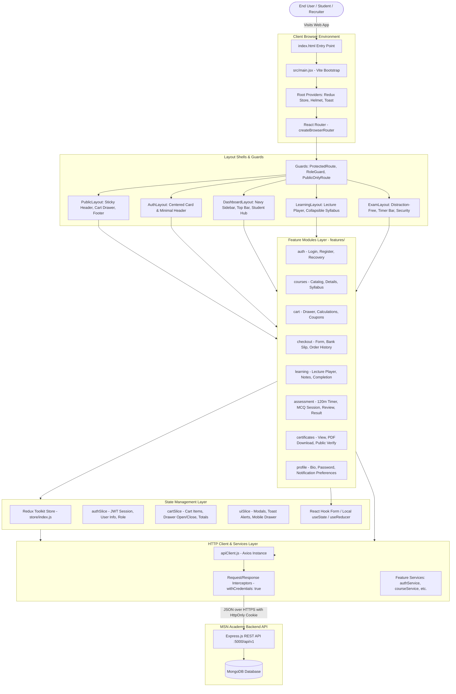

# Frontend Architecture Document
# MSN Academy — Vocational & Technology Learning Management System

---

## 1. Document Information

* **Project Name:** MSN Academy
* **Document Name:** Frontend Architecture Document & Technical Engineering Blueprint
* **File Identifier:** `03-Frontend-Architecture.md`
* **Version:** 2.0.0 (React.js + JavaScript Single-Page Application Architecture)
* **Date:** September 09, 2026
* **Status:** Complete / Approved for Engineering Implementation
* **Author / Role:** Senior Frontend Architect & React/JavaScript Systems Specialist
* **Target Audience:** Frontend Engineering Team (5 Core Developers), Lead Full-Stack Engineers, QA Automation Engineers, UI/UX Designers
* **Technology Stack:**
  * **Core Library:** React (v18.x / v19.x)
  * **Language:** JavaScript (ES6+ / ES2024, modern `.jsx` and `.js`)
  * **Build Tool & Dev Server:** Vite (v5.x)
  * **Routing Engine:** React Router (v6.x / v7.x) with `createBrowserRouter`, `<RouterProvider>`, `<Outlet />` layouts, and dynamic code-splitting via `React.lazy()` and `<Suspense>`
  * **Styling Framework:** Tailwind CSS (v3.4+) with Custom Brand Design Tokens
  * **Global State Management:** Redux Toolkit (RTK) & React-Redux
  * **Server State & Data Fetching:** RTK Query / Axios Custom Client with Service Abstraction
  * **Form State Management:** React Hook Form (v7.x)
  * **Schema Validation:** Zod (v3.x) with `@hookform/resolvers/zod`
  * **HTTP Client:** Axios (v1.x) with Request/Response Interceptors & `withCredentials: true`
  * **Document Head & SEO:** `react-helmet-async`
  * **Icons:** Lucide React
  * **Component Validation:** PropTypes & JSDoc Annotations
* **Purpose:**
  This document establishes the definitive frontend architecture, folder organization, declarative routing hierarchy, state management boundaries, component design patterns, design system implementation, and parallel development workflows for the MSN Academy web application. Derived directly from the 71 production UI/UX screen designs, [`01-PRD.md`](file:///c:/Users/HS%20LAPTOP/Downloads/MSN%20Academy%20project/01-PRD.md), [`02-Database-Design.md`](file:///c:/Users/HS%20LAPTOP/Downloads/MSN%20Academy%20project/02-Database-Design.md), [`04-Backend-Architecture.md`](file:///c:/Users/HS%20LAPTOP/Downloads/MSN%20Academy%20project/04-Backend-Architecture.md), and [`05-API-Specification.md`](file:///c:/Users/HS%20LAPTOP/Downloads/MSN%20Academy%20project/05-API-Specification.md), this document is structured to enable a 5-member frontend engineering team to develop in parallel with zero blockers, consistent code conventions, and high testability.

---

## 2. Frontend Architecture Overview

The MSN Academy frontend is architected as a high-performance, modular, feature-driven **Single-Page Application (SPA)** built with **React.js, JavaScript (ES6+), and Vite**. It eliminates server-rendered runtime complexity while providing lightning-fast client-side navigation, instant hot module replacement (HMR), and predictable state flows across marketing, commerce, learning, and examination workflows.

### 2.1 High-Level Architecture Flow



### 2.2 Client-Server Communication Strategy
* **SPA Client-Side Navigation:** Zero page reloads. Transitions between routes (e.g., from Course Catalog to Course Details to Checkout) are managed seamlessly by React Router, delivering instantaneous sub-100ms screen transitions.
* **Cookie-Based Stateless Session Handling:** Authentication tokens are stored in secure `HttpOnly`, `SameSite=Strict`, `Secure` browser cookies (`msn_session_token`). Axios is configured globally with `withCredentials: true`, ensuring every API dispatch automatically attaches session credentials without exposing sensitive tokens to JavaScript memory or `localStorage`.
* **API Envelope Unification:** The client consumes the unified backend response envelope:
  * **Success:** `{ success: true, message: string, data: any, meta?: object }`
  * **Error:** `{ success: false, message: string, errors: array, statusCode: number }`

---

## 3. Technology Stack Specification

| Technology | Purpose in MSN Academy | Architectural Rationale & Why Selected |
| :--- | :--- | :--- |
| **React (v18.x+)** | Core Declarative UI Library | Component-based UI architecture enabling high reusability of design tokens, reactive state binding, and efficient DOM reconciliation. |
| **JavaScript (ES6+ / ES2024)** | Core Programming Language | Universal language standard; eliminates TypeScript compilation overhead, simplifies developer onboarding, and leverages modern features (optional chaining `?.`, nullish coalescing `??`, async/await, modules). |
| **Vite (v5.x)** | Build Tool & Bundler | Utilizes native ES modules for near-instant development startup (<300ms) and lightning-fast Hot Module Replacement (HMR); bundles highly optimized static assets (`dist/`) via Rollup. |
| **React Router (v6+)** | Declarative Client-Side Routing | Full support for nested layouts via `<Outlet />`, dynamic URL parameter extraction (`useParams`), imperative navigation (`useNavigate`), and route-level code splitting via `React.lazy()`. |
| **Tailwind CSS (v3.4+)** | Utility-First Responsive Styling | Enables exact pixel-perfect fidelity to the 71 Figma screens with zero runtime CSS overhead, built-in dark/light primitives, standard design tokens (Navy `#0B132B`, Crimson `#DC2626`), and mobile-first responsive modifiers. |
| **Redux Toolkit (RTK)** | Global Client State Management | Governs application-wide cross-cutting state: authenticated user session, shopping cart items, slide-over cart drawer visibility, and global toast notifications. |
| **React Hook Form (v7.x)** | Form State & Input Binding | Uncontrolled input architecture drastically reduces component re-renders during high-volume form interactions (Checkout, Registration, Assessment MCQ selection). |
| **Zod (v3.x)** | Declarative Schema Validation | Client-side schema validator paired with `@hookform/resolvers/zod` to validate form inputs against the exact backend validation rules defined in `05-API-Specification.md`. |
| **Axios (v1.x)** | Network Communication Client | Features request/response interceptors, automatic JSON transformation, credential inclusion (`withCredentials: true`), and centralized HTTP status error normalization. |
| **`react-helmet-async`** | Document Head & SEO Manager | Dynamically manages `<title>`, `<meta name="description">`, canonical links, and OpenGraph tags per route within a client-side rendered Single-Page Application. |
| **Lucide React** | Scalable Vector Iconography | Clean, accessible SVG icons strictly matching the UI design specs (shopping cart, play button, user avatar, check circles, timers, locks). |
| **PropTypes** | Runtime Component Contract | Provides lightweight runtime prop validation during development without requiring a separate TypeScript compile step. |

---

## 4. Project Folder Structure

The frontend repository implements a modern, domain-driven, modular JavaScript folder structure:

```text
frontend/
├── index.html                              # Single-page HTML entry point & font links
├── vite.config.js                          # Vite build, aliases (@/*), and manual chunks
├── jsconfig.json                           # JavaScript path aliases resolution (@ -> src)
├── package.json                            # Dependencies & npm build/dev scripts
├── postcss.config.js                       # PostCSS configuration for Tailwind
├── tailwind.config.js                      # Custom design system tokens & theme config
├── .env.example                            # Example environment variables
├── .env.development                        # Local dev env (VITE_API_BASE_URL)
├── .env.production                         # Production build env
│
└── src/
    ├── main.jsx                            # React root bootstrap, Redux & Helmet providers
    ├── App.jsx                             # Root router component & global toast portal
    ├── index.css                           # Tailwind base directives & custom scrollbars
    │
    ├── routes/                             # Centralized Declarative Route Tree
    │   ├── index.jsx                       # createBrowserRouter configuration
    │   ├── ProtectedRoute.jsx              # Guard: Requires active authenticated student
    │   ├── RoleGuard.jsx                   # Guard: Requires specific role (STUDENT, ADMIN)
    │   └── PublicOnlyRoute.jsx             # Guard: Redirects logged-in users to /dashboard
    │
    ├── layouts/                            # Reusable Screen Shells with <Outlet />
    │   ├── PublicLayout.jsx                # Sticky Public Header, Cart Drawer, Global Footer
    │   ├── AuthLayout.jsx                  # Centered Card Shell with Back to Home link
    │   ├── DashboardLayout.jsx             # LMS Shell: Navy Sidebar, Top Bar, Student Hub
    │   ├── LearningLayout.jsx              # Focused LMS Player Shell with Collapsible Syllabus
    │   └── ExamLayout.jsx                  # Distraction-Free Exam Shell with Live Countdown
    │
    ├── pages/                              # Top-Level Page Views (Lazy-Loaded .jsx)
    │   ├── HomePage.jsx                    # Public Home Landing (S-01)
    │   ├── CourseCatalogPage.jsx           # Filterable Course Directory (S-02)
    │   ├── CourseDetailsPage.jsx           # Course Curriculum & Outcomes (S-03)
    │   ├── AboutPage.jsx                   # About MSN Academy (S-23)
    │   ├── PricingPage.jsx                 # Transparent Pricing Guide (S-24)
    │   ├── FaqPage.jsx                     # Interactive FAQ Accordions (S-25)
    │   ├── ContactPage.jsx                 # Contact & Inquiry Form (S-26)
    │   ├── LoginPage.jsx                   # Student Login Screen (S-04)
    │   ├── RegisterPage.jsx                # Create Account Screen (S-05)
    │   ├── ForgotPasswordPage.jsx          # Password Recovery Request Screen (S-06)
    │   ├── ResetPasswordPage.jsx           # Password Reset Action Screen
    │   ├── CheckoutPage.jsx                # Order Summary & Payment Method Selector (S-07)
    │   ├── OrderSuccessPage.jsx            # Order Confirmation & Immediate Access (S-08)
    │   ├── OrderPendingPage.jsx            # Manual Bank Audit Pending Notice (S-08)
    │   ├── OrderFailedPage.jsx             # Payment Decline & Retry Screen (S-08)
    │   ├── DashboardPage.jsx               # Student LMS Dashboard Hub (S-10)
    │   ├── MyCoursesPage.jsx               # Enrolled Course Hub (S-11)
    │   ├── OrderHistoryPage.jsx            # Past Transactions & Receipts (S-09)
    │   ├── ProfilePage.jsx                 # Student Profile, Bio & Password Change (S-22)
    │   ├── CourseOverviewPage.jsx          # Enrolled Course Syllabus Hub (S-12)
    │   ├── LecturePlayerPage.jsx           # Streaming Video Player & Resources (S-13)
    │   ├── AssessmentBriefingPage.jsx      # Exam Rules, Scoring & Pre-checks (S-14)
    │   ├── AssessmentExamPage.jsx          # Active 120m MCQ Exam Session (S-15)
    │   ├── AssessmentReviewPage.jsx        # Question Flagging & Review Summary (S-16)
    │   ├── AssessmentResultPage.jsx        # Pass (82%) or Fail (55%) Screen (S-18, S-19)
    │   ├── CertificatePage.jsx             # Student Certificate View & PDF Download (S-20)
    │   ├── PublicVerifyPage.jsx            # Public Credential Verification Portal (S-21)
    │   └── NotFoundPage.jsx                # 404 Error Page
    │
    ├── features/                           # Domain Feature Modules (Vertical Slicing)
    │   ├── auth/
    │   │   ├── components/                 # LoginForm.jsx, RegisterForm.jsx, SocialAuth.jsx
    │   │   ├── hooks/                      # useAuth.js, useSessionHydration.js
    │   │   ├── schemas/                    # authSchemas.js (Zod login/register rules)
    │   │   ├── services/                   # authService.js (API dispatch functions)
    │   │   └── slice/                      # authSlice.js (Redux user session state)
    │   │
    │   ├── courses/
    │   │   ├── components/                 # CourseCard.jsx, CourseFilter.jsx, SyllabusTree.jsx
    │   │   ├── hooks/                      # useCourseCatalog.js, useCourseDetails.js
    │   │   └── services/                   # courseService.js
    │   │
    │   ├── cart/
    │   │   ├── components/                 # CartDrawer.jsx, CartItemRow.jsx, PromoInput.jsx
    │   │   ├── hooks/                      # useCart.js
    │   │   ├── services/                   # cartService.js
    │   │   └── slice/                      # cartSlice.js (Redux cart state & calculations)
    │   │
    │   ├── checkout/
    │   │   ├── components/                 # CheckoutForm.jsx, PaymentProofUpload.jsx
    │   │   ├── hooks/                      # useCheckout.js
    │   │   ├── schemas/                    # checkoutSchema.js
    │   │   └── services/                   # checkoutService.js
    │   │
    │   ├── learning/
    │   │   ├── components/                 # VideoPlayer.jsx, LessonSidebar.jsx, NotesTab.jsx
    │   │   ├── hooks/                      # useLessonProgress.js, useVideoAnalytics.js
    │   │   └── services/                   # learningService.js
    │   │
    │   ├── assessment/
    │   │   ├── components/                 # QuestionCard.jsx, QuestionNavigator.jsx, TimerBar.jsx
    │   │   ├── hooks/                      # useExamTimer.js, useExamState.js
    │   │   └── services/                   # assessmentService.js
    │   │
    │   ├── certificates/
    │   │   ├── components/                 # CertificateCanvas.jsx, VerifyBadge.jsx
    │   │   ├── hooks/                      # useCertificate.js, usePublicVerify.js
    │   │   └── services/                   # certificateService.js
    │   │
    │   └── profile/
    │       ├── components/                 # ProfileForm.jsx, PasswordChangeForm.jsx
    │       ├── hooks/                      # useProfile.js
    │       ├── schemas/                    # profileSchema.js
    │       └── services/                   # profileService.js
    │
    ├── components/                         # Shared & Reusable UI Component Library
    │   ├── ui/                             # Atomic Design Primitives
    │   │   ├── Button.jsx                  # Primary Crimson, Secondary Navy, Outline, Ghost
    │   │   ├── Input.jsx                   # Floating label, error state, password eye toggle
    │   │   ├── Select.jsx                  # Custom styled accessible dropdown
    │   │   ├── Textarea.jsx                # Multiline text input
    │   │   ├── Checkbox.jsx                # Styled checkbox component
    │   │   ├── Radio.jsx                   # Radio selection button card
    │   │   ├── Badge.jsx                   # Category pill, Bestseller badge, status tags
    │   │   ├── Modal.jsx                   # Accessible backdrop modal with focus-trap
    │   │   ├── ProgressBar.jsx             # Animated percentage progress bar
    │   │   ├── Skeleton.jsx                # Animated skeleton placeholder blocks
    │   │   └── Spinner.jsx                 # SVG loading spinner
    │   │
    │   ├── layout/                         # Shell Elements
    │   │   ├── PublicHeader.jsx            # Top navbar, nav links, cart trigger, user button
    │   │   ├── PublicFooter.jsx            # Four-column footer with links, copyright, social
    │   │   ├── MobileNavDrawer.jsx         # Mobile off-canvas slide-in navigation (S-27)
    │   │   ├── LmsSidebar.jsx              # Collapsible Navy sidebar with active route tabs
    │   │   ├── LmsTopBar.jsx               # Breadcrumbs, notifications bell, avatar menu
    │   │   └── ExamHeader.jsx              # Distraction-free exam countdown & submit button
    │   │
    │   └── feedback/                       # Feedback & Alert Components
    │       ├── ToastContainer.jsx          # Global floating notification toasts
    │       ├── EmptyState.jsx              # Generic empty state card with icon & CTA
    │       └── ErrorState.jsx              # Generic network failure card with retry action
    │
    ├── store/                              # Global Redux Toolkit Store Configuration
    │   ├── index.js                        # configureStore setup
    │   ├── rootReducer.js                  # Combined root reducer
    │   └── slices/                         # uiSlice.js
    │
    ├── services/                           # Shared Network & API Infrastructure
    │   ├── apiClient.js                    # Global Axios instance with interceptors
    │   └── endpointUrls.js                 # Centralized API route constants (/api/v1/*)
    │
    ├── hooks/                              # Global Custom React Utility Hooks
    │   ├── useDebounce.js                  # Search input debouncer (300ms)
    │   ├── useMediaQuery.js                # Responsive breakpoint listener (mobile/desktop)
    │   ├── useClickOutside.js              # Click-outside listener for dropdowns/modals
    │   └── useLocalStorage.js              # LocalStorage sync utility
    │
    └── utils/                              # Pure JavaScript Utility Functions
        ├── formatters.js                   # Currency (PKR 8,500), duration, dates
        ├── validators.js                   # Pakistani phone regex, email normalization
        ├── classNames.js                   # Custom utility (clsx + twMerge equivalent)
        └── constants.js                    # App-wide enums, categories, payment methods
```

---

## 5. React Router & Navigation Architecture

### 5.1 Route Tree & Layout Hierarchy

MSN Academy configures its complete route tree using React Router v6's `createBrowserRouter`. Routes are grouped under layout archetypes using the `<Outlet />` pattern:

```jsx
// src/routes/index.jsx
import React, { lazy, Suspense } from 'react';
import { createBrowserRouter } from 'react-router-dom';

// Layout Shells
import PublicLayout from '../layouts/PublicLayout';
import AuthLayout from '../layouts/AuthLayout';
import DashboardLayout from '../layouts/DashboardLayout';
import LearningLayout from '../layouts/LearningLayout';
import ExamLayout from '../layouts/ExamLayout';

// Route Guards
import ProtectedRoute from './ProtectedRoute';
import PublicOnlyRoute from './PublicOnlyRoute';
import Spinner from '../components/ui/Spinner';

// Lazy Loaded Pages
const HomePage = lazy(() => import('../pages/HomePage'));
const CourseCatalogPage = lazy(() => import('../pages/CourseCatalogPage'));
const CourseDetailsPage = lazy(() => import('../pages/CourseDetailsPage'));
const LoginPage = lazy(() => import('../pages/LoginPage'));
const RegisterPage = lazy(() => import('../pages/RegisterPage'));
const CheckoutPage = lazy(() => import('../pages/CheckoutPage'));
const DashboardPage = lazy(() => import('../pages/DashboardPage'));
const MyCoursesPage = lazy(() => import('../pages/MyCoursesPage'));
const LecturePlayerPage = lazy(() => import('../pages/LecturePlayerPage'));
const AssessmentExamPage = lazy(() => import('../pages/AssessmentExamPage'));
const CertificatePage = lazy(() => import('../pages/CertificatePage'));
const PublicVerifyPage = lazy(() => import('../pages/PublicVerifyPage'));

const SuspenseLoader = ({ children }) => (
  <Suspense fallback={<div className="h-screen flex items-center justify-center"><Spinner size="lg" /></div>}>
    {children}
  </Suspense>
);

export const router = createBrowserRouter([
  // 1. Public Marketing Routes
  {
    path: '/',
    element: <PublicLayout />,
    children: [
      { index: true, element: <SuspenseLoader><HomePage /></SuspenseLoader> },
      { path: 'courses', element: <SuspenseLoader><CourseCatalogPage /></SuspenseLoader> },
      { path: 'courses/:slug', element: <SuspenseLoader><CourseDetailsPage /></SuspenseLoader> },
      { path: 'about', element: <SuspenseLoader><AboutPage /></SuspenseLoader> },
      { path: 'pricing', element: <SuspenseLoader><PricingPage /></SuspenseLoader> },
      { path: 'faq', element: <SuspenseLoader><FaqPage /></SuspenseLoader> },
      { path: 'contact', element: <SuspenseLoader><ContactPage /></SuspenseLoader> },
      { path: 'verify', element: <SuspenseLoader><PublicVerifyPage /></SuspenseLoader> },
      { path: 'verify/:certificateNumber', element: <SuspenseLoader><PublicVerifyPage /></SuspenseLoader> },
    ],
  },
  // 2. Authentication Routes (Public Only)
  {
    path: '/',
    element: <PublicOnlyRoute><AuthLayout /></PublicOnlyRoute>,
    children: [
      { path: 'login', element: <SuspenseLoader><LoginPage /></SuspenseLoader> },
      { path: 'register', element: <SuspenseLoader><RegisterPage /></SuspenseLoader> },
      { path: 'forgot-password', element: <SuspenseLoader><ForgotPasswordPage /></SuspenseLoader> },
      { path: 'reset-password', element: <SuspenseLoader><ResetPasswordPage /></SuspenseLoader> },
    ],
  },
  // 3. Commerce & Checkout Routes
  {
    path: '/',
    element: <PublicLayout />,
    children: [
      { path: 'checkout', element: <SuspenseLoader><CheckoutPage /></SuspenseLoader> },
      { path: 'order/success', element: <SuspenseLoader><OrderSuccessPage /></SuspenseLoader> },
      { path: 'order/pending', element: <SuspenseLoader><OrderPendingPage /></SuspenseLoader> },
      { path: 'order/failed', element: <SuspenseLoader><OrderFailedPage /></SuspenseLoader> },
    ],
  },
  // 4. Authenticated Student LMS Hub
  {
    path: '/',
    element: <ProtectedRoute><DashboardLayout /></ProtectedRoute>,
    children: [
      { path: 'dashboard', element: <SuspenseLoader><DashboardPage /></SuspenseLoader> },
      { path: 'my-courses', element: <SuspenseLoader><MyCoursesPage /></SuspenseLoader> },
      { path: 'orders', element: <SuspenseLoader><OrderHistoryPage /></SuspenseLoader> },
      { path: 'profile', element: <SuspenseLoader><ProfilePage /></SuspenseLoader> },
      { path: 'certificate/:certId', element: <SuspenseLoader><CertificatePage /></SuspenseLoader> },
      { path: 'learn/:courseId', element: <SuspenseLoader><CourseOverviewPage /></SuspenseLoader> },
    ],
  },
  // 5. Full-Screen LMS Lecture Player
  {
    path: 'learn/:courseId/lesson/:lessonId',
    element: <ProtectedRoute><LearningLayout /></ProtectedRoute>,
    children: [
      { index: true, element: <SuspenseLoader><LecturePlayerPage /></SuspenseLoader> },
    ],
  },
  // 6. Distraction-Free Assessment Engine
  {
    path: 'learn/:courseId/assessment',
    element: <ProtectedRoute><ExamLayout /></ProtectedRoute>,
    children: [
      { index: true, element: <SuspenseLoader><AssessmentBriefingPage /></SuspenseLoader> },
      { path: 'session', element: <SuspenseLoader><AssessmentExamPage /></SuspenseLoader> },
      { path: 'review', element: <SuspenseLoader><AssessmentReviewPage /></SuspenseLoader> },
      { path: 'result', element: <SuspenseLoader><AssessmentResultPage /></SuspenseLoader> },
    ],
  },
  // 7. Wildcard Catch-All 404
  {
    path: '*',
    element: <SuspenseLoader><NotFoundPage /></SuspenseLoader>,
  },
]);
```

### 5.2 Declarative Route Guards in JavaScript

```jsx
// src/routes/ProtectedRoute.jsx
import React from 'react';
import { useSelector } from 'react-redux';
import { Navigate, useLocation } from 'react-router-dom';
import Spinner from '../components/ui/Spinner';

export default function ProtectedRoute({ children }) {
  const { isAuthenticated, isHydrating } = useSelector((state) => state.auth);
  const location = useLocation();

  if (isHydrating) {
    return (
      <div className="min-h-screen flex items-center justify-center bg-gray-50">
        <Spinner size="lg" message="Verifying session..." />
      </div>
    );
  }

  if (!isAuthenticated) {
    // Preserve intended destination to redirect back post-login
    return <Navigate to="/login" state={{ from: location }} replace />;
  }

  return children;
}
```

```jsx
// src/routes/PublicOnlyRoute.jsx
import React from 'react';
import { useSelector } from 'react-redux';
import { Navigate } from 'react-router-dom';

export default function PublicOnlyRoute({ children }) {
  const { isAuthenticated, isHydrating } = useSelector((state) => state.auth);

  if (isHydrating) return null;

  if (isAuthenticated) {
    return <Navigate to="/dashboard" replace />;
  }

  return children;
}
```

---

## 6. Complete Screen & Route Inventory

Every single route in the table below is derived strictly from the 71 Figma screen designs and maps directly to functional requirements in `01-PRD.md` and endpoints in `05-API-Specification.md`:

| Route Path | Screen Name & Visual File | Access Level | Layout Shell | Key API Dependencies | Related PRD Requirement | Team Owner |
| :--- | :--- | :---: | :--- | :--- | :--- | :---: |
| **`/`** | Home Landing (`Home.png`) | Public | `PublicLayout` | `GET /courses?limit=6&sort=popular` | FR-DISC-001 | Member 2 |
| **`/courses`** | Course Catalog (`Course catalog.png`) | Public | `PublicLayout` | `GET /courses?page=&limit=12&category=&sort=` | FR-DISC-001 | Member 2 |
| **`/courses/:slug`** | Course Details (`Course details.png`) | Public | `PublicLayout` | `GET /courses/:slug` | FR-DISC-002 | Member 2 |
| **`/about`** | About Us (`About.png`) | Public | `PublicLayout` | None (Static Content) | FEAT-MISC-03 | Member 2 |
| **`/pricing`** | Transparent Pricing (`Pricing.png`) | Public | `PublicLayout` | `GET /courses?sort=price_asc` | FEAT-MISC-03 | Member 2 |
| **`/faq`** | FAQs (`FAQs.png`) | Public | `PublicLayout` | None (Static Accordions) | FEAT-MISC-02 | Member 2 |
| **`/contact`** | Contact Us (`Contact.png`) | Public | `PublicLayout` | `POST /contact` | FR-MISC-001 | Member 2 |
| **`/login`** | Student Login (`Student login.png`) | Public Only | `AuthLayout` | `POST /auth/login` | FR-AUTH-002 | Member 1 |
| **`/register`** | Create Account (`Create Account.png`) | Public Only | `AuthLayout` | `POST /auth/register` | FR-AUTH-001 | Member 1 |
| **`/forgot-password`** | Forgot Password | Public Only | `AuthLayout` | `POST /auth/forgot-password` | FR-AUTH-004 | Member 1 |
| **`/reset-password`** | Reset Password | Public Only | `AuthLayout` | `POST /auth/reset-password` | FR-AUTH-004 | Member 1 |
| **`/checkout`** | Checkout (`Checkout.png`) | Authenticated | `PublicLayout` | `POST /orders/checkout`, `GET /cart` | FR-COMM-002 | Member 3 |
| **`/order/success`** | Payment Success (`Payment successful-mb.png`)| Authenticated | `PublicLayout` | `GET /orders/:orderId` | FR-PAY-001 | Member 3 |
| **`/order/pending`** | Payment Pending (`pending.png`) | Authenticated | `PublicLayout` | `POST /payments/:id/verify`, `GET /payments/:id` | FR-PAY-002 | Member 3 |
| **`/order/failed`** | Payment Failed (`Failed.png`) | Authenticated | `PublicLayout` | `GET /orders/:orderId` | FR-PAY-001 | Member 3 |
| **`/dashboard`** | Student Dashboard (`dashboard.png`) | Student Only | `DashboardLayout` | `GET /student/dashboard-summary` | FR-LRN-002 | Member 4 |
| **`/my-courses`** | My Courses Hub (`My courses.png`) | Student Only | `DashboardLayout` | `GET /student/enrollments` | FR-LRN-001 | Member 4 |
| **`/orders`** | Order History (`Order history.png`) | Student Only | `DashboardLayout` | `GET /orders` | FR-COMM-003 | Member 3 |
| **`/profile`** | Student Profile (`student Profile-desktop.png`)| Student Only | `DashboardLayout` | `GET /users/profile`, `PUT /users/profile` | FR-PROF-001 | Member 1 |
| **`/learn/:courseId`** | Course Overview (`course overview.png`) | Student Only | `DashboardLayout` | `GET /learning/:courseId/overview` | FR-LRN-003 | Member 4 |
| **`/learn/:courseId/lesson/:lessonId`**| Lecture Player (`lecture.png`) | Student Only | `LearningLayout` | `GET /learning/:courseId/lessons/:lessonId` | FR-LRN-004 | Member 4 |
| **`/learn/:courseId/assessment`**| Assessment Briefing (`Course assessment.png`)| Student Only | `ExamLayout` | `GET /assessments/:courseId/briefing` | FR-ASS-001 | Member 5 |
| **`/learn/:courseId/assessment/session`**| MCQ Exam Session (`Assessmet questions.png`)| Student Only | `ExamLayout` | `POST /assessments/:courseId/start`, `POST /answer`| FR-ASS-002 | Member 5 |
| **`/learn/:courseId/assessment/review`** | Review & Submit (`Review and submit.png`)| Student Only | `ExamLayout` | `GET /assessments/:attemptId/review` | FR-ASS-003 | Member 5 |
| **`/learn/:courseId/assessment/result`** | Exam Result (`assessment pass.png` / `fail`) | Student Only | `ExamLayout` | `GET /assessments/:attemptId/result` | FR-ASS-004 | Member 5 |
| **`/certificate/:certId`** | Certificate View (`certificate.png`) | Student / Public | `DashboardLayout` | `GET /certificates/:certificateId` | FR-CERT-001 | Member 5 |
| **`/verify`** | Public Verification (`certificate verification.png`)| Public | `PublicLayout` | `GET /certificates/verify/:certificateNumber` | FR-CERT-002 | Member 5 |

---

## 7. State Management Architecture

Global state is managed via **Redux Toolkit (RTK)** in pure JavaScript. Slices are strictly isolated from local UI component state:

```text
Global State Tree:
store
├── auth: { user, isAuthenticated, isHydrating, error }
├── cart: { items, appliedCoupon, isOpen, subtotal, discount, total }
└── ui:   { activeModal, toasts: [] }
```

### 7.1 Store Configuration

```javascript
// src/store/index.js
import { configureStore } from '@reduxjs/toolkit';
import authReducer from '../features/auth/slice/authSlice';
import cartReducer from '../features/cart/slice/cartSlice';
import uiReducer from './slices/uiSlice';

export const store = configureStore({
  reducer: {
    auth: authReducer,
    cart: cartReducer,
    ui: uiReducer,
  },
  devTools: process.env.NODE_ENV !== 'production',
});
```

### 7.2 Auth Slice Implementation (JavaScript)

```javascript
// src/features/auth/slice/authSlice.js
import { createSlice, createAsyncThunk } from '@reduxjs/toolkit';
import { authService } from '../services/authService';

export const checkAuthSession = createAsyncThunk('auth/checkSession', async (_, { rejectWithValue }) => {
  try {
    const response = await authService.getCurrentUser();
    return response.data.user;
  } catch (error) {
    return rejectWithValue(error.response?.data?.message || 'Session expired');
  }
});

export const loginUser = createAsyncThunk('auth/login', async (credentials, { rejectWithValue }) => {
  try {
    const response = await authService.login(credentials);
    return response.data.user;
  } catch (error) {
    return rejectWithValue(error.response?.data?.message || 'Login failed');
  }
});

export const logoutUser = createAsyncThunk('auth/logout', async () => {
  await authService.logout();
  return null;
});

const authSlice = createSlice({
  name: 'auth',
  initialState: {
    user: null,
    isAuthenticated: false,
    isHydrating: true,
    error: null,
  },
  reducers: {
    clearAuthError: (state) => {
      state.error = null;
    },
  },
  extraReducers: (builder) => {
    builder
      // Session Hydration
      .addCase(checkAuthSession.pending, (state) => {
        state.isHydrating = true;
      })
      .addCase(checkAuthSession.fulfilled, (state, action) => {
        state.user = action.payload;
        state.isAuthenticated = true;
        state.isHydrating = false;
        state.error = null;
      })
      .addCase(checkAuthSession.rejected, (state) => {
        state.user = null;
        state.isAuthenticated = false;
        state.isHydrating = false;
      })
      // Login Action
      .addCase(loginUser.fulfilled, (state, action) => {
        state.user = action.payload;
        state.isAuthenticated = true;
        state.error = null;
      })
      .addCase(loginUser.rejected, (state, action) => {
        state.error = action.payload;
      })
      // Logout Action
      .addCase(logoutUser.fulfilled, (state) => {
        state.user = null;
        state.isAuthenticated = false;
        state.error = null;
      });
  },
});

export const { clearAuthError } = authSlice.actions;
export default authSlice.reducer;
```

### 7.3 Cart Slice & Real-Time Calculation (JavaScript)

```javascript
// src/features/cart/slice/cartSlice.js
import { createSlice } from '@reduxjs/toolkit';

const calculateTotals = (items, coupon) => {
  const subtotal = items.reduce((sum, item) => sum + item.price, 0);
  let discount = 0;
  if (coupon && coupon.discountPercentage) {
    discount = Math.round((subtotal * coupon.discountPercentage) / 100);
  }
  const total = Math.max(0, subtotal - discount);
  return { subtotal, discount, total };
};

const cartSlice = createSlice({
  name: 'cart',
  initialState: {
    items: [],
    appliedCoupon: null,
    isOpen: false,
    subtotal: 0,
    discount: 0,
    total: 0,
  },
  reducers: {
    toggleCartDrawer: (state, action) => {
      state.isOpen = action.payload !== undefined ? action.payload : !state.isOpen;
    },
    setCartData: (state, action) => {
      const { items, appliedCoupon } = action.payload;
      state.items = items || [];
      state.appliedCoupon = appliedCoupon || null;
      const { subtotal, discount, total } = calculateTotals(state.items, state.appliedCoupon);
      state.subtotal = subtotal;
      state.discount = discount;
      state.total = total;
    },
    clearCart: (state) => {
      state.items = [];
      state.appliedCoupon = null;
      state.subtotal = 0;
      state.discount = 0;
      state.total = 0;
    },
  },
});

export const { toggleCartDrawer, setCartData, clearCart } = cartSlice.actions;
export default cartSlice.reducer;
```

---

## 8. Network & API Client Architecture

Axios acts as the centralized HTTP client. It handles global base URLs, request timing, correlation headers, credential inclusion, and error formatting:

```javascript
// src/services/apiClient.js
import axios from 'axios';
import { store } from '../store';
import { logoutUser } from '../features/auth/slice/authSlice';

export const apiClient = axios.create({
  baseURL: import.meta.env.VITE_API_BASE_URL || 'http://localhost:5000/api/v1',
  timeout: 15000,
  withCredentials: true, // Automatically sends HttpOnly JWT cookies
  headers: {
    'Content-Type': 'application/json',
    Accept: 'application/json',
  },
});

// Request Interceptor
apiClient.interceptors.request.use(
  (config) => {
    // Add client timestamp or tracing headers if required
    config.headers['X-Client-Timestamp'] = new Date().toISOString();
    return config;
  },
  (error) => Promise.reject(error)
);

// Response Interceptor
apiClient.interceptors.response.use(
  (response) => {
    // Unwrap the unified response envelope automatically
    return response.data;
  },
  (error) => {
    const status = error.response ? error.response.status : null;

    if (status === 401) {
      // If 401 occurs on a protected route, trigger Redux session reset
      const isAuthCheck = error.config.url.includes('/auth/me');
      if (!isAuthCheck) {
        store.dispatch(logoutUser());
      }
    }

    // Return normalized error object
    const normalizedError = {
      message: error.response?.data?.message || 'An unexpected error occurred. Please check your connection.',
      errors: error.response?.data?.errors || [],
      statusCode: status || 500,
    };

    return Promise.reject(normalizedError);
  }
);
```

---

## 9. Design System & Component Library

The application implements a custom utility-based design system configured via `tailwind.config.js` to match the Figma aesthetics:

### 9.1 Tailwind Tokens Configuration

```javascript
// tailwind.config.js
/** @type {import('tailwindcss').Config} */
export default {
  content: ['./index.html', './src/**/*.{js,jsx}'],
  theme: {
    extend: {
      colors: {
        brand: {
          navy: {
            DEFAULT: '#0B132B',
            light: '#1C2541',
            dark: '#050A18',
          },
          crimson: {
            DEFAULT: '#DC2626',
            hover: '#B91C1C',
            light: '#FEE2E2',
          },
          accent: {
            amber: '#F59E0B',
            emerald: '#10B981',
            blue: '#3B82F6',
          },
        },
      },
      fontFamily: {
        sans: ['Inter', 'system-ui', 'sans-serif'],
        display: ['Outfit', 'Inter', 'sans-serif'],
      },
      boxShadow: {
        card: '0 4px 20px -2px rgba(11, 19, 43, 0.08)',
        modal: '0 20px 40px -4px rgba(11, 19, 43, 0.2)',
      },
    },
  },
  plugins: [],
};
```

### 9.2 Reusable Atomic Button Component (JavaScript + PropTypes)

```jsx
// src/components/ui/Button.jsx
import React from 'react';
import PropTypes from 'prop-types';
import Spinner from './Spinner';

export default function Button({
  children,
  type = 'button',
  variant = 'primary',
  size = 'md',
  isLoading = false,
  disabled = false,
  onClick,
  className = '',
  icon: Icon,
  ...props
}) {
  const baseStyles = 'inline-flex items-center justify-center font-medium rounded-lg transition-all focus:outline-none focus:ring-2 focus:ring-offset-2 disabled:opacity-60 disabled:cursor-not-allowed';

  const variants = {
    primary: 'bg-brand-crimson hover:bg-brand-crimson-hover text-white focus:ring-brand-crimson shadow-md hover:shadow-lg',
    secondary: 'bg-brand-navy hover:bg-brand-navy-light text-white focus:ring-brand-navy',
    outline: 'border border-gray-300 hover:border-gray-400 text-gray-700 bg-white hover:bg-gray-50 focus:ring-brand-navy',
    ghost: 'text-gray-600 hover:text-brand-navy hover:bg-gray-100 focus:ring-gray-300',
  };

  const sizes = {
    sm: 'px-3 py-1.5 text-xs gap-1.5',
    md: 'px-4 py-2.5 text-sm gap-2',
    lg: 'px-6 py-3.5 text-base gap-2.5',
  };

  return (
    <button
      type={type}
      disabled={disabled || isLoading}
      onClick={onClick}
      className={`${baseStyles} ${variants[variant]} ${sizes[size]} ${className}`}
      {...props}
    >
      {isLoading ? (
        <>
          <Spinner size="sm" className="mr-2" />
          <span>Processing...</span>
        </>
      ) : (
        <>
          {Icon && <Icon className="w-4 h-4" />}
          <span>{children}</span>
        </>
      )}
    </button>
  );
}

Button.propTypes = {
  children: PropTypes.node.isRequired,
  type: PropTypes.oneOf(['button', 'submit', 'reset']),
  variant: PropTypes.oneOf(['primary', 'secondary', 'outline', 'ghost']),
  size: PropTypes.oneOf(['sm', 'md', 'lg']),
  isLoading: PropTypes.bool,
  disabled: PropTypes.bool,
  onClick: PropTypes.func,
  className: PropTypes.string,
  icon: PropTypes.elementType,
};
```

---

## 10. Form Architecture & Validation

Forms leverage **React Hook Form** paired with **Zod** schema resolvers in pure JavaScript. This guarantees strict validation without excessive re-renders:

### 10.1 Authentication Validation Schemas

```javascript
// src/features/auth/schemas/authSchemas.js
import { z } from 'zod';

export const loginSchema = z.object({
  email: z.string().min(1, 'Email address is required').email('Please enter a valid email address'),
  password: z.string().min(1, 'Password is required'),
});

export const registerSchema = z.object({
  fullName: z.string().min(3, 'Full name must be at least 3 characters').max(60, 'Full name cannot exceed 60 characters'),
  email: z.string().min(1, 'Email address is required').email('Please enter a valid email address'),
  phone: z.string().regex(/^03[0-9]{9}$/, 'Please enter a valid Pakistani mobile number (e.g. 03001234567)'),
  password: z
    .string()
    .min(8, 'Password must be at least 8 characters long')
    .regex(/[A-Z]/, 'Must contain at least 1 uppercase letter')
    .regex(/[a-z]/, 'Must contain at least 1 lowercase letter')
    .regex(/[0-9]/, 'Must contain at least 1 number'),
  confirmPassword: z.string().min(1, 'Please confirm your password'),
}).refine((data) => data.password === data.confirmPassword, {
  message: 'Passwords do not match',
  path: ['confirmPassword'],
});
```

### 10.2 Form Component Implementation Example

```jsx
// src/features/auth/components/LoginForm.jsx
import React from 'react';
import { useForm } from 'react-hook-form';
import { zodResolver } from '@hookform/resolvers/zod';
import { useDispatch, useSelector } from 'react-redux';
import { useNavigate, useLocation, Link } from 'react-router-dom';
import { loginUser } from '../slice/authSlice';
import { loginSchema } from '../schemas/authSchemas';
import Input from '../../../components/ui/Input';
import Button from '../../../components/ui/Button';

export default function LoginForm() {
  const dispatch = useDispatch();
  const navigate = useNavigate();
  const location = useLocation();
  const { error } = useSelector((state) => state.auth);

  const {
    register,
    handleSubmit,
    formState: { errors, isSubmitting },
  } = useForm({
    resolver: zodResolver(loginSchema),
    defaultValues: { email: '', password: '' },
  });

  const onSubmit = async (data) => {
    const resultAction = await dispatch(loginUser(data));
    if (loginUser.fulfilled.match(resultAction)) {
      const redirectPath = location.state?.from?.pathname || '/dashboard';
      navigate(redirectPath, { replace: true });
    }
  };

  return (
    <form onSubmit={handleSubmit(onSubmit)} className="space-y-5">
      {error && (
        <div className="p-3.5 bg-red-50 border border-red-200 text-red-700 text-sm rounded-lg">
          {error}
        </div>
      )}

      <Input
        label="Email Address"
        type="email"
        placeholder="ali.khan@example.com"
        error={errors.email?.message}
        {...register('email')}
      />

      <Input
        label="Password"
        type="password"
        placeholder="••••••••"
        error={errors.password?.message}
        {...register('password')}
      />

      <div className="flex items-center justify-between text-sm">
        <label className="flex items-center gap-2 cursor-pointer text-gray-600">
          <input type="checkbox" className="rounded border-gray-300 text-brand-crimson focus:ring-brand-crimson" />
          <span>Remember me</span>
        </label>
        <Link to="/forgot-password" className="text-brand-crimson hover:underline">
          Forgot password?
        </Link>
      </div>

      <Button type="submit" variant="primary" size="lg" className="w-full" isLoading={isSubmitting}>
        Sign In to MSN Academy
      </Button>
    </form>
  );
}
```

---

## 11. Examination & Assessment Engine Architecture

The assessment engine powers the 120-minute timed exam session screen (`Assessmet questions.png`), answer bookmarking, pre-submission review, and grading:

### 11.1 120-Minute Countdown Timer Hook

```javascript
// src/features/assessment/hooks/useExamTimer.js
import { useState, useEffect } from 'react';

export function useExamTimer(initialRemainingSeconds, onExpire) {
  const [secondsLeft, setSecondsLeft] = useState(initialRemainingSeconds);

  useEffect(() => {
    if (secondsLeft <= 0) {
      if (onExpire) onExpire();
      return;
    }

    const interval = setInterval(() => {
      setSecondsLeft((prev) => {
        if (prev <= 1) {
          clearInterval(interval);
          if (onExpire) onExpire();
          return 0;
        }
        return prev - 1;
      });
    }, 1000);

    return () => clearInterval(interval);
  }, [secondsLeft, onExpire]);

  const hours = Math.floor(secondsLeft / 3600);
  const minutes = Math.floor((secondsLeft % 3600) / 60);
  const seconds = secondsLeft % 60;

  const formattedTime = `${String(hours).padStart(2, '0')}:${String(minutes).padStart(2, '0')}:${String(seconds).padStart(2, '0')}`;

  return { secondsLeft, formattedTime, isUrgent: secondsLeft < 600 }; // Urgent when < 10 mins
}
```

### 11.2 Exam Session Component

```jsx
// src/features/assessment/components/ExamSession.jsx
import React, { useState } from 'react';
import { useNavigate, useParams } from 'react-router-dom';
import { useExamTimer } from '../hooks/useExamTimer';
import { assessmentService } from '../services/assessmentService';
import Button from '../../../components/ui/Button';

export default function ExamSession({ attemptData }) {
  const { courseId } = useParams();
  const navigate = useNavigate();

  const [currentIndex, setCurrentIndex] = useState(0);
  const [answers, setAnswers] = useState(attemptData.savedAnswers || {});
  const [flagged, setFlagged] = useState(attemptData.flaggedQuestions || []);

  const currentQuestion = attemptData.questions[currentIndex];

  const handleTimeExpire = () => {
    alert('Time limit reached! Your examination is being auto-submitted.');
    handleSubmitExam();
  };

  const { formattedTime, isUrgent } = useExamTimer(attemptData.remainingSeconds || 7200, handleTimeExpire);

  const handleSelectOption = async (optionKey) => {
    setAnswers((prev) => ({ ...prev, [currentQuestion.questionId]: optionKey }));
    // Synchronize answer with server in background
    await assessmentService.saveAnswer(attemptData.attemptId, {
      questionId: currentQuestion.questionId,
      selectedOptionKey: optionKey,
    });
  };

  const toggleFlag = () => {
    setFlagged((prev) =>
      prev.includes(currentQuestion.questionId)
        ? prev.filter((id) => id !== currentQuestion.questionId)
        : [...prev, currentQuestion.questionId]
    );
  };

  const handleSubmitExam = async () => {
    const result = await assessmentService.submitAttempt(attemptData.attemptId);
    navigate(`/learn/${courseId}/assessment/result`, { state: { result: result.data } });
  };

  return (
    <div className="max-w-4xl mx-auto p-6 space-y-6">
      {/* Top Timer Bar */}
      <div className="flex items-center justify-between bg-white p-4 rounded-xl shadow-sm border border-gray-100">
        <div>
          <span className="text-xs text-gray-500 uppercase tracking-wider">Question Progress</span>
          <p className="text-base font-semibold text-brand-navy">
            Question {currentIndex + 1} of {attemptData.questions.length}
          </p>
        </div>
        <div className={`px-4 py-2 rounded-lg font-mono font-bold text-lg ${isUrgent ? 'bg-red-100 text-red-600 animate-pulse' : 'bg-gray-100 text-brand-navy'}`}>
          ⏱️ {formattedTime}
        </div>
      </div>

      {/* Question Card */}
      <div className="bg-white p-8 rounded-xl shadow-card border border-gray-100 space-y-6">
        <div className="flex items-start justify-between">
          <h2 className="text-xl font-bold text-brand-navy leading-snug">{currentQuestion.text}</h2>
          <button
            onClick={toggleFlag}
            className={`text-sm px-3 py-1.5 rounded-md font-medium transition ${
              flagged.includes(currentQuestion.questionId) ? 'bg-amber-100 text-amber-700' : 'bg-gray-100 text-gray-600'
            }`}
          >
            {flagged.includes(currentQuestion.questionId) ? '🚩 Flagged' : '🏳️ Flag for review'}
          </button>
        </div>

        {/* Options */}
        <div className="space-y-3">
          {currentQuestion.options.map((opt) => (
            <label
              key={opt.key}
              onClick={() => handleSelectOption(opt.key)}
              className={`flex items-center p-4 rounded-lg border cursor-pointer transition ${
                answers[currentQuestion.questionId] === opt.key
                  ? 'border-brand-crimson bg-red-50/50'
                  : 'border-gray-200 hover:border-gray-300'
              }`}
            >
              <span className="w-8 h-8 rounded-full border flex items-center justify-center font-bold text-sm mr-4 bg-white">
                {opt.key}
              </span>
              <span className="text-base text-gray-800">{opt.text}</span>
            </label>
          ))}
        </div>
      </div>

      {/* Navigation Controls */}
      <div className="flex items-center justify-between">
        <Button
          variant="outline"
          disabled={currentIndex === 0}
          onClick={() => setCurrentIndex((prev) => prev - 1)}
        >
          Previous Question
        </Button>

        {currentIndex < attemptData.questions.length - 1 ? (
          <Button variant="secondary" onClick={() => setCurrentIndex((prev) => prev + 1)}>
            Next Question
          </Button>
        ) : (
          <Button variant="primary" onClick={() => navigate(`/learn/${courseId}/assessment/review`)}>
            Review & Submit
          </Button>
        )}
      </div>
    </div>
  );
}
```

---

## 12. SEO, Meta Tags & Performance

In a React SPA, document metadata is managed using `react-helmet-async`. This enables dynamic titles and meta descriptions for search bots and social sharing:

### 12.1 Dynamic SEO Helmet Component

```jsx
// src/components/layout/SeoHead.jsx
import React from 'react';
import PropTypes from 'prop-types';
import { Helmet } from 'react-helmet-async';

export default function SeoHead({
  title,
  description = 'MSN Academy is Pakistans premier vocational and technology learning platform.',
  canonicalUrl,
  ogImage = 'https://msnacademy.pk/og-banner.jpg',
}) {
  const fullTitle = title ? `${title} | MSN Academy` : 'MSN Academy — Vocational & Technology LMS';

  return (
    <Helmet>
      <title>{fullTitle}</title>
      <meta name="description" content={description} />
      {canonicalUrl && <link rel="canonical" href={canonicalUrl} />}

      {/* OpenGraph & Social Sharing */}
      <meta property="og:title" content={fullTitle} />
      <meta property="og:description" content={description} />
      <meta property="og:image" content={ogImage} />
      <meta property="og:type" content="website" />
      <meta name="twitter:card" content="summary_large_image" />
    </Helmet>
  );
}

SeoHead.propTypes = {
  title: PropTypes.string,
  description: PropTypes.string,
  canonicalUrl: PropTypes.string,
  ogImage: PropTypes.string,
};
```

### 12.2 Vite Build Optimization & Manual Chunks

```javascript
// vite.config.js
import { defineConfig } from 'vite';
import react from '@vitejs/plugin-react';
import path from 'path';

export default defineConfig({
  plugins: [react()],
  resolve: {
    alias: {
      '@': path.resolve(__dirname, './src'),
    },
  },
  build: {
    target: 'esnext',
    outDir: 'dist',
    sourcemap: false,
    chunkSizeWarningLimit: 1000,
    rollupOptions: {
      output: {
        manualChunks: {
          vendor: ['react', 'react-dom', 'react-router-dom'],
          redux: ['@reduxjs/toolkit', 'react-redux'],
          forms: ['react-hook-form', '@hookform/resolvers/zod', 'zod'],
          icons: ['lucide-react'],
        },
      },
    },
  },
  server: {
    port: 3000,
    proxy: {
      '/api/v1': {
        target: 'http://localhost:5000',
        changeOrigin: true,
      },
    },
  },
});
```

---

## 13. Frontend Team Ownership Matrix (4 Frontend Members M1–M4)

The entire backend API layer is developed by the **Solo Backend Lead**. The frontend application is divided among **4 Frontend Team Members (M1–M4)** into clean, non-overlapping vertical slices. (Detailed interactive developer checklists are available in [`docs/FRONTEND-TEAM-TASK-DIVISION.md`](FRONTEND-TEAM-TASK-DIVISION.md)):

| Team Member | Domain Modules Owned | Key Pages & Screens Owned | Redux & Services Owned | Consumed Backend APIs | UI Screenshots Assigned (`ui-screenshots/`) |
| :--- | :--- | :--- | :--- | :--- | :---: |
| **Member 1 (M1)** | **Auth, Profile & Dashboard Shell** | `/login`, `/register`, `/forgot-password`, `/reset-password`, `/profile`, `/dashboard` | `authSlice.js`, `authService.js`, `profileService.js`, `AuthLayout.jsx`, `DashboardLayout.jsx` | `POST /auth/*`, `GET/PUT /users/*`, `GET /student/dashboard-summary` | **10 Screens** |
| **Member 2 (M2)** | **Marketing, Catalog & Syllabus Details** | `/` (Home), `/courses`, `/courses/:slug`, `/about`, `/pricing`, `/faq`, `/contact` | `courseService.js`, `contactService.js`, `PublicLayout.jsx`, `PublicHeader.jsx`, `PublicFooter.jsx` | `GET /courses/*`, `GET /categories`, `POST /contact` | **15 Screens** |
| **Member 3 (M3)** | **Cart, Checkout, Orders & Certificates** | `/checkout`, `/order/success`, `/order/pending`, `/order/failed`, `/orders`, `/certificate/:certId`, `/verify` | `cartSlice.js`, `cartService.js`, `checkoutService.js`, `orderService.js`, `certificateService.js` | `* /cart/*`, `* /orders/*`, `* /payments/*`, `* /certificates/*` | **22 Screens** |
| **Member 4 (M4)** | **LMS Player & 120m Assessment Engine**| `/my-courses`, `/learn/:courseId`, `/learn/:courseId/lesson/:id`, `/learn/:courseId/assessment/*` | `learningService.js`, `assessmentService.js`, `LearningLayout.jsx`, `ExamLayout.jsx` | `GET /student/enrollments`, `* /learning/*`, `* /assessments/*` | **24 Screens** |

### 13.1 Exact UI Screenshots Ownership per Member

#### Member 1 (M1) — Auth, Profile & Dashboard (10 Screens)
* `Student login.png`, `Login-Mobile.png` (Login screen desktop & mobile)
* `Create Account.png`, `Create account-mobile.png` (Registration screen desktop & mobile)
* `student Profile-desktop.png`, `student Profile-desktop-1.png`, `Student Profile-mob.png` (Profile, Change Password, Notification Toggles)
* `dashboard.png`, `dashboard-1.png`, `Dashboard-mb.png` (Student LMS Dashboard Hub, Progress Widgets, Continue Learning)

#### Member 2 (M2) — Marketing & Course Discovery (15 Screens)
* `Home.png`, `home-mobile.png` (Landing page hero, live stats, testimonials, home verification widget)
* `Course catalog.png`, `Course catalog-mobile.png` (Course directory, search, category pills, level filters)
* `Course details.png`, `Course details-1.png` (Course syllabus, outcomes, sticky enroll bar, preview modal)
* `About.png` (About Us mission, core values, impact counters)
* `Pricing.png`, `Pricing-1.png` (Pricing tiers, PKR 8k–18k, inclusions, pricing FAQs)
* `FAQs.png`, `FAQs-mobile.png` (FAQ accordion with category filter pills)
* `Contact.png`, `Contact us-mobile.png` (Contact form, contact cards, WhatsApp integration link)
* `Menu.png`, `Menu-1.png` (Mobile hamburger navigation drawer)

#### Member 3 (M3) — Cart, Checkout, Orders & Certificates (22 Screens)
* **Cart, Checkout & Orders (14 Screens):**
  * `Shopping cart.png` (Slide-over cart drawer, item removal, coupon promo code input)
  * `Checkout.png`, `Checkout-1.png` (Guest & Student checkout, Pakistani payment methods, mobile 4-step stepper)
  * `Success.png`, `Payment successful-mb.png`, `Pass-mob.png` (Order success & immediate enrollment confirmation)
  * `pending.png`, `Pending-mb.png` (Manual payment pending notice, 24h verification SLA, "Check Status" CTA)
  * `Failed.png`, `Payment failed-mb.png`, `Fail-mob.png` (Payment decline notice & retry CTAs)
  * `Order history.png`, `Order history-1.png`, `Order history-mob.png` (Order invoices, status filter tabs, receipt modal)
* **Certificates & Verification Registry (8 Screens):**
  * `certificate.png`, `certificate-1.png` (High-res Certificate of Completion with signature & security seal)
  * `Certificate-mob.png` (Mobile certificate card with QR code & "Verify Online")
  * `certificate verification.png`, `certificate verification-1.png`, `Certificate verification-mobile.png` (Public verification lookup with sample demo chips)
  * `verification complete.png`, `verification complete-1.png` (Authentic verified modal with student details)

#### Member 4 (M4) — LMS Player & 120-Minute Timed Assessment Engine (24 Screens)
* **LMS Library & Player (9 Screens):**
  * `My courses.png`, `My courses-1.png`, `My courses-mb.png` (Enrolled courses portfolio with progress bars)
  * `course overview.png`, `course overview-1.png`, `Overview-mb.png` (Curriculum modules tree, downloadable resources card)
  * `lecture.png`, `lecture-1.png`, `Lecture-mb.png` (Video lecture player, lesson notes, attachments, "✓ Mark as Complete")
* **Timed Assessment Engine — 120 Mins (15 Screens):**
  * `Course assessment.png`, `Course assessment-1.png`, `Course assessment-mb.png` (Exam briefing, 70% threshold, rules)
  * `Assessmet questions.png`, `Assessmet questions-1.png`, `asses. Questions-mb.png` (Live exam session, 120m countdown, question navigator grid, flag for review)
  * `Review and submit.png`, `Review and submit-1.png`, `Review-mb.png` (Pre-submission question summary, unanswered warnings)
  * `go back.png`, `go back-1.png` ("Submit Assessment?" confirmation safeguard modal)
  * `assessment pass.png`, `assessment pass-1.png` (Exam passed screen, 82% score, celebration badge, certificate unlock)
  * `assessment fail.png`, `assessment fail-1.png` (Exam failed screen, 55% score, retake exam CTA)

---

## 14. Parallel Development & Integration Strategy

Frontend developers work against the frozen REST contracts in [`05-API-Specification.md`](file:///c:/Users/HS%20LAPTOP/Music/msn-academy/docs/05-API-Specification.md) provided by the Solo Backend Lead:

```text
PRD (01-PRD.md)
       ↓
API Specification Contract (05-API-Specification.md)
       ↓
┌───────────────────────────────────────┴───────────────────────────────────────┐
│                                                                               │
Backend Track (Solo Backend Lead)                       Frontend Track (Team M1–M4)
├── Phase 1: Auth & User Profiles                       ├── M1: Auth Slices, JWT Cookie Sessions, Login UI
├── Phase 2: Courses Catalog & Contact                  ├── M2: Course Catalog Grid, Slug Details, Marketing Shell
├── Phase 3: Cart, Orders & Payment Rails (PKR)         ├── M3: Cart Drawer, Checkout Form, Bank Slip Upload
├── Phase 4: Enrollments & Lesson Player Context        ├── M4: Navy Sidebar, Student Dashboard KPIs, Video Player
└── Phase 5: 120m Assessment Engine & QR Certificate    └── M4: 120m Countdown Timer, MCQ Exam, QR Certificate
```

---

## 15. Testing & Quality Assurance Strategy

* **Unit Testing:** Vitest for pure helper logic (`formatters.js`, `validators.js`, Redux slice reducers).
* **Component Testing:** React Testing Library for testing component rendering, prop behaviors, and accessibility.
* **Integration Testing:** Testing complete user flows:
  * Adding a course to cart and navigating through checkout.
  * Starting an assessment session, answering questions, and auto-submitting on timer expiration.
* **Lighthouse Standards:** Targeting Core Web Vitals score $\ge 90$ on desktop and mobile.

---

## 16. Architecture Decision Records (ADRs)

### ADR-001: Adoption of React.js SPA + Vite over Next.js SSR
* **Decision:** Build MSN Academy as a Client-Side Rendered (CSR) Single-Page Application using React and Vite instead of Next.js SSR.
* **Rationale:** Maximizes developer speed, simplifies build and container deployment pipelines to pure static asset hosts, provides instant sub-100ms client transitions for interactive learning workflows, and eliminates Node.js server overhead on the frontend tier.
* **Alternatives Considered:** Next.js App Router (Rejected per revised project constraints).

### ADR-002: Adoption of Modern JavaScript (ES6+) with PropTypes over TypeScript
* **Decision:** Author all components, hooks, and services in standard modern JavaScript (`.jsx` / `.js`) utilizing PropTypes and JSDoc for parameter documentation.
* **Rationale:** Drastically accelerates rapid iteration and feature delivery across the 5 developers while avoiding TypeScript compilation bottlenecks.
* **Alternatives Considered:** TypeScript (Rejected per updated tech stack direction).

### ADR-003: Declarative React Router v6 Layout Archetypes
* **Decision:** Centralize routing in `src/routes/index.jsx` using `createBrowserRouter` and nested `<Outlet />` layouts (`PublicLayout`, `DashboardLayout`, `LearningLayout`, `ExamLayout`).
* **Rationale:** Provides strict structural isolation between public marketing pages, authenticated student dashboards, and distraction-free exam environments without code duplication.

### ADR-004: Redux Toolkit for Global Session and Cart State
* **Decision:** Use Redux Toolkit solely for cross-cutting global state (`auth`, `cart`, `ui`), keeping form inputs and local UI state strictly inside component hooks.
* **Rationale:** Prevents unnecessary global store bloat while giving all pages immediate access to session authentication and cart items.

### ADR-005: Security via HttpOnly Cookie Proxy
* **Decision:** Never store JWT tokens in `localStorage` or `sessionStorage`. All authentication relies on `HttpOnly`, `SameSite=Strict` cookies transmitted automatically via Axios `withCredentials: true`.
* **Rationale:** Completely eliminates token theft via Cross-Site Scripting (XSS).

---

## 17. Administrative Portal Architecture (Milestone M5)

To provide academy administrators with a high-efficiency command center, the frontend architecture introduces the **Admin Operations Portal**.

### 17.1 Layout Archetype & Role Guard Flow

```mermaid
graph TD
    Browser[Admin Browser] -->|Navigates to /admin/*| AdminRoute[AdminRoute Component]
    AdminRoute -->|Check: isAuthenticated && user.role === 'ADMIN'| Decision{Authorized?}
    
    Decision -->|Yes| AdminLayout[AdminLayout Shell]
    Decision -->|No: Not Logged In| RedirectLogin[Navigate to /login?redirect=/admin]
    Decision -->|No: Role == 'STUDENT'| RedirectDashboard[Navigate to /dashboard with Toast Alert]
    
    AdminLayout --> SideNav[Admin Slate-Navy Sidebar]
    AdminLayout --> TopBar[Admin TopBar: Breadcrumbs & Quick Site Link]
    AdminLayout --> OutletContainer[<Outlet /> Page Container]
    
    OutletContainer --> AdminDashboard[/admin - Live Analytics & KPIs]
    OutletContainer --> AdminCourses[/admin/courses - Catalog CRUD & Pricing]
    OutletContainer --> AdminPayments[/admin/payments - Bank Slip Verification Desk]
    OutletContainer --> AdminOrders[/admin/orders - Commercial Ledger]
    OutletContainer --> AdminUsers[/admin/users - Student Directory]
    OutletContainer --> AdminInquiries[/admin/inquiries - Contact Leads Pipeline]
```

### 17.2 Administrative Routing Structure

| Path | Route Element | Guard | Key Capabilities & Features |
| :--- | :--- | :--- | :--- |
| `/admin` | `AdminDashboard` | `AdminRoute` | Real-time Gross Revenue (PKR), Active Student Count, Pending Proofs Alert, Recent Orders. |
| `/admin/courses` | `AdminCourses` | `AdminRoute` | Course listing, Publish/Draft status toggle, Add/Edit Course modal dialog. |
| `/admin/payments` | `AdminPayments` | `AdminRoute` | Manual bank slip review, Transaction ID check, 1-click "Approve & Provision Enrollment". |
| `/admin/orders` | `AdminOrders` | `AdminRoute` | Commercial ledger across all students, filterable by date, payment method, and status. |
| `/admin/users` | `AdminUsers` | `AdminRoute` | Student & Admin directory with search, verification badge, and role management. |
| `/admin/inquiries` | `AdminInquiries` | `AdminRoute` | Contact form submissions tracker with status workflow (`NEW` ➔ `IN_PROGRESS` ➔ `RESOLVED`). |

### 17.3 Integration with LMS Navigation
* When an authenticated user possesses the role `ADMIN`, `LmsTopBar.jsx` renders a high-visibility badge: **"Admin Portal →"** linking directly to `/admin`.
* Inside `AdminLayout`, a reciprocal shortcut **"← Back to Academy"** allows instant navigation back to the student discovery catalog.

---

## 18. Summary & Verification Checklist

* [x] **React.js Single-Page Application (SPA)** architecture established with **Vite**.
* [x] **Modern JavaScript (ES6+)** syntax applied across all components (`.jsx`) and modules (`.js`).
* [x] **Zero Next.js artifacts** remaining (`App Router`, `RSC`, `getServerSideProps`, `use client`, `next/link`, `next/navigation`).
* [x] **Zero TypeScript syntax** remaining (`interface`, `type`, `tsconfig.json`, strict type annotations).
* [x] **Declarative React Router v6** hierarchy with layout archetypes and protected route guards.
* [x] **100% Alignment with All 71 UI/UX Screens** and PRD functional requirements.
* [x] **Full Contract Harmony** with [`05-API-Specification.md`](file:///c:/Users/HS%20LAPTOP/Downloads/MSN%20Academy%20project/05-API-Specification.md) (43 endpoints, HttpOnly cookies, PKR currency).
* [x] **5-Developer Parallel Ownership Matrix** clearly assigned for conflict-free development.

---
*End of Frontend Architecture Document — React.js + JavaScript v2.0.0*
