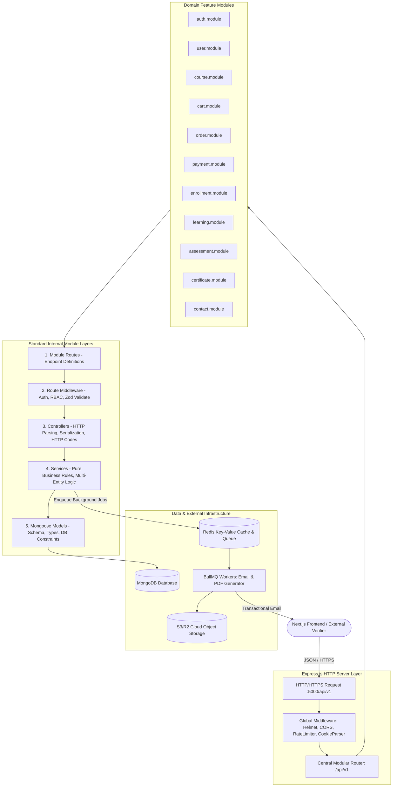
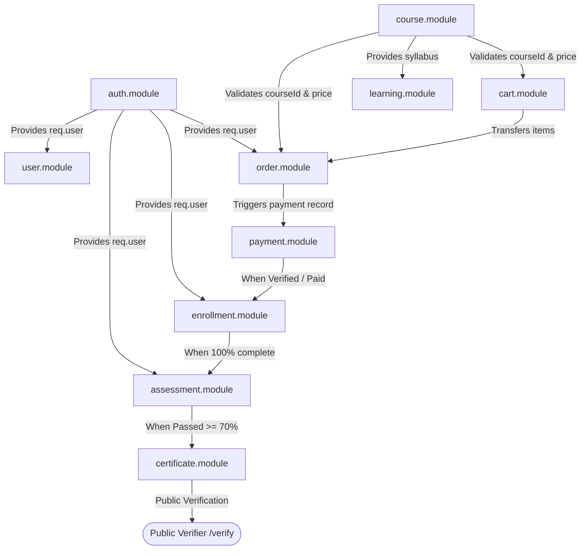
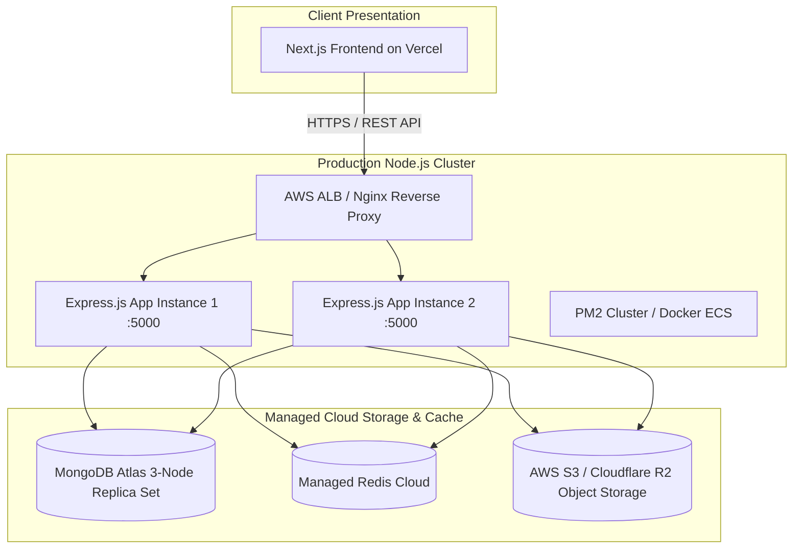
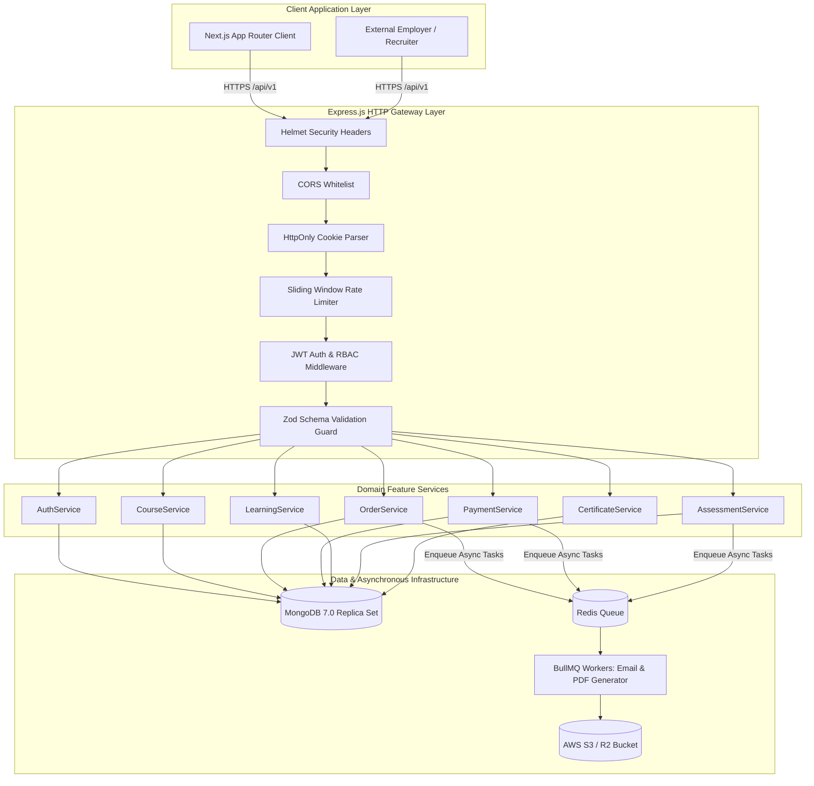

# Backend Architecture Document
# MSN Academy — Vocational & Technology Learning Management System

--- 

## 1. Document Information

* **Project Name:** MSN Academy
* **Document Name:** Backend Architecture Document & REST API Engineering Blueprint
* **File Identifier:** `04-Backend-Architecture.md`
* **Version:** 1.0.0 (Baseline Architecture)
* **Date:** September 08, 2026
* **Status:** Complete / Approved for Engineering Implementation
* **Author / Role:** Senior Backend Architect & Node.js/MongoDB Systems Specialist
* **Target Audience:** Solo Backend Lead (Full Backend & API Ownership), Frontend Engineering Team (M1–M4), Lead Full-Stack Engineers, DevOps/SRE, QA Automation Engineers
* **Backend Technology Stack:**
  * **Runtime:** Node.js (v20.x LTS)
  * **Language:** TypeScript (v5.x Strict Mode)
  * **HTTP Framework:** Express.js (v4.19+ / v5.x)
  * **Database Engine:** MongoDB (v7.0+ Replica Set / Atlas)
  * **Object Data Modeling (ODM):** Mongoose (v8.x)
  * **Authentication:** Stateless JWT (`jsonwebtoken`) over Secure, `HttpOnly`, `SameSite=Strict` Cookies
  * **Password Hashing:** Argon2id (`argon2`) or Bcrypt (`bcryptjs` cost factor 12)
  * **Validation Engine:** Zod (v3.x) with custom Express validation middleware
  * **File & Object Storage:** AWS S3 / Cloudflare R2 (compatible with `@aws-sdk/client-s3`)
  * **Background Job Queue:** BullMQ (v5.x) + Redis (v7.x) for asynchronous email dispatch and PDF certificate compilation
  * **Logging Engine:** Pino (v9.x) with `pino-http` request tracking
  * **Process Manager:** PM2 (Cluster Mode) / Docker Container Engine
* **Purpose:**
  This document provides the definitive architectural blueprint for the MSN Academy backend services. Derived strictly from [`01-PRD.md`](file:///c:/Users/HS%20LAPTOP/Downloads/MSN%20Academy%20project/01-PRD.md), [`02-Database-Design.md`](file:///c:/Users/HS%20LAPTOP/Downloads/MSN%20Academy%20project/02-Database-Design.md), and [`03-Frontend-Architecture.md`](file:///c:/Users/HS%20LAPTOP/Downloads/MSN%20Academy%20project/03-Frontend-Architecture.md), this document establishes the structural layer responsibilities, modular domain partitioning, security controls, transaction boundaries, asynchronous worker patterns, and an optimal phased implementation roadmap for the Solo Backend Lead to deliver all 43 REST API endpoints for the Frontend team.

---

## 2. Backend Architecture Overview

The MSN Academy backend is architected as a modular, layered, domain-driven monolithic REST application built on Node.js, Express.js, and TypeScript. It enforces strict separation of concerns across presentation, business logic, persistence, and external service adapters.

### 2.1 Layered Architectural Flow



### 2.2 Layer Responsibilities
1. **HTTP / Middleware Layer:** Sanitizes incoming requests, enforces CORS policies, attaches correlation request IDs, checks rate limits, extracts session JWTs from encrypted cookies, and halts invalid payloads at the boundary using Zod schema validators.
2. **Controller Layer:** Pure HTTP handler that extracts request parameters, headers, and body payloads, invokes the relevant service method, and serializes responses using the standardized API envelope. Controllers contain **zero** direct database queries and zero complex business logic.
3. **Service Layer (Core Business Logic):** Encapsulates business rules, cross-entity orchestrations, calculations (e.g., cart discount deductions, lesson progress percentage, 2-hour exam expiry checks, 70% assessment grading), and multi-document transactions.
4. **Data Access / Model Layer:** Leverages Mongoose models, lean queries, atomic update operations (`$addToSet`, `$push`, `$inc`), custom static methods, and database-level schema constraints.

---

## 3. Backend Architecture Pattern

The backend strictly implements the **Controller-Service-Model (CSM)** architectural pattern. 

```text
HTTP Request
     ↓
[Route Definition]       → Binds URI pattern + HTTP Verb
     ↓
[Middleware Chain]       → Authenticates JWT, enforces RBAC, validates request payload via Zod
     ↓
[Controller]             → Extracts params/body, delegates to Service, sends standardized JSON
     ↓
[Service]                → Enforces domain logic, computes totals/scores, manages transactions
     ↓
[Mongoose Model]         → Executes indexed queries, enforces schema types and DB constraints
     ↓
MongoDB
```

### 3.1 Why This Pattern Fits MSN Academy
* **High Decoupling for 5 Developers:** By enforcing that controllers only handle HTTP and services only handle business logic, developers can build and unit-test business rules completely isolated from the Express request/response mock cycle.
* **Transaction Safety:** Complex multi-collection workflows (such as checking out, approving a bank payment, or finalizing an exam and issuing a certificate) require coordinating multiple models within a single database session (`session.withTransaction()`). Placing this logic in the Service layer ensures complete transactional cohesion.
* **Elimination of Fat Controllers:** Prevents bloated 1,000-line controller files common in fast-paced projects, keeping maintenance overhead exceptionally low.

---

## 4. Complete Backend Folder Structure

```text
backend/
├── .env.example
├── .env.development
├── .env.production
├── .gitignore
├── Dockerfile
├── docker-compose.yml
├── package.json
├── tsconfig.json
├── README.md
│
├── src/
│   ├── app.ts                              # Express Application Initialization & Global Middleware
│   ├── server.ts                           # Server Bootstrap, Mongo Connection & Graceful Shutdown
│   │
│   ├── config/                             # Centralized Environment & External Config
│   │   ├── env.config.ts                   # Validated Environment Variables (Zod)
│   │   ├── db.config.ts                    # MongoDB Mongoose Connection Pool
│   │   ├── redis.config.ts                 # Redis Connection Client
│   │   └── s3.config.ts                    # AWS S3 / Cloudflare R2 Client Config
│   │
│   ├── constants/                          # Global Enums & Immutable Values
│   │   ├── errorCodes.constants.ts         # Unified Error Codes (e.g., AUTH_001, EXAM_004)
│   │   ├── httpStatusCodes.constants.ts   # HTTP Status Code Constants
│   │   └── roles.constants.ts              # System Roles (STUDENT, ADMIN)
│   │
│   ├── middleware/                         # Global & Reusable Middleware
│   │   ├── auth.middleware.ts              # JWT Cookie Verification & User Hydration
│   │   ├── role.middleware.ts              # Role-Based Access Control (RBAC) Guard
│   │   ├── validate.middleware.ts          # Generic Zod Schema Request Validator
│   │   ├── error.middleware.ts             # Centralized Global Error Handler
│   │   ├── notFound.middleware.ts          # 404 Route Catch-All
│   │   ├── rateLimiter.middleware.ts       # Express-Rate-Limit Defense
│   │   └── requestLogger.middleware.ts     # Pino HTTP Logger
│   │
│   ├── modules/                            # Domain Feature Modules (Horizontal Slicing)
│   │   ├── auth/                           # Module 1: Authentication & Password Recovery
│   │   │   ├── auth.controller.ts
│   │   │   ├── auth.service.ts
│   │   │   ├── auth.routes.ts
│   │   │   ├── auth.schemas.ts             # Zod Validation Schemas
│   │   │   └── auth.types.ts
│   │   │
│   │   ├── users/                          # Module 2: User Profiles & Notification Settings
│   │   │   ├── user.controller.ts
│   │   │   ├── user.service.ts
│   │   │   ├── user.routes.ts
│   │   │   ├── user.model.ts               # Mongoose Schema (users collection)
│   │   │   └── user.schemas.ts
│   │   │
│   │   ├── courses/                        # Module 3: Catalog, Search, Syllabus & Resources
│   │   │   ├── course.controller.ts
│   │   │   ├── course.service.ts
│   │   │   ├── course.routes.ts
│   │   │   ├── course.model.ts             # Mongoose Schema (courses collection)
│   │   │   └── course.schemas.ts
│   │   │
│   │   ├── cart/                           # Module 4: Transient Shopping Cart & Coupons
│   │   │   ├── cart.controller.ts
│   │   │   ├── cart.service.ts
│   │   │   ├── cart.routes.ts
│   │   │   ├── cart.model.ts               # Mongoose Schema (carts collection)
│   │   │   └── cart.schemas.ts
│   │   │
│   │   ├── orders/                         # Module 5: Checkout Ledger & Order History
│   │   │   ├── order.controller.ts
│   │   │   ├── order.service.ts
│   │   │   ├── order.routes.ts
│   │   │   ├── order.model.ts              # Mongoose Schema (orders collection)
│   │   │   └── order.schemas.ts
│   │   │
│   │   ├── payments/                       # Module 6: Payment Rails & Verification Audits
│   │   │   ├── payment.controller.ts
│   │   │   ├── payment.service.ts
│   │   │   ├── payment.routes.ts
│   │   │   ├── payment.model.ts            # Mongoose Schema (payments collection)
│   │   │   ├── payment.schemas.ts
│   │   │   └── adapters/                   # Pluggable Payment Rails
│   │   │       ├── bankTransfer.adapter.ts
│   │   │       ├── easypaisa.adapter.ts
│   │   │       └── jazzcash.adapter.ts
│   │   │
│   │   ├── enrollments/                    # Module 7: Student Access Grants & Course Hub
│   │   │   ├── enrollment.controller.ts
│   │   │   ├── enrollment.service.ts
│   │   │   ├── enrollment.routes.ts
│   │   │   └── enrollment.model.ts         # Mongoose Schema (enrollments collection)
│   │   │
│   │   ├── learning/                       # Module 8: Lesson Player & Progress Tracking
│   │   │   ├── learning.controller.ts
│   │   │   ├── learning.service.ts
│   │   │   ├── learning.routes.ts
│   │   │   └── learning.schemas.ts
│   │   │
│   │   ├── assessments/                    # Module 9: Exam Session, Timers & MCQ Grading
│   │   │   ├── assessment.controller.ts
│   │   │   ├── assessment.service.ts
│   │   │   ├── assessment.routes.ts
│   │   │   ├── assessment.model.ts         # Mongoose Schema (assessments collection)
│   │   │   ├── attempt.model.ts            # Mongoose Schema (assessment_attempts collection)
│   │   │   └── assessment.schemas.ts
│   │   │
│   │   ├── certificates/                   # Module 10: Credential Issuance & Public Registry
│   │   │   ├── certificate.controller.ts
│   │   │   ├── certificate.service.ts
│   │   │   ├── certificate.routes.ts
│   │   │   ├── certificate.model.ts        # Mongoose Schema (certificates collection)
│   │   │   └── certificate.schemas.ts
│   │   │
│   │   └── contact/                        # Module 11: Public Contact & Lead Management
│   │       ├── contact.controller.ts
│   │       ├── contact.service.ts
│   │       ├── contact.routes.ts
│   │       ├── contact.model.ts            # Mongoose Schema (contact_inquiries collection)
│   │       └── contact.schemas.ts
│   │
│   ├── jobs/                               # Asynchronous BullMQ Background Workers
│   │   ├── queues.ts                       # BullMQ Queue Definitions (EmailQueue, CertQueue)
│   │   ├── email.worker.ts                 # Transactional Email Dispatcher Worker
│   │   └── pdf.worker.ts                   # Certificate PDF Vector Compilation Worker
│   │
│   ├── types/                              # Shared Global TypeScript Interfaces & Declarations
│   │   ├── express.d.ts                    # Augments Express Request with User Payload
│   │   ├── api.types.ts                    # ApiResponse, ApiError, Pagination DTOs
│   │   └── common.types.ts
│   │
│   └── utils/                              # Shared Technical Utilities
│       ├── apiResponse.util.ts             # Standardized JSON Success Envelope Formatter
│       ├── appError.util.ts                # Operational Error Class (extends Error)
│       ├── asyncHandler.util.ts            # Wraps Async Controllers Eliminating Try/Catch
│       ├── hash.util.ts                    # Argon2 / Bcrypt Encapsulation
│       ├── jwt.util.ts                     # Token Signing & Verification
│       └── qrCode.util.ts                  # Vector QR Code Generation
│
└── tests/                                  # Automated Test Suites
    ├── setup.ts                            # Test Environment Initialization & DB Hook
    ├── unit/                               # Pure Service Unit Tests
    ├── integration/                        # Controller + Service + DB Integration Tests
    └── fixtures/                           # Deterministic Test Fixtures & Seed Data
```

---

## 5. Feature Module Architecture

| Module Identifier | Core Responsibility | Related Mongoose Model(s) | Key Business Logic Enforced | Frontend Consumers |
| :--- | :--- | :--- | :--- | :--- |
| **`auth`** | User login, registration, password hashing, session cookies, OAuth callbacks. | `User` | Duplicate email prevention, Argon2id password verification, JWT cookie issuance. | `features/auth` (`/login`, `/register`) |
| **`users`** | Student profile retrieval, profile updates, password change, notification toggle. | `User` | Current password verification, avatar uploads, notification preference persistence. | `features/profile` (`/profile`) |
| **`courses`** | Public catalog browsing, faceted filtering, text search, syllabus inspection. | `Course` | Published/Draft status filtering, category/level faceting, syllabus tree projection. | `features/courses` (`/courses`, `/courses/[slug]`) |
| **`cart`** | Transient shopping cart, item addition/deletion, promo voucher discounts. | `Cart`, `Course` | Prevents duplicate courses in cart, calculates subtotal, applies coupon limits. | `features/cart` (Slide-Over Drawer) |
| **`orders`** | Order placement, unique numbering (`MSN-ORD-XXX`), student order history. | `Order`, `User` | Server-side total calculation, guest account auto-provisioning, order immutable snapshotting. | `features/checkout`, `features/orders` (`/checkout`, `/orders`) |
| **`payments`** | Multi-rail settlements (Bank, Easypaisa, JazzCash), manual audit approvals. | `Payment`, `Order`, `Enrollment` | 24-hour manual verification queuing, transaction reference storage, atomic enrollment trigger. | `features/checkout` (`/order/success`, `/order/pending`, `/order/failed`) |
| **`enrollments`** | Student course access validation, active course listing, dashboard aggregations. | `Enrollment`, `Course` | Prevents unauthorized course access, aggregates student dashboard metric cards. | `features/learning` (`/dashboard`, `/my-courses`) |
| **`learning`** | Lecture streaming access, lesson completion tracking, sequential unlocks. | `Enrollment`, `Course` | Atomic `$addToSet` lesson completion, recalculates progress percentage, unlocks final exam. | `features/learning` (`/learn/[courseId]`, `/lesson/[lessonId]`) |
| **`assessments`**| Timed exam session management, MCQ answer evaluation, scoring, retake history. | `Assessment`, `AssessmentAttempt` | Secret answer key protection, 2-hour server expiration, 70% passing threshold evaluation. | `features/assessment` (`/learn/[courseId]/assessment/*`) |
| **`certificates`**| Certificate document creation, PDF generation queuing, public lookup engine. | `Certificate`, `AssessmentAttempt` | Tamper-proof name snapshotting, unique ID generation (`MSN-2024-XXXX`), public verification. | `features/certificates` (`/certificate/[certId]`, `/verify`) |
| **`contact`** | Public inquiry and lead form message persistence. | `ContactInquiry` | Validates contact fields, saves inquiry, triggers internal notifications. | `features/courses` (`/contact`) |

---

## 6. Authentication Architecture

### 6.1 Authentication Mechanism
* **Stateful Credentials / Stateless Verification:** Students authenticate using email and password. Upon successful credential verification, the backend generates an industry-standard signed JWT.
* **Token Payload:** The JWT contains strictly non-sensitive identity metadata:
  ```json
  {
    "sub": "66dd8f1a10a1b2c3d4e5f001",
    "email": "ahmed@example.com",
    "role": "STUDENT",
    "iat": 1773000000,
    "exp": 1773604800
  }
  ```
* **Cookie-Based Transport:** The JWT is transmitted to the client in an `HttpOnly`, `Secure` (in production), `SameSite=Strict` cookie named `msn_session_token` with an expiration window of 7 days (`maxAge: 7 * 24 * 60 * 60 * 1000`).
* **Zero Client-Side Token Storage:** The frontend has zero access to the token string via JavaScript, preventing any possibility of XSS-based session hijacking.

### 6.2 Password Security & Hashing
* Passwords are salted and hashed using **Argon2id** (memory cost: 64MB, time cost: 3 iterations, parallelism: 4 threads).
* Bcrypt (cost factor 12) is maintained as an alternate fallback utility. Plaintext passwords are never logged, cached, or persisted.

### 6.3 Guest Checkout Auto-Provisioning Flow
1. Guest student inputs checkout details (First Name, Last Name, Email, Phone Number).
2. Service checks if a `User` record exists for the email:
   * **Existing User:** Verifies email; links order to existing account.
   * **New User:** Automatically provisions a `User` entity with `isGuestProvisioned: true`, generates an initial secure randomized password, and emits an asynchronous onboarding welcome email containing initial login credentials.

---

## 7. Authorization & Role-Based Access Control (RBAC)

### 7.1 System Roles Defined
* **`GUEST`:** Unauthenticated public visitor. Can browse courses, view public syllabi, manage transient carts, execute Guest Checkout, and query the public Certificate Verification registry.
* **`STUDENT`:** Authenticated student. Can access the LMS Dashboard, stream enrolled video lectures, download resource attachments, commit lesson progress, take final assessments, view earned certificates, and manage their profile.
* **`ADMIN`:** Back-office administrative role. Authorized to review pending Bank Transfer / Easypaisa / JazzCash payments, approve/reject orders, create courses, and invalidate fraudulent certificates.

### 7.2 Access Control Matrix

| Resource / Endpoint Scope | GUEST | STUDENT | ADMIN |
| :--- | :---: | :---: | :---: |
| `GET /api/v1/courses/**` (Public Catalog & Syllabus) | Allowed | Allowed | Allowed |
| `POST /api/v1/auth/login`, `register` | Allowed | Denied (Logged In) | Allowed |
| `POST /api/v1/orders/checkout` (Guest Mode) | Allowed | Denied (Use Student) | Denied |
| `POST /api/v1/orders/checkout` (Registered Mode) | Denied | Allowed | Allowed |
| `GET /api/v1/certificates/verify/:id` (Public Registry)| Allowed | Allowed | Allowed |
| `POST /api/v1/contact` | Allowed | Allowed | Allowed |
| `GET /api/v1/student/**` (Dashboard, Enrolled Courses) | Denied | Allowed | Allowed |
| `GET /api/v1/learning/:courseId/**` (Video Streams & Files)| Denied | Allowed (If Enrolled)| Allowed |
| `POST /api/v1/learning/:courseId/lesson/:id/complete`| Denied | Allowed (If Enrolled)| Allowed |
| `POST /api/v1/assessments/:courseId/**` (Exam Engine) | Denied | Allowed (If 100% Completed)| Allowed |
| `PATCH /api/v1/payments/:id/verify` (Manual Approvals) | Denied | Denied | Allowed |
| `POST /api/v1/courses` (Course Authoring Studio) | Denied | Denied | Allowed |

---

## 8. Middleware Architecture

Express middleware functions execute in a strict sequential pipeline:

```
[Request In]
     ↓
1.  helmet()                  → Sets HTTP security headers (X-Frame-Options, CSP, HSTS)
2.  cors(corsOptions)         → Enforces origin allow-listing and credentials transmission
3.  express.json({ limit })   → Parses JSON body with strict 1MB size limit
4.  cookieParser()            → Parses incoming HttpOnly session cookies
5.  pinoHttp()                → Logs incoming request metadata (Method, Path, IP, User-Agent)
6.  rateLimiter()             → Enforces IP-based sliding window request caps
     ↓
[Route-Specific Middleware]
7.  authMiddleware            → Decodes JWT cookie, verifies signature, attaches req.user
8.  requireRole([...])        → Verifies req.user.role matches required privilege level
9.  validateRequest(schema)   → Validates req.body, req.query, req.params against Zod schemas
     ↓
[Controller Execution]
     ↓
[Error Pipeline]
10. notFoundHandler           → Intercepts unmapped routes, throws 404 AppError
11. errorHandler              → Normalizes error, masks secrets, formats standardized JSON
```

---

## 9. Validation Architecture

Validation is standardized using **Zod** schemas executed via a reusable Express middleware helper (`validateRequest`).

### 9.1 Authoritative Server-Side Validation Pipeline
1. Incoming HTTP payload (`req.body`, `req.params`, `req.query`) is intercepted by `validateRequest(schema)`.
2. Zod executes synchronous or asynchronous schema parsing:
   * **Valid:** Mutates `req[target]` with sanitized, trimmed, and typed data; calls `next()`.
   * **Invalid:** Short-circuits the pipeline immediately; formats all Zod validation errors into an array of `{ field, message }`; passes a `ValidationError` (HTTP 422) to the centralized error handler.
3. Controllers and Services receive **guaranteed-valid**, strongly-typed TypeScript objects matching `z.infer<typeof schema>`.

---

## 10. REST API Architecture & Conventions

### 10.1 Global URI Versioning
All public and authenticated endpoints are prefixed with `/api/v1`:
```text
https://api.msnacademy.com/api/v1/[resource]
```

### 10.2 HTTP Verbs & Resource Semantics
* `GET`: Safe, idempotent retrieval of resource collections or single entities.
* `POST`: Creation of new entities (orders, assessment attempts, contact inquiries) or non-idempotent business actions (login, calculate score).
* `PUT`: Complete idempotent replacement of an entity (e.g., student profile updates).
* `PATCH`: Partial modification of an entity (e.g., marking a lesson complete, updating order status).
* `DELETE`: Deactivation or removal of an entity (e.g., removing a course from the cart).

### 10.3 Standard Query Parameters
* **Pagination:** `?page=1&limit=10` (Enforced maximum limit: 50).
* **Sorting:** `?sort=-createdAt` (prefix `-` indicates descending order).
* **Faceted Filtering:** `?category=Data+Science&level=Beginner`.
* **Full-Text Search:** `?q=analytics`.

---

## 11. API Response Standards

Every backend route outputs JSON strictly matching the unified contract established with the frontend team:

### 11.1 Success Response Standard
```json
{
  "success": true,
  "message": "Operation completed successfully",
  "data": {},
  "meta": {
    "page": 1,
    "limit": 10,
    "total": 42,
    "totalPages": 5
  }
}
```

### 11.2 Error Response Standard
```json
{
  "success": false,
  "message": "Validation failed on provided inputs",
  "errors": [
    {
      "field": "email",
      "message": "Please enter a valid email address"
    }
  ],
  "statusCode": 422
}
```

---

## 12. Centralized Error Handling Architecture

### 12.1 Custom Operational Error Class (`AppError`)
The system differentiates between **trusted operational errors** (expected business failures like duplicate emails, expired exam timers, invalid coupons) and **unhandled programmer bugs** (null pointers, database disconnections).

```typescript
// Conceptual Architecture of AppError
export class AppError extends Error {
  public readonly statusCode: number;
  public readonly isOperational: boolean;
  public readonly errors?: Array<{ field: string; message: string }>;

  constructor(message: string, statusCode: number = 500, errors?: Array<{ field: string; message: string }>) {
    super(message);
    this.statusCode = statusCode;
    this.isOperational = true;
    this.errors = errors;
    Error.captureStackTrace(this, this.constructor);
  }
}
```

### 12.2 Environment-Aware Error Masking
* **Development (`NODE_ENV=development`):** Full error responses include error stack traces and internal Mongoose error details for rapid debugging.
* **Production (`NODE_ENV=production`):** If an error is operational (`isOperational: true`), sends the sanitized message and status code. If an unhandled bug occurs (`isOperational: false`), logs the full error to Pino and sends a generic safe message: *"An unexpected internal server error occurred. Our engineering team has been notified."* (HTTP 500).

---

## 13. Course & Content Architecture

* **Catalog Aggregations:** The course listing service queries the `courses` collection, filtering exclusively by `status: 'PUBLISHED'` and `isDeleted: false`.
* **Curriculum Syllabus Projection:** When public catalog visitors inspect course details (`/courses/:slug`), the syllabus tree is projected **without** private media stream keys.
* **Stream Security:** Video lecture URLs (`videoStreamUrl`) are never exposed in public catalog responses. Protected streaming tokens are delivered exclusively through `GET /api/v1/learning/:courseId/lesson/:lessonId` after verifying active enrollment.

---

## 14. Enrollment Architecture

* **Enrollment Factory:** Enrollments are created exclusively via the internal `EnrollmentService.createEnrollment(userId, courseId, orderId)` method.
* **Duplicate Prevention:** The database enforces a compound unique index on `{ userId: 1, courseId: 1 }`. If a student attempts to purchase an already-owned course, the service rejects the checkout transaction with HTTP 409 Conflict.
* **Access Guard Middleware (`requireEnrollment`):** All learning routes (`/api/v1/learning/:courseId/*`) execute a pre-flight database check:
  ```typescript
  const enrollment = await Enrollment.findOne({ userId: req.user._id, courseId: req.params.courseId, status: 'ACTIVE' });
  if (!enrollment) throw new AppError('You are not enrolled in this course', 403);
  ```

---

## 15. Learning & Progress Tracking Architecture

1. **Progress Commitment:** When a student clicks `Mark as Complete` in the lecture player, the client fires `POST /api/v1/learning/:courseId/lesson/:lessonId/complete`.
2. **Atomic In-Memory Mutation:** The service executes:
   ```typescript
   await Enrollment.updateOne(
     { userId, courseId, "completedLectures.lectureId": { $ne: lectureId } },
     { 
       $push: { completedLectures: { lectureId, completedAt: new Date() } },
       $set: { lastAccessedLectureId: lectureId }
     }
   );
   ```
3. **Progress Recalculation:** The service loads total lessons count for the course and computes integer percentage:
   $$\text{progressPercentage} = \operatorname{round}\left( \frac{\text{len}(\text{completedLectures})}{\text{courses.totalLessonsCount}} \times 100 \right)$$
4. **Assessment Gating:** If `progressPercentage === 100`, the service atomically updates `enrollment.assessmentStatus` to `'ELIGIBLE'`, unlocking the assessment briefing card on the frontend.

---

## 16. Shopping Cart Architecture

* **Hybrid Session Storage:** Carts support both authenticated students (`userId`) and anonymous visitors (`guestSessionId` stored in a signed browser cookie).
* **Price Staleness Protection:** When viewing the cart drawer or initiating checkout, the cart service cross-references items against active `courses.price` in MongoDB to prevent students from checking out with stale, discounted prices.
* **Auto-Purge TTL:** Inactive guest carts expire automatically after 14 days via MongoDB's native TTL index on `expiresAt`.

---

## 17. Order Architecture

* **Server-Side Financial Calculation:** The backend **never trusts client-submitted price totals**. When checkout is initiated, the order service reads canonical prices directly from the `courses` collection, applies validated coupon discounts, and calculates `totalAmount` server-side.
* **Order Number Generator:** Generates human-readable sequential tracking numbers in format `MSN-ORD-XXX` matching the UI designs (`Order history.png`).
* **Immutable Snapshotting:** Each item in `order.items` stores an immutable snapshot of `courseTitle` and `pricePaid` at transaction time to guarantee audit integrity against future catalog price updates.

---

## 18. Payment Architecture & Provider Abstraction

### 18.1 Pluggable Payment Rail Pattern
The payment domain uses an adapter pattern to decouple commercial orders from the underlying banking or mobile wallet rail:

```
                          ┌────────────────────────┐
                          │     PaymentService     │
                          └───────────┬────────────┘
                                      │
            ┌─────────────────────────┼─────────────────────────┐
            │                         │                         │
            ▼                         ▼                         ▼
  ┌───────────────────┐     ┌───────────────────┐     ┌───────────────────┐
  │ BankTransferRail  │     │   EasypaisaRail   │     │   JazzCashRail    │
  │ (Manual 24h Queue)│     │ (Manual / Wallet) │     │ (Manual / Wallet) │
  └───────────────────┘     └───────────────────┘     └───────────────────┘
```

### 18.2 Manual Offline Settlement Workflow (Confirmed in UI)
1. Order created in `PENDING` status; Payment record created in `PENDING` status.
2. Frontend renders `Payment Pending` screen (`pending.png`): *"Manual payments may take up to 24 hours to verify"*.
3. Student receives email containing official MSN Academy bank account / wallet details.
4. Administrator reviews bank statement; executes `PATCH /api/v1/payments/:id/verify`.
5. Service executes multi-document transaction: updates payment to `SUCCESSFUL`, order to `COMPLETED`, and provisions student `enrollments`.

---

## 19. Assessment Engine Architecture

### 19.1 Secure Question Delivery
* The `assessments` collection stores the secret answer key (`correctOptionKey`).
* When `POST /api/v1/assessments/:courseId/start` is called, the backend initializes an `AssessmentAttempt` record and returns questions to the client **strictly projecting out** `correctOptionKey` (`select: false`).

### 19.2 Server-Side Timer Enforcement
* The backend computes: `expiresAt = startedAt + (120 * 60 * 1000)` (2 hours).
* When answers are submitted via `POST /api/v1/assessments/:attemptId/submit`, the server checks:
  $$\text{if } (\text{Date.now()} > \text{attempt.expiresAt} + 30\text{s grace period}) \implies \text{Mark Status: EXPIRED}$$
* Prevents client-side tampering with local browser clocks.

### 19.3 Automated Instant Grading & Unlimited Retakes
1. Compares submitted student options against authoritative database answer keys.
2. Computes score percentage: `(correct / total) * 100`.
3. If score $\ge 70\%$: Marks attempt `passed: true`; triggers certificate issuance pipeline.
4. If score $< 70\%$: Marks attempt `passed: false`; preserves attempt history; leaves course assessment open for unlimited retakes.

---

## 20. Certificate & Verification Architecture

### 20.1 Generation Pipeline
1. When an assessment attempt is graded $\ge 70\%$, `CertificateService.generateCertificate()` is invoked inside the completion transaction.
2. Generates a unique Certificate Number formatted `MSN-YYYY-NNNN` (e.g., `MSN-2024-0042`) and a cryptographic UUID `verificationCode`.
3. Persists immutable snapshots: `studentNameSnapshot`, `courseTitleSnapshot`, `scoreAchieved` (`82%`), `issueDate`.
4. Enqueues background job to compile vector PDF and upload scannable QR code to S3/R2 storage.

### 20.2 Public Verification Lookup (`/api/v1/certificates/verify/:id`)
* Fully public endpoint (zero authentication required).
* Performs indexed lookup on `certificateNumber`.
* Returns public verification data (Student Name, Course, Issue Date, Status) while keeping internal user account IDs completely private.

---

## 21. File & Object Storage Architecture

* **Storage Provider:** AWS S3 or Cloudflare R2 (zero egress fees) via `@aws-sdk/client-s3`.
* **Zero Binary Storage in MongoDB:** MongoDB stores **only** absolute CDN URL strings. Binary media files (video streams, PDF certificates, slide presentations, avatars) are stored in cloud object storage.
* **Presigned Download URLs:** Protected course resources (`Course Slides.pdf`, `Exercise Files.zip`) generate time-limited (15-minute) presigned S3 URLs to prevent unauthorized hotlinking.

---

## 22. Asynchronous Job & Worker Architecture (BullMQ & Redis)

### 22.1 Objective Justification for Redis & BullMQ
To maintain API response times under 250ms, time-consuming I/O operations are offloaded from the main Node.js event loop to dedicated **BullMQ** background workers backed by **Redis**:

| Background Queue | Triggering Event | Worker Operation | Failure & Retry Policy |
| :--- | :--- | :--- | :--- |
| **`EmailQueue`** | Registration, Order Placed, Payment Approved, Exam Result | Sends transactional email via SMTP/SendGrid/SES. | 3 retries with exponential backoff (10s, 30s, 90s). |
| **`CertificateQueue`**| Assessment passed ($\ge 70\%$) | Compiles vector PDF certificate, creates QR code, uploads to S3 bucket. | 3 retries with exponential backoff. |

*If Redis is unavailable in local development, an in-process synchronous fallback adapter is provided.*

---

## 23. Database Interaction Architecture

* **Mongoose Connection Pool:** Maintained via singleton `src/config/db.config.ts` with `maxPoolSize: 50`, `minPoolSize: 10`, `serverSelectionTimeoutMS: 5000`.
* **Lean Queries for Read Throughput:** All read-only catalog, syllabus, and order history queries utilize `.lean()` to bypass Mongoose document hydration overhead, reducing memory footprint by up to 70%.
* **Atomic Array Operations:** Avoids read-modify-write antipatterns by executing atomic MongoDB operators (`$addToSet`, `$pull`, `$set`, `$inc`) directly on the database.

---

## 24. Transaction & Consistency Architecture

MongoDB Multi-Document ACID Transactions (`session.withTransaction()`) are strictly enforced for:
1. **Checkout & Order Creation:** Atomic insertion into `orders`, insertion into `payments`, and purging of the active `cart`.
2. **Manual Payment Approval:** Atomic update of `payment.status = 'SUCCESSFUL'`, `order.status = 'COMPLETED'`, and provisioning of `enrollments` records.
3. **Assessment Passing & Certification:** Atomic update of `assessment_attempts.status = 'SUBMITTED'`, `enrollment.status = 'COMPLETED'`, and insertion of `certificates`.

---

## 25. Pagination, Filtering & Search Architecture

* **Database-Level Pagination:** Enforced using `skip((page - 1) * limit).limit(limit)` paired with `countDocuments()`.
* **Full-Text Search:** Utilizes MongoDB's native `$text` index on `courses.title` and `courses.shortDescription`.
* **Faceted Category & Level Filters:** Converted into indexed compound MongoDB query filters:
  ```typescript
  const filter: Record<string, any> = { status: 'PUBLISHED', isDeleted: false };
  if (category && category !== 'All') filter.category = category;
  if (level && level !== 'All Levels') filter.level = level;
  ```

---

## 26. Security Architecture

* **HTTP Header Hardening:** `helmet()` enforces HTTP Strict Transport Security (HSTS), X-Content-Type-Options: nosniff, and frameguard protections.
* **CORS Policy:** Whitelists strictly the frontend application origin (`process.env.FRONTEND_URL`), with `credentials: true`.
* **Rate Limiting:** IP-based sliding window limiter via `express-rate-limit`:
  * Global API: 300 requests per 15-minute window.
  * Sensitive Auth Routes (`/login`, `/register`): 10 requests per 15-minute window.
* **NoSQL Injection Defense:** `express-mongo-sanitize` strips out `$` and `.` operators from client request payloads.
* **Body Size Caps:** JSON request body parser capped at 1 MB to prevent memory-exhaustion DoS attacks.

---

## 27. Configuration & Environment Architecture

### 27.1 Environment Classification Matrix

| Variable Name | Classification | Requirement | Purpose |
| :--- | :---: | :---: | :--- |
| `NODE_ENV` | Public Config | **Required** | `development`, `test`, `production` |
| `PORT` | Public Config | **Required** | Express listening port (Default: `5000`) |
| `FRONTEND_URL` | Public Config | **Required** | CORS origin whitelist (e.g. `http://localhost:3000`) |
| `MONGODB_URI` | **Secret** | **Required** | MongoDB connection string with replica set credentials |
| `JWT_SECRET` | **Secret** | **Required** | 256-bit cryptographic signing secret for session tokens |
| `JWT_EXPIRES_IN` | Public Config | **Required** | Token lifetime (Default: `7d`) |
| `REDIS_URL` | **Secret** | Optional | Redis connection URI for BullMQ queues |
| `AWS_S3_BUCKET` | Public Config | Optional | S3/R2 Bucket name for assets and certificates |
| `AWS_ACCESS_KEY_ID` | **Secret** | Optional | Cloud storage IAM access key |
| `AWS_SECRET_ACCESS_KEY`| **Secret** | Optional | Cloud storage IAM secret key |
| `SMTP_HOST` / `KEY` | **Secret** | Optional | Transactional email provider credentials |

---

## 28. Logging & Observability Architecture

* **Structured Logging (Pino):** All application events are logged as structured JSON objects containing timestamp, log level, correlation `reqId`, HTTP method, path, and execution duration.
* **Sanitized Audit Trails:** Request logging middleware explicitly filters out sensitive parameters:
  ```typescript
  // Parameters blacklisted from log output
  ['password', 'passwordConfirm', 'creditCard', 'token', 'authorization']
  ```
* **Critical Event Alerts:** System logs explicit warning/error entries for failed payment audits, rate-limit triggers, and database transaction rollbacks.

---

## 29. Testing Architecture

* **Unit Testing (Jest + ts-jest):** Tests pure domain service calculations (score evaluations, percentage rounding, cart totals) in complete isolation.
* **Integration Testing (Supertest + `mongodb-memory-server`):** Tests Express route pipelines, middleware validations, controller responses, and actual Mongoose database mutations against an in-memory replica set.
* **End-to-End API Workflows:**
  1. Register $\rightarrow$ Login $\rightarrow$ Query Profile.
  2. Browse Catalog $\rightarrow$ Add to Cart $\rightarrow$ Execute Checkout $\rightarrow$ Order Created in `PENDING`.
  3. Admin Payment Approval $\rightarrow$ Verify Enrollment Created.
  4. Stream Lessons $\rightarrow$ Mark Lessons Complete $\rightarrow$ Progress Updates to 100%.
  5. Start Assessment $\rightarrow$ Submit Answers (8/10) $\rightarrow$ Graded 82% $\rightarrow$ Certificate Issued $\rightarrow$ Verify via Public `/verify`.

---

## 30. API Dependency Map



---

## 31. Solo Backend Lead Ownership & Phased Delivery Roadmap

The entire backend service layer, database persistence, and all 43 REST API endpoints are owned and developed by the **Solo Backend Lead**. To provide the Frontend team (M1–M4) with immediate integration endpoints while honoring domain dependencies (see Section 30 API Dependency Map), backend development proceeds through 5 sequential phases:

| Phase | Phase Title | Domain Modules Owned | Core Deliverables & Business Logic | Primary Frontend Consumer |
| :---: | :--- | :--- | :--- | :--- |
| **1** | **Foundation, Auth & Identity** | `auth`, `users` | Express server bootstrap, MongoDB connection pool, Zod validator middleware, JWT HttpOnly cookie pipeline, password hashing, and user profile CRUD. | **M1** (`/login`, `/register`, `/profile`) |
| **2** | **Catalog & Content Engine** | `courses`, `contact` | Master course catalog, faceted filters (categories, levels), syllabus tree endpoints, and public contact inquiries. | **M2** (`/`, `/courses`, `/courses/:slug`, `/contact`) |
| **3** | **Commerce & Payment Rails** | `cart`, `orders`, `payments` | Guest & student cart persistence, promo coupons, checkout ledger, Pakistani payment rails (Bank Wire, Easypaisa, JazzCash), and slip verification audit. | **M3** (`CartDrawer`, `/checkout`, `/orders`) |
| **4** | **LMS Learning Portal** | `enrollments`, `learning` | Paid course access grants, video lecture streaming context, downloadable attachments, lesson completion toggles, and atomic 0–100% progress tracking. | **M4** (`/my-courses`, `/learn/:courseId`, `/lesson/:id`) |
| **5** | **Evaluation & Credential Registry** | `assessments`, `certificates` | 120m timed exam engine, auto-grading (70% pass threshold), BullMQ certificate PDF worker, vector QR codes, and public `/verify` registry. | **M4** (`/learn/:courseId/assessment`, `/verify`) |

---

## 32. Parallel Development & Contract-First Strategy

1. **Foundational Code Agreement (Day 1):** The lead architect commits `app.ts`, `server.ts`, centralized `authMiddleware`, `validateRequest`, `apiResponse.util.ts`, and base Mongoose schemas before feature branching begins.
2. **Canonical TypeScript Types:** All DTOs, request payloads, and response interfaces in `src/types/` are locked on Day 1.
3. **Mock Data Fixtures:** Each developer uses seeded fixtures (`tests/fixtures/`) allowing Member 5 to develop the assessment engine even before Member 4 finishes the video lecture completion API.

---

## 33. Git & Branching Strategy

* **Branching Model:** Feature-branch workflow off integration branch `develop`.
* **Naming Conventions:**
  * `feature/backend-auth-[feature-name]`
  * `feature/backend-courses-[feature-name]`
  * `feature/backend-orders-[feature-name]`
  * `feature/backend-learning-[feature-name]`
  * `feature/backend-assessments-[feature-name]`
* **Pull Request Criteria:** Every PR must include unit/integration tests, zero ESLint/TypeScript warnings, and require approvals from at least two peer backend developers.

---

## 34. Deployment Architecture



---

## 35. Backend Definition of Done (DoD)

A backend feature is officially considered **Done** and ready for deployment only when:
* [ ] All business rules from `01-PRD.md` are implemented.
* [ ] Adheres strictly to the schema and indexing definitions in `02-Database-Design.md`.
* [ ] All inputs are strictly validated using Zod schemas via `validateRequest`.
* [ ] Proper authorization and ownership checks are enforced via middleware.
* [ ] Responses strictly follow the unified `{ success, message, data, meta }` envelope.
* [ ] Automated integration tests achieve $\ge 80\%$ code coverage on service logic.
* [ ] Zero unhandled promise rejections or unmasked stack traces in production mode.
* [ ] API endpoints verified and accepted by the respective frontend feature owner.

---

## 36. PRD & Database Traceability Matrix

| Backend Module | PRD Feature ID | Database Collection | Frontend Feature Module | Target Route / Endpoint |
| :--- | :--- | :--- | :--- | :--- |
| **`auth`** | FR-AUTH-001, FR-AUTH-002 | `users` | `features/auth` | `POST /api/v1/auth/register`, `login` |
| **`users`** | FR-PROF-001, FR-PROF-003 | `users` | `features/profile` | `GET /api/v1/users/profile`, `PUT /password`|
| **`courses`** | FR-DISC-001, FR-DISC-002 | `courses` | `features/courses` | `GET /api/v1/courses`, `GET /courses/:slug` |
| **`cart`** | FR-COMM-001, FEAT-CART-01 | `carts` | `features/cart` | `GET /api/v1/cart`, `POST /items` |
| **`orders`** | FR-COMM-002, FR-COMM-003 | `orders` | `features/checkout` | `POST /api/v1/orders/checkout`, `GET /orders`|
| **`payments`** | FR-PAY-001, FR-PAY-002 | `payments` | `features/checkout` | `PATCH /api/v1/payments/:id/verify` |
| **`enrollments`**| FR-LRN-001, FR-LRN-002 | `enrollments` | `features/learning` | `GET /api/v1/student/dashboard`, `enrollments`|
| **`learning`** | FR-LRN-003, FR-LRN-005 | `enrollments`, `courses` | `features/learning` | `POST /api/v1/learning/:id/lesson/:id/complete`|
| **`assessments`**| FR-ASS-001, FR-ASS-003 | `assessments`, `attempts`| `features/assessment` | `POST /api/v1/assessments/:id/start`, `submit`|
| **`certificates`**| FR-CERT-001, FR-CERT-002| `certificates` | `features/certificates` | `GET /api/v1/certificates/:id`, `verify` |
| **`contact`** | FR-MISC-001 | `contact_inquiries` | `features/courses` | `POST /api/v1/contact` |

---

## 37. Architecture Decision Records (ADRs)

### ADR-001: Adoption of Modular Controller-Service-Model Pattern
* **Decision:** Enforce CSM pattern with domain modules instead of technical folders (all controllers together).
* **Rationale:** Allows 5 developers to own complete vertical features independently without merge collisions.
* **Alternatives Considered:** Technical layer grouping (all routes in one directory, all controllers in another). Rejected due to high merge conflicts.

### ADR-002: Stateless HttpOnly Cookie-Based Authentication
* **Decision:** JWT session tokens stored exclusively in `HttpOnly`, `SameSite=Strict` browser cookies.
* **Rationale:** Completely eliminates XSS token theft vulnerability while supporting stateless horizontal scaling.
* **Alternatives Considered:** `localStorage` token storage (Insecure; rejected), server-side Redis sessions (Unnecessary state overhead; rejected).

### ADR-003: Server-Side Assessment Scoring & Question Projection
* **Decision:** Assessment questions exclude `correctOptionKey` during active exams; grading is strictly executed server-side upon final submission.
* **Rationale:** Prevents students from inspecting network requests in browser DevTools to cheat on exams.
* **Alternatives Considered:** Client-side grading (Critical security flaw; rejected).

### ADR-004: Payment Rail Abstraction
* **Decision:** Decouple `orders` from `payments` using an adapter architecture supporting manual bank/wallet verification today and automated gateways tomorrow.
* **Rationale:** Meets immediate domestic Pakistani payment requirements without locking the architecture into a single provider.

---

## 38. Open Decisions & Technical Assumptions

### 38.1 Confirmed Technical Foundations
1. Express.js REST API with TypeScript running on Node.js LTS.
2. MongoDB with Mongoose enforcing strict schema types, compound indexes, and multi-document transactions.
3. Pakistani Rupee (PKR) one-time course monetization model.
4. 2-hour server-anchored assessment countdown timer with 70% passing grade and unlimited retakes.

### 38.2 Strongly Implied Technical Inferences
1. Guest Checkout requires creating a shadow `User` account to maintain enrollment and order histories.
2. Video lectures utilize adaptive bitrate HLS streams delivered via presigned expiring tokens.
3. Public certificate verification requires public API access without authentication cookies.

### 38.3 Open Decisions for Engineering Leadership (To Be Confirmed)
1. **Automated Payment Aggregator Integration:** When automated digital payments are activated, which gateway (Safepay, Kuickpay, PayFast) will be integrated?
2. **Video Streaming Infrastructure:** Will video playback utilize signed Cloudflare Stream URLs or Vimeo OTT private embed players?
3. **Transactional Email Provider:** Which email provider credentials (AWS SES, SendGrid, Postmark) will be configured for production deployment?

---

## 39. Final Backend Architecture Summary



### Core Architecture Summary:
1. **Separation of Concerns:** Clean CSM pattern cleanly isolates HTTP delivery, business rules, and MongoDB persistence.
2. **5-Developer Parallel Concurrency:** Vertical domain modules allow 5 engineers to develop and test their assigned features without blocking dependencies.
3. **Stateless Security:** HttpOnly cookie-based JWT sessions eliminate XSS vulnerabilities while enabling horizontal scaling across Docker containers.
4. **Data Integrity & Consistency:** Multi-document ACID transactions guarantee atomic consistency across commercial checkouts, payment approvals, and exam grading.
5. **Production Ready:** Centralized error handling, Zod validation guards, Pino logging, and BullMQ worker queues provide a solid foundation for deployment.

---
*End of Backend Architecture Document — Baseline v1.0.0*
