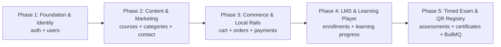

# MSN Academy — Backend Implementation Roadmap (Solo Backend Lead)

This implementation plan outlines the engineering roadmap for building the complete **Node.js + Express + TypeScript + MongoDB + Redis/BullMQ** backend for MSN Academy. As the **Solo Backend Lead**, you have 100% ownership of the backend architecture, database models, and all 43 REST API endpoints.

---

## User Review Required

> [!IMPORTANT]
> **Database & Environment Prerequisites:**
> - **MongoDB:** A local MongoDB instance (`mongodb://localhost:27017/msn_academy`) or a MongoDB Atlas connection string.
> - **Redis:** A local Redis instance (`redis://localhost:6379`) or cloud Redis (Upstash) for BullMQ background workers and caching.
> - **Node.js:** Node 20+ LTS installed.

> [!NOTE]
> All 43 REST endpoints will adhere strictly to the frozen contracts established in [`docs/05-API-Specification.md`](file:///c:/Users/HS%20LAPTOP/Music/msn-academy/docs/05-API-Specification.md), using standardized response envelopes and HttpOnly cookie-based JWT sessions.

---

## Architecture & Code Structure

The backend will live in the `backend/` directory using the **Controller-Service-Model (CSM)** architecture with strict TypeScript types:

```text
backend/
├── src/
│   ├── @types/                    # Express ambient type extensions (req.user)
│   ├── config/                    # Environment variables, MongoDB pool, Redis client
│   ├── constants/                 # Error codes, HTTP status, payment methods, user roles
│   ├── middleware/                # AuthGuard, RoleGuard, ZodValidator, ErrorHandler, RateLimiter
│   ├── modules/                   # Domain vertical modules (CSM pattern)
│   │   ├── auth/                  # auth.controller, auth.service, auth.routes, auth.validation
│   │   ├── users/                 # user.model, user.controller, user.service, user.routes
│   │   ├── courses/               # course.model, category.model, course.service, course.controller
│   │   ├── cart/                  # cart.model, cart.service, cart.controller
│   │   ├── orders/                # order.model, order.service, order.controller
│   │   ├── payments/              # payment.model, payment.service, payment.controller
│   │   ├── enrollments/           # enrollment.model, enrollment.service, enrollment.controller
│   │   ├── learning/              # learning.service, learning.controller (player & progress)
│   │   ├── assessments/           # assessment.model, session.model, assessment.service
│   │   ├── certificates/          # certificate.model, certificate.service, qr.generator
│   │   └── contact/               # contact.model, contact.service, contact.controller
│   ├── queues/                    # BullMQ job queues (emailQueue, certificateQueue)
│   ├── workers/                   # Background workers (pdfWorker, emailWorker)
│   ├── utils/                     # ApiResponse, ApiError, jwtHelper, passwordHelper, logger (Pino)
│   ├── app.ts                     # Express pipeline setup (CORS, Helmet, cookies, routes)
│   └── server.ts                  # Server entry point, database connection & graceful shutdown
├── .env.example
├── .env.development
├── package.json
└── tsconfig.json
```

---

## Phased Implementation Roadmap



---

### Phase 1: Foundation, Infrastructure & Identity (Sprint 1)
**Goal:** Establish a rock-solid, production-grade Express + TypeScript server with database connectivity, centralized error handling, and complete authentication & user management.

#### 1.1 Foundation & Tooling Setup
- [ ] Initialize `backend/package.json` with TypeScript 5, Express, Mongoose 8, Zod, Argon2/Bcrypt, JsonWebToken, Cookie-Parser, Helmet, CORS, Pino logger, and `tsx` (for fast live reload).
- [ ] Configure `tsconfig.json` (strict mode, ES2022 target, path aliases `@/*`).
- [ ] Build `src/config/environment.ts` with Zod environment variable parsing (`PORT`, `MONGO_URI`, `JWT_SECRET`, `JWT_REFRESH_SECRET`, `CLIENT_URL`).
- [ ] Implement `src/utils/ApiResponse.ts` and `src/utils/ApiError.ts` for standardized response envelopes.
- [ ] Configure `src/middleware/errorHandler.ts` to catch operational vs. unhandled errors and format Zod validation failures as HTTP 422.
- [ ] Setup Pino HTTP logger middleware.

#### 1.2 Database & Security Middleware
- [ ] Configure Mongoose connection in `src/config/database.ts` with auto-reconnect, index creation, and graceful shutdown handlers.
- [ ] Implement `src/middleware/authGuard.ts` (extracts JWT from HttpOnly cookie `access_token` or `Authorization: Bearer` fallback).
- [ ] Implement `src/middleware/roleGuard.ts` (restricts access to `STUDENT` or `ADMIN`).
- [ ] Implement `src/middleware/validateRequest.ts` (generic Zod schema validator for `body`, `query`, `params`).

#### 1.3 `users` & `auth` Modules
- [ ] **Model:** `User.ts` (fields: `fullName`, `email`, `passwordHash`, `role`, `phoneNumber`, `isEmailVerified`, `avatarUrl`, `passwordResetToken`, `passwordResetExpires`).
- [ ] **Services:** Password hashing/verification, JWT generation (`accessToken` 15m, `refreshToken` 7d), password reset token generation.
- [ ] **Endpoints Implemented & Tested:**
  - `POST /api/v1/auth/register` (creates user, hashes password, sets session cookie)
  - `POST /api/v1/auth/login` (verifies credentials, sets HttpOnly cookies)
  - `POST /api/v1/auth/logout` (clears auth cookies)
  - `GET  /api/v1/auth/me` (returns current authenticated session)
  - `POST /api/v1/auth/forgot-password` (generates reset token)
  - `POST /api/v1/auth/reset-password` (updates password via token)
  - `GET  /api/v1/users/profile` (fetches user profile)
  - `PUT  /api/v1/users/profile` (updates name, bio, phone)
  - `PUT  /api/v1/users/password` (changes password with current password check)

---

### Phase 2: Content, Catalog & Discovery (Sprint 2)
**Goal:** Deliver the course catalog, faceted search, category taxonomy, syllabus tree, and contact inquiry endpoints for Frontend Member 2 (M2).

- [ ] **Models:**
  - `Category.ts` (slug, title, icon, sortOrder).
  - `Course.ts` (slug, title, subtitle, description, categoryId, level, pricePKR, comparePricePKR, thumbnail, syllabusModules, isPublished, averageRating, totalStudentsCount).
  - `ContactInquiry.ts` (name, email, phone, subject, message, status).
- [ ] **Faceted Search Engine:**
  - Full-text search on course title and description.
  - Filtering by `category`, `level` (`BEGINNER`, `INTERMEDIATE`, `ADVANCED`), price range.
  - Sorting by `newest`, `price_asc`, `price_desc`, `popularity`, `rating`.
  - Standard pagination with `meta` object (`total`, `page`, `limit`, `totalPages`).
- [ ] **Endpoints Implemented & Tested:**
  - `GET  /api/v1/courses` (paginated, filtered catalog)
  - `GET  /api/v1/courses/:slug` (full course details, outcomes, prerequisites)
  - `GET  /api/v1/courses/:slug/syllabus` (modules, lecture titles, duration, previewable lectures)
  - `GET  /api/v1/categories` (active categories list)
  - `POST /api/v1/contact` (submits customer support message)

---

### Phase 3: Commerce, Hybrid Cart & Pakistani Payment Rails (Sprint 3)
**Goal:** Power checkout, coupon discounts, order ledger, and local Pakistani payment flows (Bank Wire, Easypaisa, JazzCash) for Frontend Member 3 (M3).

- [ ] **Models:**
  - `Cart.ts` (user reference or guest sessionId, course items, appliedCoupon, expiry).
  - `Order.ts` (orderNumber e.g. `MSN-2026-0001`, userId, guestDetails, items snapshot, subtotal, discount, totalPKR, status: `PENDING`, `PAID`, `FAILED`, `CANCELLED`).
  - `Payment.ts` (orderId, method: `BANK_TRANSFER`, `EASYPAISA`, `JAZZCASH`, proofFileUrl, transactionRef, reviewStatus: `UNDER_REVIEW`, `APPROVED`, `REJECTED`, reviewedBy, reviewedAt).
  - `Coupon.ts` (code, discountPercentage, validFrom, validUntil, maxUses, currentUses, isActive).
- [ ] **Business Logic:**
  - Cart item calculation with promo discount deduction.
  - Guest checkout: automatically creates or links a shadow student account.
  - Multi-document ACID transactions (`session.withTransaction`) during checkout to lock cart items and generate order.
  - Manual payment proof submission with 24-hour audit SLA notice.
- [ ] **Endpoints Implemented & Tested:**
  - `GET    /api/v1/cart`
  - `POST   /api/v1/cart/items`
  - `DELETE /api/v1/cart/items/:courseId`
  - `POST   /api/v1/cart/apply-coupon`
  - `POST   /api/v1/orders/checkout` (creates order, initiates payment record)
  - `GET    /api/v1/orders/my-orders` (student past orders ledger)
  - `GET    /api/v1/orders/:orderId` (order receipt & invoice details)
  - `POST   /api/v1/payments/submit-proof` (file upload/slip reference)
  - `GET    /api/v1/payments/:orderId/status` (checks payment status)

---

### Phase 4: LMS Enrollment & Video Player Context (Sprint 4)
**Goal:** Grant course access upon payment approval and provide lecture streaming context with atomic progress tracking (0–100%) for Frontend Member 4 (M4).

- [ ] **Models:**
  - `Enrollment.ts` (userId, courseId, orderId, enrolledAt, progressPercentage, isCompleted, completedAt).
  - `LessonProgress.ts` (userId, courseId, lessonId, isCompleted, lastWatchedSecond, completedAt).
- [ ] **Business Logic:**
  - Course enrollment guard (`isEnrolled` middleware) to protect lecture videos and attachments.
  - Atomic lesson completion: toggling a lesson recalculates overall course progress (0–100%).
  - 100% course completion automatically unlocks eligibility for the 120-minute assessment.
- [ ] **Endpoints Implemented & Tested:**
  - `GET  /api/v1/student/enrollments` (enrolled courses portfolio with progress bars)
  - `GET  /api/v1/student/dashboard-summary` (KPIs: enrolled, in-progress, completed, certificates count)
  - `GET  /api/v1/learning/:courseId/modules` (full curriculum tree with completion flags)
  - `GET  /api/v1/learning/:courseId/lessons/:lessonId` (video player URL, lesson notes, downloadable attachments)
  - `POST /api/v1/learning/:courseId/lessons/:lessonId/complete` (marks lesson done, recalculates progress)

---

### Phase 5: Timed Assessment Engine & QR Certificate Registry (Sprint 5)
**Goal:** Power the 120-minute timed MCQ examination, automated scoring (70% pass threshold), BullMQ Redis background certificate PDF generation, and public verification registry.

- [ ] **Models:**
  - `Assessment.ts` (courseId, title, durationMinutes: 120, passingPercentage: 70, questions pool).
  - `AssessmentSession.ts` (userId, courseId, assessmentId, startedAt, expiresAt: 120 mins from startedAt, answers map, scorePercentage, status: `IN_PROGRESS`, `PASSED`, `FAILED`, submittedAt, timeTakenSeconds).
  - `Certificate.ts` (certificateId e.g. `MSN-CERT-2026-XXXX`, userId, courseId, studentName, courseTitle, issueDate, gradePercentage, pdfUrl, qrCodeDataUrl).
- [ ] **Assessment Engine Rules:**
  - Server-anchored countdown timer: questions cannot be submitted after `expiresAt`.
  - Question options randomized per session.
  - Automated grading upon submission: $\ge 70\%$ marks session as `PASSED` and enqueues certificate generation job in BullMQ.
  - Unlimited retakes allowed on `FAILED` result.
- [ ] **BullMQ Background Workers:**
  - `pdfWorker`: Generates high-resolution PDF certificate with founder signature and security seal using PDFKit/Puppeteer and embeds scannable QR code.
- [ ] **Public Registry:**
  - Public `/verify/:certId` endpoint accessible without cookies to confirm authenticity.
- [ ] **Endpoints Implemented & Tested:**
  - `GET  /api/v1/assessments/:courseId/briefing` (briefing rules, 70% threshold, question count)
  - `POST /api/v1/assessments/:courseId/start` (starts 120m timed session)
  - `POST /api/v1/assessments/:sessionId/answer` (saves individual answer state in real-time)
  - `POST /api/v1/assessments/:sessionId/submit` (submits, grades, returns score & pass/fail)
  - `GET  /api/v1/assessments/:sessionId/results` (fetches scorecard and breakdown)
  - `GET  /api/v1/certificates/:certificateId` (student certificate view & download)
  - `GET  /api/v1/certificates/verify/:certificateId` (public validation lookup)

---

## Verification Plan

### Automated Testing
- Unit tests for password hashing, JWT creation, cart calculations, and assessment grading logic.
- Integration tests using Supertest for all API endpoints (`POST /auth/register`, `POST /auth/login`, `GET /courses`, etc.).
- Run script: `npm test` or `npx vitest run`.

### Manual Testing & Tooling
- Build a lightweight `test/api-test.http` / Postman collection for all 43 REST endpoints.
- Validate cookie transmission (`Set-Cookie: access_token=...; HttpOnly; SameSite=Strict`).
- Verify MongoDB database collections and compound indexes via MongoDB Compass or mongosh.
- Verify Redis queue job processing for certificates.
