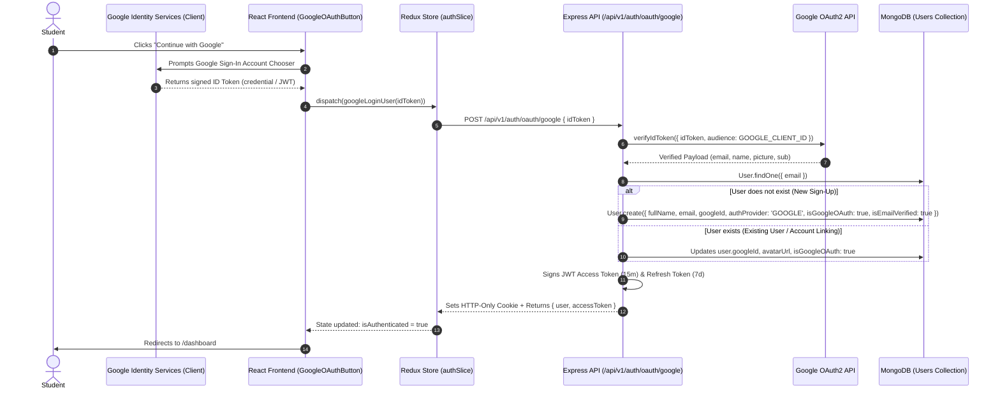

# Google OAuth 2.0 Complete Implementation Guide (MSN Academy)

Yeh document MSN Academy ke andar Google Authentication ki complete end-to-end implementation, flow, aur tamam code changes ko step-by-step detail ke sath explain karta hai.

---

## Table of Contents
1. [Architecture & Flow](#1-architecture--flow)
2. [Step 1: Packages & SDK Setup](#step-1-packages--sdk-setup)
3. [Step 2: Environment Variables](#step-2-environment-variables)
4. [Step 3: Database & User Model Changes](#step-3-database--user-model-changes)
5. [Step 4: Backend Implementation (Route, Controller, Validation, Service)](#step-4-backend-implementation)
6. [Step 5: Security & CORS Configuration (App & Helmet)](#step-5-security--cors-configuration)
7. [Step 6: Frontend API & Endpoints](#step-6-frontend-api--endpoints)
8. [Step 7: Redux Auth Slice Integration](#step-7-redux-auth-slice-integration)
9. [Step 8: Frontend UI Components (Button, Login, Register)](#step-8-frontend-ui-components)
10. [Google Cloud Console Configuration Checklist](#google-cloud-console-configuration-checklist)

---

## 1. Architecture & Flow



---

## Step 1: Packages & SDK Setup

### 1.1 Backend Dependency
Backend par Google ke cryptographic signature ko verify karne ke liye official library install ki gayi:
```bash
cd backend
npm install google-auth-library
```

### 1.2 Frontend SDK
Frontend par Google Identity Services (GIS) library ko asynchronously load kiya gaya:
**File: `frontend/index.html`**
```html
<!-- Google Identity Services SDK -->
<script src="https://accounts.google.com/gsi/client" async defer></script>
```

---

## Step 2: Environment Variables

Dono frontend aur backend ko Google Client ID provide ki gayi:

### 2.1 Backend (`backend/.env.development`)
```env
# Google OAuth
GOOGLE_CLIENT_ID=991572512851-nvqis4m80s8393fnkp2k9mef77f4mrb2.apps.googleusercontent.com
```

### 2.2 Frontend (`frontend/.env`)
```env
VITE_API_BASE_URL=http://localhost:5000/api/v1
VITE_GOOGLE_CLIENT_ID=991572512851-nvqis4m80s8393fnkp2k9mef77f4mrb2.apps.googleusercontent.com
```

### 2.3 Backend Environment Schema (`backend/src/config/environment.ts`)
Zod schema mein `GOOGLE_CLIENT_ID` ko add kiya gaya taake environment validation pass ho:
```typescript
const environmentSchema = z.object({
  // ... other variables
  GOOGLE_CLIENT_ID: z.string().optional(),
});
```

---

## Step 3: Database & User Model Changes

**File:** `backend/src/modules/users/user.model.ts`

### Logic:
* Normal user ke liye password lazmi hota hai, lekin Google user Google se sign in karta hai isliye uska `passwordHash` nahi hota.
* `AuthProvider` type banaya gaya (`'LOCAL' | 'GOOGLE' | 'EMAIL'`).
* `passwordHash` ko conditional banaya gaya: sirf tab required hoga jab user Google OAuth ke baghair register kare.

### Code:
```typescript
export type UserRole = 'STUDENT' | 'ADMIN';
export type AuthProvider = 'LOCAL' | 'GOOGLE' | 'EMAIL';

export interface IUser extends Document {
  _id: mongoose.Types.ObjectId;
  fullName: string;
  email: string;
  passwordHash?: string; // Optional for Google OAuth users
  role: UserRole;
  googleId?: string;
  authProvider?: AuthProvider;
  isGoogleOAuth?: boolean;
  phoneNumber?: string;
  avatarUrl?: string;
  isEmailVerified: boolean;
  passwordResetToken?: string;
  passwordResetExpires?: Date;
  createdAt: Date;
  updatedAt: Date;
}

const userSchema = new Schema<IUser>(
  {
    // ... fullName, email
    passwordHash: {
      type: String,
      required: function (this: IUser) {
        // Password hash is required for local/email registrations, optional for Google users
        return !this.authProvider || this.authProvider === 'LOCAL';
      },
      select: false,
    },
    googleId: {
      type: String,
      sparse: true,
      index: true,
    },
    authProvider: {
      type: String,
      enum: ['LOCAL', 'EMAIL', 'GOOGLE'],
      default: 'LOCAL',
      index: true,
    },
    isGoogleOAuth: {
      type: Boolean,
      default: false,
    },
    // ... role, phoneNumber, timestamps
  }
);
```

---

## Step 4: Backend Implementation

### 4.1 Zod Request Validation Schema
**File:** `backend/src/modules/auth/auth.validation.ts`
```typescript
export const googleOAuthSchema = z.object({
  idToken: z.string({
    required_error: 'Google ID Token is required.',
  }).min(1, 'Google ID Token cannot be empty.'),
});

export type GoogleOAuthInput = z.infer<typeof googleOAuthSchema>;
```

### 4.2 Route Definition
**File:** `backend/src/modules/auth/auth.routes.ts`
```typescript
import { Router } from 'express';
import { AuthController } from './auth.controller';
import { validateRequest } from '../../middleware/validateRequest';
import { googleOAuthSchema } from './auth.validation';

const router = Router();

// Endpoint: POST /api/v1/auth/oauth/google
router.post(
  '/oauth/google',
  validateRequest({ body: googleOAuthSchema }),
  AuthController.googleOAuth
);

export default router;
```

### 4.3 Controller Handler
**File:** `backend/src/modules/auth/auth.controller.ts`
```typescript
/**
 * POST /api/v1/auth/oauth/google
 */
public static async googleOAuth(req: Request, res: Response, next: NextFunction): Promise<void> {
  try {
    const result = await AuthService.googleOAuth(req.body.idToken);
    
    // Refresh token HTTP-only cookie mein save hota hai
    setAuthCookies(res, result.accessToken, result.refreshToken);

    res.status(200).json(
      ApiResponse.ok(
        { user: result.user, accessToken: result.accessToken, refreshToken: result.refreshToken },
        'Google authentication successful. Welcome to MSN Academy!'
      )
    );
  } catch (error) {
    next(error);
  }
}
```

### 4.4 Service Logic (Token Verification & DB Upsert)
**File:** `backend/src/modules/auth/auth.service.ts`
```typescript
import { OAuth2Client } from 'google-auth-library';
const googleClient = new OAuth2Client();

export class AuthService {
  /**
   * Authenticate or register a user via Google OAuth ID Token.
   */
  public static async googleOAuth(idToken: string): Promise<AuthResult> {
    let email: string = '';
    let fullName: string = 'Google User';
    let avatarUrl: string | undefined;
    let googleId: string | undefined;

    const clientId = process.env.GOOGLE_CLIENT_ID;

    // 1. Google Signature Verification (Cryptographic)
    if (clientId && idToken !== 'mock_google_token') {
      try {
        const ticket = await googleClient.verifyIdToken({
          idToken,
          audience: clientId, // Token is strictly verified against your Google Client ID
        });
        const payload = ticket.getPayload();
        if (payload && payload.email) {
          email = payload.email;
          fullName = payload.name || payload.given_name || email.split('@')[0];
          avatarUrl = payload.picture;
          googleId = payload.sub; // Google's unique user identifier
        }
      } catch (err: any) {
        throw ApiError.badRequest('Invalid or expired Google token: ' + (err.message || 'Verification failed'));
      }
    }

    if (!email) {
      throw ApiError.badRequest('Invalid Google ID Token: unable to extract email address.');
    }

    // 2. Database Lookup
    let user = await User.findOne({ email: email.toLowerCase() });

    if (!user) {
      // 3A. Naya student create karein (Sign-Up)
      user = await User.create({
        fullName,
        email: email.toLowerCase(),
        role: 'STUDENT',
        isEmailVerified: true, // Google already verified this email
        avatarUrl,
        googleId,
        authProvider: 'GOOGLE',
        isGoogleOAuth: true,
      });
    } else {
      // 3B. Purana student update/link karein (Sign-In)
      let changed = false;
      if (!user.googleId && googleId) {
        user.googleId = googleId;
        changed = true;
      }
      if (!user.avatarUrl && avatarUrl) {
        user.avatarUrl = avatarUrl;
        changed = true;
      }
      if (!user.isEmailVerified) {
        user.isEmailVerified = true;
        changed = true;
      }
      if (!user.isGoogleOAuth) {
        user.isGoogleOAuth = true;
        changed = true;
      }
      if (changed) {
        await user.save();
      }
    }

    // 4. Issue MSN Academy Platform JWT Tokens
    const accessToken = signAccessToken({
      id: user._id.toString(),
      email: user.email,
      role: user.role,
      fullName: user.fullName,
    });

    const refreshToken = signRefreshToken({
      id: user._id.toString(),
    });

    return { user, accessToken, refreshToken };
  }

  // Password Login Guard: Protect accounts that only have Google Sign-in
  public static async login(input: LoginInput): Promise<AuthResult> {
    const user = await User.findOne({ email: input.email.toLowerCase() }).select('+passwordHash');
    if (!user) throw ApiError.unauthorized('Invalid email or password.');

    if (!user.passwordHash) {
      throw ApiError.unauthorized('This account was created using Google Sign-In. Please sign in with Google.');
    }

    // ... standard password verification
  }
}
```

---

## Step 5: Security & CORS Configuration

**File:** `backend/src/app.ts`

### 5.1 Helmet Policy (Allowing Google PostMessage)
Google login popup window parent window se `postMessage` ke zariye communicate karti hai. Default `Cross-Origin-Opener-Policy: same-origin` isko block karta hai, isliye `same-origin-allow-popups` enable kiya:
```typescript
app.use(
  helmet({
    crossOriginOpenerPolicy: { policy: 'same-origin-allow-popups' },
  })
);
```

### 5.2 Dynamic Development CORS
Frontend jab multiple dev servers (port 5173, 5174, 5175) par chalta hai, CORS block na ho:
```typescript
const staticAllowedOrigins = [
  env.CORS_ORIGIN,
  env.CLIENT_URL,
  'http://localhost:5173',
  'http://localhost:5174',
  'http://localhost:5175',
];

app.use(
  cors({
    origin: (origin, callback) => {
      if (!origin) return callback(null, true);

      if (
        staticAllowedOrigins.includes(origin) ||
        (env.NODE_ENV === 'development' && /^http:\/\/(localhost|127\.0\.0\.1)(:\d+)?$/.test(origin))
      ) {
        return callback(null, true);
      }

      return callback(new Error(`Origin ${origin} not allowed by CORS`));
    },
    credentials: true,
    methods: ['GET', 'POST', 'PUT', 'PATCH', 'DELETE', 'OPTIONS'],
    allowedHeaders: [
      'Content-Type',
      'Authorization',
      'X-Requested-With',
      'X-Client-Timestamp',
      'x-guest-session-id',
      'X-Guest-Session-Id',
    ],
  })
);
```

---

## Step 6: Frontend API & Endpoints

### 6.1 Endpoint Constants
**File:** `frontend/src/services/endpointUrls.js`
```javascript
export const ENDPOINTS = {
  AUTH: {
    LOGIN: '/auth/login',
    REGISTER: '/auth/register',
    LOGOUT: '/auth/logout',
    FORGOT_PASSWORD: '/auth/forgot-password',
    RESET_PASSWORD: '/auth/reset-password',
    GOOGLE_OAUTH: '/auth/oauth/google', // <-- Added
    ME: '/auth/me',
  },
  // ...
};
```

### 6.2 Auth Service API Call
**File:** `frontend/src/services/authService.js`
```javascript
export const authService = {
  /**
   * POST /auth/oauth/google
   * Sends Google ID Token to backend for verification & session creation
   */
  async googleOAuth(idToken) {
    const response = await apiClient.post(ENDPOINTS.AUTH.GOOGLE_OAUTH, { idToken });
    return response.data;
  },
};
```

---

## Step 7: Redux Auth Slice Integration

**File:** `frontend/src/features/auth/slice/authSlice.js`

### Code:
```javascript
// Async Thunk
export const googleLoginUser = createAsyncThunk(
  'auth/googleLoginUser',
  async (idToken, { rejectWithValue }) => {
    try {
      const response = await authService.googleOAuth(idToken);
      return response.data; // { user, accessToken }
    } catch (error) {
      return rejectWithValue(
        error.response?.data?.message || 'Google authentication failed.'
      );
    }
  }
);

// Extra Reducers
builder
  .addCase(googleLoginUser.pending, (state) => {
    state.loading = true;
    state.error = null;
  })
  .addCase(googleLoginUser.fulfilled, (state, action) => {
    state.loading = false;
    state.isAuthenticated = true;
    state.user = action.payload.user;
    state.token = action.payload.accessToken;
    state.error = null;
    localStorage.setItem('auth_token', action.payload.accessToken);
    localStorage.setItem('user', JSON.stringify(action.payload.user));
  })
  .addCase(googleLoginUser.rejected, (state, action) => {
    state.loading = false;
    state.error = action.payload;
    state.isAuthenticated = false;
  });
```

---

## Step 8: Frontend UI Components

### 8.1 Google OAuth Button Component
**File:** `frontend/src/components/auth/GoogleOAuthButton.jsx`
* Yeh component Google Identity Services ko initialize karta hai.
* Official button render karta hai aur React 18 Strict Mode duplicate initialization se bachne ke liye `hasInitializedRef` use karta hai.

```jsx
import React, { useEffect, useRef, useState } from 'react';
import { useDispatch } from 'react-redux';
import { useNavigate, useSearchParams } from 'react-router-dom';
import { Loader2 } from 'lucide-react';
import { googleLoginUser } from '../../features/auth/slice/authSlice';

export default function GoogleOAuthButton({ onError, buttonText = 'Continue with Google' }) {
  const dispatch = useDispatch();
  const navigate = useNavigate();
  const [searchParams] = useSearchParams();
  const redirectPath = searchParams.get('redirect') || '/dashboard';

  const [isLoading, setIsLoading] = useState(false);
  const [gisReady, setGisReady] = useState(false);
  const googleBtnContainerRef = useRef(null);
  const hasInitializedRef = useRef(false);

  const clientId = import.meta.env.VITE_GOOGLE_CLIENT_ID;

  const handleGoogleCredentialResponse = async (response) => {
    if (!response?.credential) {
      if (onError) onError('No credential received from Google.');
      return;
    }

    setIsLoading(true);
    if (onError) onError('');

    try {
      await dispatch(googleLoginUser(response.credential)).unwrap();
      navigate(redirectPath);
    } catch (err) {
      const message = typeof err === 'string' ? err : err?.message || 'Google sign-in failed.';
      if (onError) onError(message);
    } finally {
      setIsLoading(false);
    }
  };

  const handleCredentialResponseRef = useRef(handleGoogleCredentialResponse);
  handleCredentialResponseRef.current = handleGoogleCredentialResponse;

  useEffect(() => {
    if (!clientId) return;

    const initializeGoogleSignIn = () => {
      if (hasInitializedRef.current) return;
      if (window.google?.accounts?.id && googleBtnContainerRef.current) {
        try {
          hasInitializedRef.current = true;
          window.google.accounts.id.initialize({
            client_id: clientId,
            callback: (res) => handleCredentialResponseRef.current(res),
            auto_select: false,
            cancel_on_tap_outside: true,
          });

          // Google Official Button Rendering
          window.google.accounts.id.renderButton(googleBtnContainerRef.current, {
            type: 'standard',
            theme: 'outline',
            size: 'large',
            text: 'continue_with',
            shape: 'rectangular',
            width: 380,
            logo_alignment: 'left',
          });

          setGisReady(true);
        } catch (err) {
          console.error('Failed to initialize Google Identity Services:', err);
        }
      }
    };

    if (window.google?.accounts?.id) {
      initializeGoogleSignIn();
    } else {
      const interval = setInterval(() => {
        if (window.google?.accounts?.id) {
          clearInterval(interval);
          initializeGoogleSignIn();
        }
      }, 150);
      return () => clearInterval(interval);
    }
  }, [clientId]);

  return (
    <div className="relative flex w-full flex-col items-center justify-center">
      {/* Official Google GIS Button */}
      <div
        ref={googleBtnContainerRef}
        className={`w-full flex justify-center ${gisReady ? 'block' : 'hidden'}`}
      />

      {/* Fallback / Loading State */}
      {!gisReady && (
        <button
          type="button"
          disabled={isLoading}
          className="w-full h-11 flex items-center justify-center gap-3 rounded-xl border border-slate-200 bg-white text-xs sm:text-sm font-semibold text-slate-700 hover:bg-slate-50 transition-colors shadow-2xs"
        >
          {isLoading ? (
            <Loader2 className="h-4 w-4 animate-spin text-slate-500" />
          ) : (
            <span>{buttonText}</span>
          )}
        </button>
      )}
    </div>
  );
}
```

### 8.2 Usage in Login & Register Pages
**Files:** `frontend/src/pages/auth/Login.jsx` & `frontend/src/pages/auth/Register.jsx`
```jsx
import GoogleOAuthButton from '../../components/auth/GoogleOAuthButton';

// Rendered inside the form:
<div className="space-y-2.5 mb-5">
  <GoogleOAuthButton onError={setSubmitError} buttonText="Continue with Google" />
</div>

<div className="relative my-5 flex items-center justify-center">
  <div className="border-t border-slate-200 w-full" />
  <span className="bg-white px-3 text-[11px] font-semibold uppercase tracking-wider text-slate-400 absolute">
    Or continue with email
  </span>
</div>
```

---

## Google Cloud Console Configuration Checklist

Google Cloud Console par `Error 400: origin_mismatch` se bachne ke liye yeh settings lazmi hain:

1. [Google Cloud Console Credentials](https://console.cloud.google.com/apis/credentials) par jayein.
2. Apna OAuth 2.0 Web Client ID select karein (`991572512851-...`).
3. **Authorized JavaScript origins** mein add karein:
   - `http://localhost:5173`
   - `http://localhost:5174`
   - `http://localhost:5175`
   - `http://localhost`
4. **Authorized redirect URIs** mein add karein:
   - `http://localhost:5173`
   - `http://localhost:5174`
5. **Save** par click karein (Google changes ko worldwide sync karne mein 1–5 minutes leta hai).
